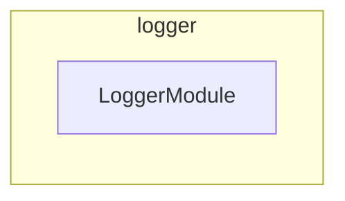

# Logger: Shared NestJS Logging Package

## Quick Start

**Type**: NestJS library package (`@codebase/logger`)

**Purpose**: The single `LoggerService` every NestJS project in the codebase
injects. Seventeen projects each carried an identical copy of
`src/modules/logger`, so a change to log formatting had to land seventeen
times. This package owns that code; consumers import it and declare nothing
about `pino`.

This package is a graph leaf — it must never import another workspace package,
or every consumer inherits that edge.

## Architecture Overview

### Tech Stack

- **Framework**: NestJS (modules, dependency injection, providers)
- **Logging**: `pino` (structured JSON) + `pino-pretty` (development transport)
- **Language**: Strict TypeScript

### Directory Layout

```text
src/
  index.ts                          # Public API — LoggerService, LoggerModule
  modules/
    logger/
      logger.service.ts             # Transient pino LoggerService
      logger.module.ts              # @Global() LoggerModule (exports LoggerService)
      logger.constants.ts
      logger.types.ts
testing/                            # Shared test utilities
```

### Module Graph

The modules this project defines and the imports between them, regenerated by `nx run synchronization:synchronize --configuration=write`.

<!-- nestjs-module-graph-start -->



<!-- nestjs-module-graph-end -->

## Consuming this package

Add the dependency, then import `LoggerModule` once in the root module:

```jsonc
// package.json
"dependencies": { "@codebase/logger": "workspace:*" }
```

```ts
import { LoggerModule } from "@codebase/logger";

@Module({
  imports: [ConfigModule.forRoot({ ... }), LoggerModule],
})
export class MainModule {}
```

`LoggerModule` is `@Global()`, so feature modules inject `LoggerService`
without importing the module themselves.

`LoggerService` is `Scope.TRANSIENT` — each injecting class gets its own
instance. Always call `setContext` in the constructor, and always with
`MyClass.name` rather than a string literal:

```ts
constructor(private readonly logger: LoggerService) {
  this.logger.setContext(MyService.name);
}
```

Inject `LoggerService` as the **last** constructor parameter, after
repository and domain dependencies.

### Output modes

| `NODE_ENV`    | Output                               |
| ------------- | ------------------------------------ |
| `production`  | Structured JSON on stdout            |
| anything else | Colorized `pino-pretty` single lines |

`LOG_LEVEL` sets the pino level in both modes and defaults to `info`.

`pino-pretty` is named as a **string** transport target, never imported, so
static analysis cannot see the reference. It is declared here as a real
dependency so it resolves from wherever `pino` lives, and it is excluded from
knip and `@nx/dependency-checks` by name.

### File logging helpers

Commands that stream failures to a log file share two helpers rather than
re-deriving timestamps and output paths:

| Method                                       | Returns                                                         |
| -------------------------------------------- | --------------------------------------------------------------- |
| `buildErrorLogEntry(context, error)`         | `{ errorMessage, logLine }` — normalizes `unknown` errors       |
| `createTimestampedOutputLogFilePath(prefix)` | `<cwd>/output/<prefix>-<ISO timestamp>.log`, creating `output/` |

## Development

### Key Commands

Always prefer running tasks through Nx rather than calling the underlying tools directly.

```bash
nx run logger:lint           # ESLint
nx run logger:typecheck      # tsc --noEmit
nx run logger:format         # oxfmt formatting
nx run logger:build          # Compile for production
nx run logger:test           # Vitest
```

### Testing

`LoggerService` is exercised through `Test.createTestingModule` and
`module.resolve` — `resolve`, not `get`, because the provider is transient.
Level routing is asserted by swapping the private `child` pino logger for a
mock; the `NODE_ENV` branches are covered by re-importing the module under a
mutated environment with `vi.resetModules()`.

```bash
nx run logger:vitest:unit
```

## Best Practices

- **Never add a workspace dependency here** — every consumer inherits it.
- **Do not widen the public API casually** — `src/index.ts` is a contract for
  every consuming project; each new export is one more thing to keep working.
- **Changes ripple** — a behavior change to log shape affects every
  application and package at once. Prefer additive methods.

## Troubleshooting

- **`LoggerService` resolves to a stale context** — the provider is
  `Scope.TRANSIENT`; use `module.resolve(LoggerService)` in tests, not
  `module.get(LoggerService)`.
- **Logs are unformatted in development** — `pino-pretty` is not resolvable
  from where `pino` was loaded; it is a dependency of this package.
- **Dependency injection failure in a consumer** — confirm `LoggerModule` is
  imported in that project's root module; `@Global()` only applies once the
  module is registered somewhere.

See the [triage-submission skill](../../.agents/skills/triage-submission/SKILL.md) for lint and git hook failures.

## Key Files

- [src/index.ts](src/index.ts): Public API
- [src/modules/logger/logger.service.ts](src/modules/logger/logger.service.ts): pino-backed logger
- [src/modules/logger/logger.module.ts](src/modules/logger/logger.module.ts): `@Global()` `LoggerModule`
- [project.json](project.json): Nx targets (`build`, `test`, `lint`, `typecheck`, `format`)
