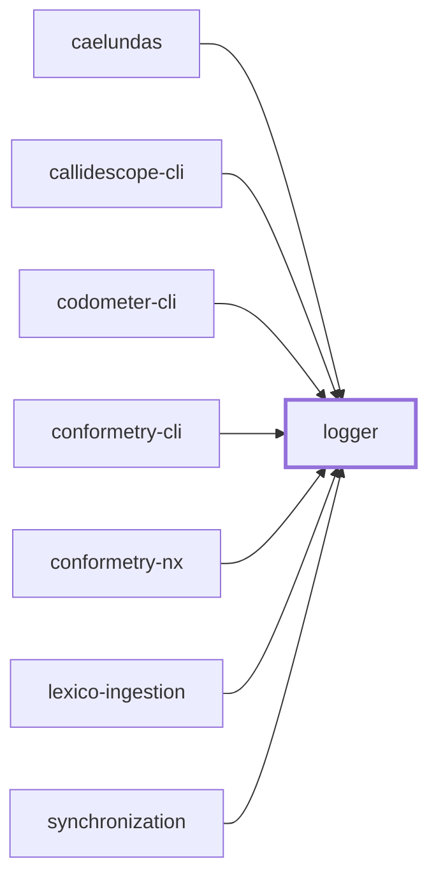
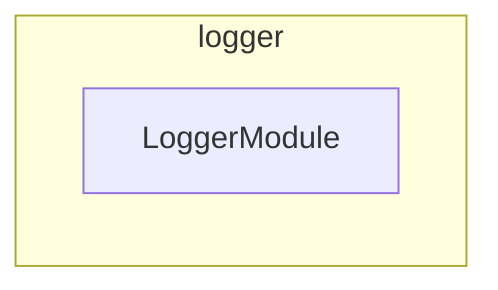

# 🪵 Logger

The shared NestJS logging package.

## Purpose

The one `LoggerService` every NestJS project in the codebase injects. Before
this package, seventeen projects each carried an identical copy of the same
`src/modules/logger` directory, so a fix to log formatting had to be applied
seventeen times.

It exports two things:

| Export          | Responsibility                                                             |
| --------------- | -------------------------------------------------------------------------- |
| `LoggerService` | Transient-scoped, `pino`-backed logger implementing Nest's `LoggerService` |
| `LoggerModule`  | `@Global()` module providing and exporting `LoggerService`                 |

## Usage

Import `LoggerModule` once in the root module. It is `@Global()`, so feature
modules inject `LoggerService` without importing anything themselves:

```ts
import { LoggerModule } from "@codebase/logger";

@Module({
  imports: [LoggerModule],
})
export class MainModule {}
```

`LoggerService` is `Scope.TRANSIENT` — each injecting class gets its own
instance. Always call `setContext` in the constructor so every line is tagged
with the originating class:

```ts
import { LoggerService } from "@codebase/logger";

@Injectable()
export class MyService {
  constructor(private readonly logger: LoggerService) {
    this.logger.setContext(MyService.name);
  }
}
```

## Output modes

| `NODE_ENV`    | Output                                               |
| ------------- | ---------------------------------------------------- |
| `production`  | Structured JSON on stdout                            |
| anything else | Human-readable, colorized `pino-pretty` single lines |

`LOG_LEVEL` sets the pino level in both modes and defaults to `info`.

Because `pino-pretty` is named as a string transport target rather than
imported, no static analysis can see the reference. It is a real dependency of
this package so it resolves wherever `pino` does.

## File logging helpers

Commands that stream failures to a log file share two helpers rather than
re-deriving timestamps and output paths:

| Method                                       | Returns                                                         |
| -------------------------------------------- | --------------------------------------------------------------- |
| `buildErrorLogEntry(context, error)`         | `{ errorMessage, logLine }` — normalizes `unknown` errors       |
| `createTimestampedOutputLogFilePath(prefix)` | `<cwd>/output/<prefix>-<ISO timestamp>.log`, creating `output/` |

## Project Graph

Where this project sits in the Nx project graph: what it depends on, and what depends on it. Regenerated by `nx run synchronization:synchronize --configuration=write`.

<!-- nx-project-graph-start -->



<!-- nx-project-graph-end -->

## Module Graph

The modules this project defines and the imports between them, regenerated by `nx run synchronization:synchronize --configuration=write`.

<!-- nestjs-module-graph-start -->



<!-- nestjs-module-graph-end -->

## Development

```bash
nx run logger:vitest
```

## License

MIT — see [LICENSE](../../LICENSE).

<!-- CALL_STACKS_START -->

## 🔭 Callidescope

Call stacks traced through `logger`, deepest first. Each frame shows what it takes, what it returns, and what its documentation says.

| Measure | Value |
| --- | --- |
| Callables | 14 |
| Files | 7 |
| Calls traced | 12 |
| Call stacks | 1 |
| Deepest stack | 4 |
| Stacks through recursion | 0 |
| Unfollowable calls | 1 |

### Call stacks

**1. `LoggerService.verbose`** — depth 4 · orphan-root

```text
🚀 LoggerService.verbose(message: unknown, context?: string, data?: LogData): void [packages/logger/src/modules/logger/logger.service.ts:241]
   ↳ Logs a verbose message at the `trace` level.
  └─> LoggerService.buildBindings(…): Record<string, unknown> [packages/logger/src/modules/logger/logger.service.ts:115]
     ↳ Assembles the object pino merges into the line.
    └─> LoggerService.assertConventionalMessage(args: { context: string | undefined; parsed: ParsedLogMessage; }): void [packages/logger/src/modules/logger/logger.service.ts:82]
       ↳ Fails a malformed message in development, and never in production.
      └─> LoggerService.isConventionalVerb(word: string): boolean [packages/logger/src/modules/logger/logger.service.ts:140]
         ↳ Whether a word is a verb in one of the two tenses the convention allows.
```

### Module spread

None.

### Possibly misplaced

None.
<!-- CALL_STACKS_END -->
