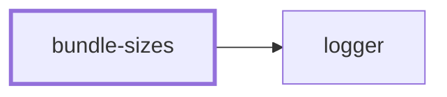
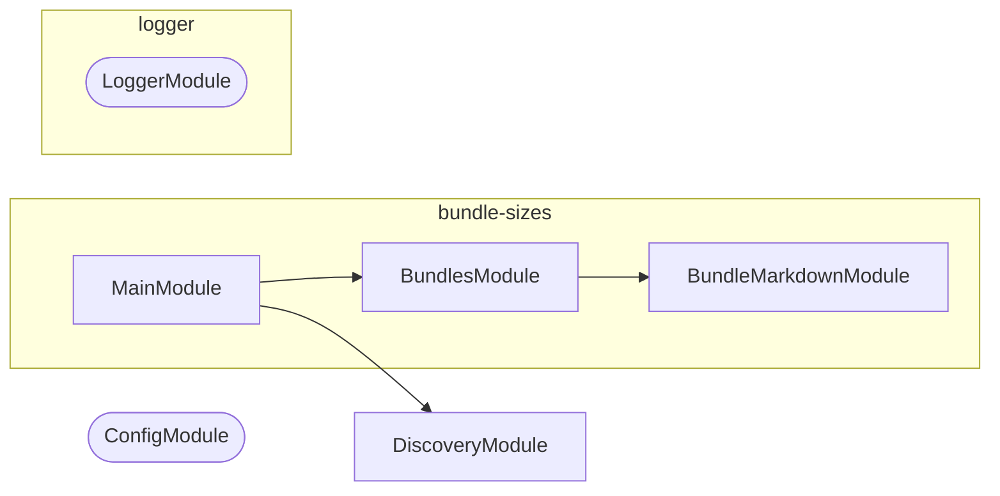

# 🎒 Bundle Sizes

**Report what the build weighs, and where it grew.**

Every project with a `bundlesize` target leaves a `size-limit-report.json`
behind. This CLI reads them all, compares them to a baseline snapshot of the
same reports taken from `main`, and renders one markdown section — the
`🎒 Bundles` block that 👷 Make Projects splices into each pull request
description.

```bash
nx run bundle-sizes:bundles -- --baseline .bundle-baseline --markdown REPORT.md
```

## Why it lives here

The measurement itself is generic, but everything around it is this
workspace's: the `applications`/`packages`/`tools` layout the reports are
found in, the `main` branch the baseline comes from, the `bundlesize` Nx target
that produced them, and the pull request the section lands in. Making those
configurable would mean inventing settings so a stranger could describe a
workspace they do not have. They are facts here, so the tool lives here rather
than in a publishable package.

It reads the JSON that [size-limit](https://github.com/ai/size-limit) writes.
That is a file format, not a dependency — nothing here imports it.

## Options

| Flag | Does |
| ---- | ---- |
| `--baseline <dir>` | Directory holding a baseline copy of the reports; without it every bundle reads as new |
| `--baseline-url <url>` | Run URL the baseline came from, linked from the headline |
| `--markdown <file>` | Splice the section into this file, between its anchor markers |
| `--output <file>` | Write the section alone to this file |

With no destination the section goes to standard output, which is what makes it
inspectable before it is wired into anything.

## What the section says

- Every measured bundle with its size, baseline size, byte and percentage
  change, limit, and the share of that limit it consumes
- A per-project subtotal wherever a project has more than one bundle
- A headline total, and a callout for whatever grew most
- Bundles that were not rebuilt this run, at their baseline size, collapsed
- Separate counts of bundles that appeared or disappeared

Totals only ever compare bundles both sides measured. A renamed bundle is
reported as one addition and one removal rather than a saving, because counting
the removal without its replacement would invent a reduction that never
happened.

## Splicing

The section is wrapped in `<!-- bundle-sizes:start -->` and
`<!-- bundle-sizes:end -->`. On every run the block between those markers is
replaced and everything around it is left alone, so the same command can run on
each push without stacking copies or disturbing what an author wrote.

Getting that markdown in front of a reader — into a pull request description,
say — is the caller's job. 👷 Make Projects fetches the description, runs this
against it, and puts it back.

## Project Graph

Where this project sits in the Nx project graph: what it depends on, and what depends on it. Regenerated by `nx run synchronization:synchronize --configuration=write`.

<!-- nx-project-graph-start -->



<!-- nx-project-graph-end -->

## Module Graph

The modules this project defines and the imports between them, regenerated by `nx run synchronization:synchronize --configuration=write`.

<!-- nestjs-module-graph-start -->



_Rounded modules are global: every module can inject them, so their edges are left out._

<!-- nestjs-module-graph-end -->

## Start

```bash
nx run bundle-sizes:start
```

## Test

```bash
nx run bundle-sizes:vitest
```
