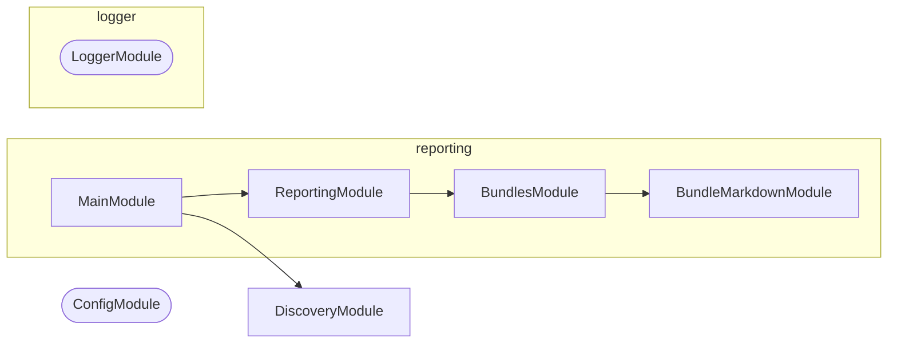

# 📝 Reporting

**Say what the codebase currently looks like, in markdown someone will read.**

Some questions about this repository are only worth answering as a report: what
the build weighs, how it moved since `main`, what is close to a limit. This is
the NestJS CLI that renders those reports, and splices each one into a document
between its own markers.

```bash
nx run reporting:start           # every report
nx run reporting:start:bundles   # just the bundle sizes report
```

It is the reporting counterpart to
[synchronization](../synchronization/README.md): that tool keeps derived files
derived, this one writes down what is currently true.

## Why it lives here

The reports are about _this_ workspace — the `applications`/`packages`/`tools`
layout, the `main` branch a baseline comes from, the Nx targets that produced
the measurements. Those are facts here rather than settings, so this is a
workspace tool and not a publishable package.

## Reports

| Report | Renders |
| ------ | ------- |
| `bundles` | 🎒 Bundles — what every built bundle weighs, how it moved against a baseline, and how much of its limit it uses |

### 🎒 Bundles

Reads the `codometer-report.json` each project's `codometer` target wrote and
compares it to a baseline snapshot of the same reports. It reads the JSON that
[codometer](../../packages/codometer-cli/README.md) writes — a file format, not
a dependency; nothing here imports it. Every metric denominated in bytes becomes
a row; every other metric a codometer report carries belongs to a different
report than this one.

The section reports every measured metric with its size, baseline size, byte and
percentage change, limit, and share of that limit; a per-project subtotal; a
headline total with a callout for whatever grew most; bundles that were not
rebuilt, at their baseline size, collapsed; and separate counts of bundles that
appeared or disappeared.

A row is marked ❌ when it breached a `fail` limit and ❗ when it breached a
`warn` one, so "close to full" is declared per project in the codometer
configuration rather than assumed by this renderer.

A metric may carry several limits — a `warn` short of a `fail` is the point of
the feature — so precedence is fixed rather than incidental. The **glyph** takes
the worst breach: a breached `fail` outranks a breached `warn`, which outranks
growth. The **`Limit` and `Used` columns** take the enforced limit, meaning
the lowest `fail` limit, or the lowest `warn` limit when nothing fails the
metric at all. So `Used` means the same thing on every row — the share of what
actually stops a change — while the advisory state is carried by the glyph. A
breached `warn` beneath a `fail` that held therefore reads as ❗ with the `fail`
limit still in the column: neither reads as passing, and neither reads as
failing. A target whose globs matched
nothing is marked ⁉️ — the report says an empty match outright, which is what
keeps it distinct from a target that genuinely measured zero bytes.

Comparing against a baseline lives here and not in codometer. Codometer is
stateless and measures only the tree in front of it; a baseline needs branches,
workflow artifacts, and pull request context, which are facts about this
repository rather than settings a measurement tool should carry.

Metrics join to their baseline on the metric's name, which codometer builds from
the target's name and the metric's path within it — both written in the
configuration, so the key is stable across runs. Totals only ever compare
metrics both sides measured. A renamed target is reported as one addition and
one removal rather than a saving, because counting the removal without its
replacement would invent a reduction that never happened.

Byte counts are Node-version dependent: the bundled zlib differs between
releases, so a baseline captured on one runtime and compared against a run on
another shifts every number. Neither the report nor this table records the
runtime — codometer's report deliberately holds nothing that varies between two
runs over the same tree, and this tool renders on the pull request runner rather
than the one that produced the baseline, so any version it stamped would be the
wrong one. CI uses the runtime `.nvmrc` pins on both sides, and the rendered
guidelines say so.

The same drift is why continuous integration never runs codometer's
`--check reports`: a report written on the pinned runtime and checked on any
other reads as stale when nothing changed. Staleness checking is for local use
on the pinned runtime, and project READMEs are written on the default branch
where that runtime is the only one in play.

## Options

| Flag | Does |
| ---- | ---- |
| `--baseline <dir>` | Directory holding a baseline snapshot to compare against |
| `--baseline-url <url>` | Run URL the baseline came from, linked from the headline |
| `--markdown <file>` | Splice the report into this document, between its markers |
| `--output <file>` | Write the report to this file on its own (single reports only) |

With no destination a report goes to standard output, which is what makes it
inspectable before it is wired into anything.

## Adding a report

1. Generate a module: `nx generate conformetry:nestjs-command-module --name=<report>`.
2. Have its command implement `ReportableCommand` from
   [`reporting.types.ts`](src/modules/reporting/reporting.types.ts): a label, a
   marker pair no other report claims, and `renderReport(options)` returning the
   body as markdown — heading included, markers excluded.
3. Provide `ReportingService` and `ReportingMarkersService` in the report's own
   module. They are stateless, and providing them there rather than importing
   the reporting module — which imports every report module — keeps the graph
   acyclic.
4. Register the command in `ReportingCommand.getReports()` and add a
   configuration for it to the `report` target.

Wrapping, splicing, destination handling, and option narrowing are all handled
for you. A report only has to gather its data and render markdown.

## Where reports end up

Splicing into a file is the whole of the output contract. Getting that markdown
in front of a reader — a pull request description, an issue, a wiki page — is
the caller's job, which keeps this tool independent of any one forge. 👷 Make
Projects fetches a pull request description, runs the bundles report against it,
and puts it back.

## Project Graph

Where this project sits in the Nx project graph: what it depends on, and what depends on it. Regenerated by `nx run synchronization:nx-project-graphs:write`.

<!-- nx-project-graph-start -->


<!-- nx-project-graph-end -->

## Module Graph

The modules this project defines and the imports between them, published by `nx run synchronization:nestjs-module-graphs:write`.

<!-- nestjs-module-graph-start -->



_Rounded modules are global: every module can inject them, so their edges are left out._

<!-- nestjs-module-graph-end -->

## Start

```bash
nx run reporting:start
```

## Test

```bash
nx run reporting:vitest
```

<!-- CALL_STACKS_START -->

## 🔭 Callidescope

Call stacks traced through `reporting`, deepest first. Each frame shows what it takes, what it returns, and what its documentation says.

| Measure | Value |
| --- | --- |
| Callables | 114 |
| Files | 22 |
| Calls traced | 145 |
| Call stacks | 17 |
| Deepest stack | 9 |
| Stacks through recursion | 0 |
| Unfollowable calls | 2 |

### Call stacks

**1. `BundlesCommand.run`** — depth 9 · decorated-method

```text
🚀 BundlesCommand.run(_passedParameters: string[], options: BundlesCommandOptions): Promise<void> [tools/reporting/src/modules/bundles/bundles.command.ts:111]
   ↳ Renders this report alone, to wherever the flags point.
  └─> ReportingService.emit(…): Promise<void> [tools/reporting/src/modules/reporting/reporting.service.ts:57]
     ↳ Renders one report and writes it wherever the destination says.
    └─> BundlesCommand.renderReport(options: ReportOptions): string [tools/reporting/src/modules/bundles/bundles.command.ts:92]
       ↳ Renders the report body from whatever the `codometer` target measured.
      └─> BundlesService.collect(args: CollectRowsArguments): MetricCollection [tools/reporting/src/modules/bundles/bundles.service.ts:289]
         ↳ Joins every current report to the baseline snapshot.
        └─> BundlesService.readReportPaths(args: CollectRowsArguments): string[] [tools/reporting/src/modules/bundles/bundles.service.ts:240]
           ↳ Lists every report path either side knows about, so a project the baseline measured is still accounted for when this…
          └─> LoggerService.debug(message: unknown, context?: string, data?: LogData): void [packages/logger/src/modules/logger/logger.service.ts:241]
             ↳ Logs a debug message at the `debug` level.
            └─> LoggerService.buildBindings(…): Record<string, unknown> [packages/logger/src/modules/logger/logger.service.ts:140]
               ↳ Assembles the object pino merges into the line.
              └─> LoggerService.assertConventionalMessage(args: { context: string | undefined; parsed: ParsedLogMessage; }): void [packages/logger/src/modules/logger/logger.service.ts:107]
                 ↳ Fails a malformed message in development, and never in production.
                └─> LoggerService.isConventionalVerb(word: string): boolean [packages/logger/src/modules/logger/logger.service.ts:165]
                   ↳ Whether a word is a verb in one of the two tenses the convention allows.
```

**2. `ReportingCommand.run`** — depth 9 · decorated-method

```text
🚀 ReportingCommand.run(_passedParameters: string[], options: ReportingCommandOptions): Promise<void> [tools/reporting/src/modules/reporting/reporting.command.ts:83]
   ↳ Render every report into the given destination.
  └─> ReportingService.emit(…): Promise<void> [tools/reporting/src/modules/reporting/reporting.service.ts:57]
     ↳ Renders one report and writes it wherever the destination says.
    └─> BundlesCommand.renderReport(options: ReportOptions): string [tools/reporting/src/modules/bundles/bundles.command.ts:92]
       ↳ Renders the report body from whatever the `codometer` target measured.
      └─> BundlesService.collect(args: CollectRowsArguments): MetricCollection [tools/reporting/src/modules/bundles/bundles.service.ts:289]
         ↳ Joins every current report to the baseline snapshot.
        └─> BundlesService.readReportPaths(args: CollectRowsArguments): string[] [tools/reporting/src/modules/bundles/bundles.service.ts:240]
           ↳ Lists every report path either side knows about, so a project the baseline measured is still accounted for when this…
          └─> LoggerService.debug(message: unknown, context?: string, data?: LogData): void [packages/logger/src/modules/logger/logger.service.ts:241]
             ↳ Logs a debug message at the `debug` level.
            └─> LoggerService.buildBindings(…): Record<string, unknown> [packages/logger/src/modules/logger/logger.service.ts:140]
               ↳ Assembles the object pino merges into the line.
              └─> LoggerService.assertConventionalMessage(args: { context: string | undefined; parsed: ParsedLogMessage; }): void [packages/logger/src/modules/logger/logger.service.ts:107]
                 ↳ Fails a malformed message in development, and never in production.
                └─> LoggerService.isConventionalVerb(word: string): boolean [packages/logger/src/modules/logger/logger.service.ts:165]
                   ↳ Whether a word is a verb in one of the two tenses the convention allows.
```

**3. `BundlesService.collectProjectRows`** — depth 7 · orphan-root

```text
🚀 BundlesService.collectProjectRows(args: CollectProjectRowsArguments): MetricCollection [tools/reporting/src/modules/bundles/bundles.service.ts:110]
   ↳ Joins one project's current report to its baseline.
  └─> BundlesService.readBaseline(args: CollectProjectRowsArguments): Map<string, SizeMetric> [tools/reporting/src/modules/bundles/bundles.service.ts:154]
     ↳ Reads a baseline report into a name-to-metric lookup.
    └─> BundlesService.readReport(workingDirectory: string, reportPath: string): ProjectReport [tools/reporting/src/modules/bundles/bundles.service.ts:216]
       ↳ Parses a codometer report, tolerating an absent or malformed file.
      └─> LoggerService.warn(message: unknown, context?: string, data?: LogData): void [packages/logger/src/modules/logger/logger.service.ts:312]
         ↳ Logs a warning message at the `warn` level.
        └─> LoggerService.buildBindings(…): Record<string, unknown> [packages/logger/src/modules/logger/logger.service.ts:140]
           ↳ Assembles the object pino merges into the line.
          └─> LoggerService.assertConventionalMessage(args: { context: string | undefined; parsed: ParsedLogMessage; }): void [packages/logger/src/modules/logger/logger.service.ts:107]
             ↳ Fails a malformed message in development, and never in production.
            └─> LoggerService.isConventionalVerb(word: string): boolean [packages/logger/src/modules/logger/logger.service.ts:165]
               ↳ Whether a word is a verb in one of the two tenses the convention allows.
```

<details>
<summary>14 more call stacks</summary>

**4. `BundlesService.readSizeMetrics`** — depth 4 · orphan-root

```text
🚀 BundlesService.readSizeMetrics(target: ReportTarget): SizeMetric[] [tools/reporting/src/modules/bundles/bundles.service.ts:273]
   ↳ Pulls one target's byte-counting metrics out of the report.
  └─> BundlesService.map(…)(…): { breach: MetricSeverity | undefined; empty: boolean; label: string; limit: number | undefined; name: string; size: number; } [tools/reporting/src/modules/bundles/bundles.service.ts:276]
    └─> BundlesService.readBreach(limits: readonly ReportLimit[]): MetricSeverity | undefined [tools/reporting/src/modules/bundles/bundles.service.ts:175]
       ↳ The severity of the worst limit a metric breached, if it breached one.
      └─> BundlesService.filter(…)(…): boolean [tools/reporting/src/modules/bundles/bundles.service.ts:178]
```

**5. `BundleMarkdownService.renderRow`** — depth 3 · orphan-root

```text
🚀 BundleMarkdownService.renderRow(row: MetricRow): string [tools/reporting/src/modules/bundle-markdown/bundle-markdown.service.ts:298]
   ↳ Renders one table row.
  └─> BundleMarkdownService.readStatus(row: MetricRow): string [tools/reporting/src/modules/bundle-markdown/bundle-markdown.service.ts:200]
     ↳ Picks the status icon for one row of the measured table.
    └─> BundleMarkdownService.readGrowthStatus(row: MetricRow): string [tools/reporting/src/modules/bundle-markdown/bundle-markdown.service.ts:175]
       ↳ Picks the icon for a rebuilt bundle, from how far it moved.
```

**6. `BundlesCommand.parseBaseline`** — depth 2 · decorated-method

```text
🚀 BundlesCommand.parseBaseline(value: unknown): string | undefined [tools/reporting/src/modules/bundles/bundles.command.ts:56]
   ↳ Parse the baseline directory holding a snapshot of the reports.
  └─> ReportingService.readOptionalText(value: unknown): string | undefined [tools/reporting/src/modules/reporting/reporting.service.ts:108]
     ↳ Narrows an option that carries text, or nothing at all.
```

**7. `BundlesCommand.parseBaselineUrl`** — depth 2 · decorated-method

```text
🚀 BundlesCommand.parseBaselineUrl(value: unknown): string | undefined [tools/reporting/src/modules/bundles/bundles.command.ts:65]
   ↳ Parse the run URL the baseline came from, linked from the headline.
  └─> ReportingService.readOptionalText(value: unknown): string | undefined [tools/reporting/src/modules/reporting/reporting.service.ts:108]
     ↳ Narrows an option that carries text, or nothing at all.
```

**8. `BundlesCommand.parseMarkdown`** — depth 2 · decorated-method

```text
🚀 BundlesCommand.parseMarkdown(value: unknown): string | undefined [tools/reporting/src/modules/bundles/bundles.command.ts:74]
   ↳ Parse the markdown document the report is spliced into.
  └─> ReportingService.readOptionalText(value: unknown): string | undefined [tools/reporting/src/modules/reporting/reporting.service.ts:108]
     ↳ Narrows an option that carries text, or nothing at all.
```

**9. `BundlesCommand.parseOutput`** — depth 2 · decorated-method

```text
🚀 BundlesCommand.parseOutput(value: unknown): string | undefined [tools/reporting/src/modules/bundles/bundles.command.ts:83]
   ↳ Parse the file the report is written to on its own.
  └─> ReportingService.readOptionalText(value: unknown): string | undefined [tools/reporting/src/modules/reporting/reporting.service.ts:108]
     ↳ Narrows an option that carries text, or nothing at all.
```

**10. `ReportingCommand.parseBaseline`** — depth 2 · decorated-method

```text
🚀 ReportingCommand.parseBaseline(value: unknown): string | undefined [tools/reporting/src/modules/reporting/reporting.command.ts:56]
   ↳ Parse the baseline directory holding a snapshot to compare against.
  └─> ReportingService.readOptionalText(value: unknown): string | undefined [tools/reporting/src/modules/reporting/reporting.service.ts:108]
     ↳ Narrows an option that carries text, or nothing at all.
```

**11. `ReportingCommand.parseBaselineUrl`** — depth 2 · decorated-method

```text
🚀 ReportingCommand.parseBaselineUrl(value: unknown): string | undefined [tools/reporting/src/modules/reporting/reporting.command.ts:65]
   ↳ Parse the run URL the baseline came from.
  └─> ReportingService.readOptionalText(value: unknown): string | undefined [tools/reporting/src/modules/reporting/reporting.service.ts:108]
     ↳ Narrows an option that carries text, or nothing at all.
```

**12. `ReportingCommand.parseMarkdown`** — depth 2 · decorated-method

```text
🚀 ReportingCommand.parseMarkdown(value: unknown): string | undefined [tools/reporting/src/modules/reporting/reporting.command.ts:74]
   ↳ Parse the markdown document every report is spliced into.
  └─> ReportingService.readOptionalText(value: unknown): string | undefined [tools/reporting/src/modules/reporting/reporting.service.ts:108]
     ↳ Narrows an option that carries text, or nothing at all.
```

**13. `main`** — depth ≥ 2 · module-bootstrap

```text
🚀 main(): Promise<void> [tools/reporting/src/main.ts:9]
   ↳ Bootstraps the bundle sizes CLI application.
  └─> LoggerService.constructor(): LoggerService [packages/logger/src/modules/logger/logger.service.ts:38]
```

**14. `ReportingService.constructor`** — depth 2 · orphan-root

```text
🚀 ReportingService.constructor(…): ReportingService [tools/reporting/src/modules/reporting/reporting.service.ts:27]
  └─> LoggerService.setContext(context: string): void [packages/logger/src/modules/logger/logger.service.ts:297]
     ↳ Sets the context label included in every subsequent log line.
```

**15. `BundlesService.constructor`** — depth 2 · orphan-root

```text
🚀 BundlesService.constructor(logger: LoggerService): BundlesService [tools/reporting/src/modules/bundles/bundles.service.ts:49]
  └─> LoggerService.setContext(context: string): void [packages/logger/src/modules/logger/logger.service.ts:297]
     ↳ Sets the context label included in every subsequent log line.
```

**16. `BundlesCommand.constructor`** — depth ≥ 2 · orphan-root

```text
🚀 BundlesCommand.constructor(…): BundlesCommand [tools/reporting/src/modules/bundles/bundles.command.ts:33]
  └─> LoggerService.setContext(context: string): void [packages/logger/src/modules/logger/logger.service.ts:297]
     ↳ Sets the context label included in every subsequent log line.
```

**17. `ReportingCommand.constructor`** — depth ≥ 2 · orphan-root

```text
🚀 ReportingCommand.constructor(…): ReportingCommand [tools/reporting/src/modules/reporting/reporting.command.ts:33]
  └─> LoggerService.setContext(context: string): void [packages/logger/src/modules/logger/logger.service.ts:297]
     ↳ Sets the context label included in every subsequent log line.
```

</details>

### Module spread

None.

### Possibly misplaced

None.
<!-- CALL_STACKS_END -->

<!-- CODE_STATISTICS_START -->

## ⏲️ Codometer

### Project


### TypeScript & JavaScript


### Python


### JSON


### YAML


### TOML


### Shell


### SQL


### HCL


### CSS


### Conventions


### Jupyter


### Markdown


<!-- CODE_STATISTICS_END -->
