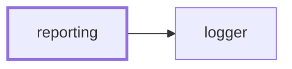

# 📝 Reporting

**Say what the codebase currently looks like, in markdown someone will read.**

Some questions about this repository are only worth answering as a report: what
the build weighs, how it moved since `main`, what is close to a limit. This is
the NestJS CLI that renders those reports, and splices each one into a document
between its own markers.

```bash
nx run reporting:report                      # every report
nx run reporting:report:bundles              # just the bundle sizes report
```

It is the reporting counterpart to
[synchronization](../synchronization/README.md): that tool keeps derived files
derived, this one writes down what is currently true.

## Why it lives here

The reports are about _this_ workspace — the `applications`/`packages`/`tools`
layout, the `main` branch a baseline comes from, the Nx targets that produced
the measurements. Those are facts here rather than settings, so this is a
workspace tool and not a publishable package.

## Reports

| Report | Renders |
| ------ | ------- |
| `bundles` | 🎒 Bundles — what every built bundle weighs, how it moved against a baseline, and how much of its limit it uses |

### 🎒 Bundles

Reads the `size-limit-report.json` each project's `bundlesize` target wrote and
compares it to a baseline snapshot of the same reports. It reads the JSON that
[size-limit](https://github.com/ai/size-limit) writes — a file format, not a
dependency; nothing here imports it.

The section reports every measured bundle with its size, baseline size, byte and
percentage change, limit, and share of that limit; a per-project subtotal; a
headline total with a callout for whatever grew most; bundles that were not
rebuilt, at their baseline size, collapsed; and separate counts of bundles that
appeared or disappeared.

Totals only ever compare bundles both sides measured. A renamed bundle is
reported as one addition and one removal rather than a saving, because counting
the removal without its replacement would invent a reduction that never
happened.

## Options

| Flag | Does |
| ---- | ---- |
| `--baseline <dir>` | Directory holding a baseline snapshot to compare against |
| `--baseline-url <url>` | Run URL the baseline came from, linked from the headline |
| `--markdown <file>` | Splice the report into this document, between its markers |
| `--output <file>` | Write the report to this file on its own (single reports only) |

With no destination a report goes to standard output, which is what makes it
inspectable before it is wired into anything.

## Adding a report

1. Generate a module: `nx generate conformetry:nestjs-command-module --name=<report>`.
2. Have its command implement `ReportableCommand` from
   [`reporting.types.ts`](src/modules/reporting/reporting.types.ts): a label, a
   marker pair no other report claims, and `renderReport(options)` returning the
   body as markdown — heading included, markers excluded.
3. Provide `ReportingService` and `ReportingMarkersService` in the report's own
   module. They are stateless, and providing them there rather than importing
   the reporting module — which imports every report module — keeps the graph
   acyclic.
4. Register the command in `ReportingCommand.getReports()` and add a
   configuration for it to the `report` target.

Wrapping, splicing, destination handling, and option narrowing are all handled
for you. A report only has to gather its data and render markdown.

## Where reports end up

Splicing into a file is the whole of the output contract. Getting that markdown
in front of a reader — a pull request description, an issue, a wiki page — is
the caller's job, which keeps this tool independent of any one forge. 👷 Make
Projects fetches a pull request description, runs the bundles report against it,
and puts it back.

## Project Graph

Where this project sits in the Nx project graph: what it depends on, and what depends on it. Regenerated by `nx run synchronization:synchronize --configuration=write`.

<!-- nx-project-graph-start -->



<!-- nx-project-graph-end -->

## Module Graph

The modules this project defines and the imports between them, regenerated by `nx run synchronization:synchronize --configuration=write`.

<!-- nestjs-module-graph-start -->


_Rounded modules are global: every module can inject them, so their edges are left out._

<!-- nestjs-module-graph-end -->

## Start

```bash
nx run reporting:start
```

## Test

```bash
nx run reporting:vitest
```
