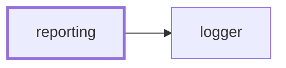

# 📝 Reporting

**Say what the codebase currently looks like, in markdown someone will read.**

Some questions about this repository are only worth answering as a report: what
the build weighs, how it moved since `main`, what is close to a limit. This is
the NestJS CLI that renders those reports, and splices each one into a document
between its own markers.

```bash
nx run reporting:report                      # every report
nx run reporting:report:bundles              # just the bundle sizes report
```

It is the reporting counterpart to
[synchronization](../synchronization/README.md): that tool keeps derived files
derived, this one writes down what is currently true.

## Why it lives here

The reports are about _this_ workspace — the `applications`/`packages`/`tools`
layout, the `main` branch a baseline comes from, the Nx targets that produced
the measurements. Those are facts here rather than settings, so this is a
workspace tool and not a publishable package.

## Reports

| Report | Renders |
| ------ | ------- |
| `bundles` | 🎒 Bundles — what every built bundle weighs, how it moved against a baseline, and how much of its limit it uses |

### 🎒 Bundles

Reads the `size-limit-report.json` each project's `bundlesize` target wrote and
compares it to a baseline snapshot of the same reports. It reads the JSON that
[size-limit](https://github.com/ai/size-limit) writes — a file format, not a
dependency; nothing here imports it.

The section reports every measured bundle with its size, baseline size, byte and
percentage change, limit, and share of that limit; a per-project subtotal; a
headline total with a callout for whatever grew most; bundles that were not
rebuilt, at their baseline size, collapsed; and separate counts of bundles that
appeared or disappeared.

Totals only ever compare bundles both sides measured. A renamed bundle is
reported as one addition and one removal rather than a saving, because counting
the removal without its replacement would invent a reduction that never
happened.

## Options

| Flag | Does |
| ---- | ---- |
| `--baseline <dir>` | Directory holding a baseline snapshot to compare against |
| `--baseline-url <url>` | Run URL the baseline came from, linked from the headline |
| `--markdown <file>` | Splice the report into this document, between its markers |
| `--output <file>` | Write the report to this file on its own (single reports only) |

With no destination a report goes to standard output, which is what makes it
inspectable before it is wired into anything.

## Adding a report

1. Generate a module: `nx generate conformetry:nestjs-command-module --name=<report>`.
2. Have its command implement `ReportableCommand` from
   [`reporting.types.ts`](src/modules/reporting/reporting.types.ts): a label, a
   marker pair no other report claims, and `renderReport(options)` returning the
   body as markdown — heading included, markers excluded.
3. Provide `ReportingService` and `ReportingMarkersService` in the report's own
   module. They are stateless, and providing them there rather than importing
   the reporting module — which imports every report module — keeps the graph
   acyclic.
4. Register the command in `ReportingCommand.getReports()` and add a
   configuration for it to the `report` target.

Wrapping, splicing, destination handling, and option narrowing are all handled
for you. A report only has to gather its data and render markdown.

## Where reports end up

Splicing into a file is the whole of the output contract. Getting that markdown
in front of a reader — a pull request description, an issue, a wiki page — is
the caller's job, which keeps this tool independent of any one forge. 👷 Make
Projects fetches a pull request description, runs the bundles report against it,
and puts it back.

## Project Graph

Where this project sits in the Nx project graph: what it depends on, and what depends on it. Regenerated by `nx run synchronization:synchronize --configuration=write`.

<!-- nx-project-graph-start -->



<!-- nx-project-graph-end -->

## Module Graph

The modules this project defines and the imports between them, regenerated by `nx run synchronization:synchronize --configuration=write`.

<!-- nestjs-module-graph-start -->


_Rounded modules are global: every module can inject them, so their edges are left out._

<!-- nestjs-module-graph-end -->

## Start

```bash
nx run reporting:start
```

## Test

```bash
nx run reporting:vitest
```

<!-- CALL_STACKS_START -->

## 🔭 Callidescope

Call stacks traced through `reporting`, deepest first. Each frame shows what it takes, what it returns, and what its documentation says.

| Measure | Value |
| --- | --- |
| Callables | 89 |
| Files | 22 |
| Calls traced | 111 |
| Call stacks | 15 |
| Deepest stack | 9 |
| Stacks through recursion | 0 |
| Unfollowable calls | 2 |

### Call stacks

**1. `BundlesCommand.run`** — depth 9 · decorated-method

```text
🚀 BundlesCommand.run(_passedParameters: string[], options: BundlesCommandOptions): Promise<void> [tools/reporting/src/modules/bundles/bundles.command.ts:103]
   ↳ Renders this report alone, to wherever the flags point.
  └─> ReportingService.emit(…): Promise<void> [tools/reporting/src/modules/reporting/reporting.service.ts:57]
     ↳ Renders one report and writes it wherever the destination says.
    └─> BundlesCommand.renderReport(options: ReportOptions): string [tools/reporting/src/modules/bundles/bundles.command.ts:92]
       ↳ Renders the report body from whatever the `bundlesize` target measured.
      └─> BundleMarkdownService.renderSection(args: RenderSectionArguments): string [tools/reporting/src/modules/bundle-markdown/bundle-markdown.service.ts:336]
         ↳ Renders the report body: its heading, and everything under it.
        └─> BundleMarkdownService.renderMeasuredTable(rows: readonly BundleRow[]): string[] [tools/reporting/src/modules/bundle-markdown/bundle-markdown.service.ts:178]
           ↳ Renders the table of everything this run rebuilt.
          └─> BundleMarkdownService.flatMap(…)(this: undefined, group: ProjectGroup): string[] [tools/reporting/src/modules/bundle-markdown/bundle-markdown.service.ts:186]
            └─> BundleMarkdownService.renderSubtotal(group: ProjectGroup): string[] [tools/reporting/src/modules/bundle-markdown/bundle-markdown.service.ts:214]
               ↳ Renders a project's rollup, which earns its line only with siblings.
              └─> formatDelta(delta: number | undefined): string [tools/reporting/src/modules/bundle-markdown/bundle-markdown.utilities.ts:26]
                 ↳ Formats a signed delta, or an em dash when there is no baseline.
                └─> formatBytes(bytes: number): string [tools/reporting/src/modules/bundle-markdown/bundle-markdown.utilities.ts:13]
                   ↳ Formats a byte count, switching to megabytes once kilobytes get unwieldy.
```

**2. `ReportingCommand.run`** — depth 9 · decorated-method

```text
🚀 ReportingCommand.run(_passedParameters: string[], options: ReportingCommandOptions): Promise<void> [tools/reporting/src/modules/reporting/reporting.command.ts:83]
   ↳ Render every report into the given destination.
  └─> ReportingService.emit(…): Promise<void> [tools/reporting/src/modules/reporting/reporting.service.ts:57]
     ↳ Renders one report and writes it wherever the destination says.
    └─> BundlesCommand.renderReport(options: ReportOptions): string [tools/reporting/src/modules/bundles/bundles.command.ts:92]
       ↳ Renders the report body from whatever the `bundlesize` target measured.
      └─> BundleMarkdownService.renderSection(args: RenderSectionArguments): string [tools/reporting/src/modules/bundle-markdown/bundle-markdown.service.ts:336]
         ↳ Renders the report body: its heading, and everything under it.
        └─> BundleMarkdownService.renderMeasuredTable(rows: readonly BundleRow[]): string[] [tools/reporting/src/modules/bundle-markdown/bundle-markdown.service.ts:178]
           ↳ Renders the table of everything this run rebuilt.
          └─> BundleMarkdownService.flatMap(…)(this: undefined, group: ProjectGroup): string[] [tools/reporting/src/modules/bundle-markdown/bundle-markdown.service.ts:186]
            └─> BundleMarkdownService.renderSubtotal(group: ProjectGroup): string[] [tools/reporting/src/modules/bundle-markdown/bundle-markdown.service.ts:214]
               ↳ Renders a project's rollup, which earns its line only with siblings.
              └─> formatDelta(delta: number | undefined): string [tools/reporting/src/modules/bundle-markdown/bundle-markdown.utilities.ts:26]
                 ↳ Formats a signed delta, or an em dash when there is no baseline.
                └─> formatBytes(bytes: number): string [tools/reporting/src/modules/bundle-markdown/bundle-markdown.utilities.ts:13]
                   ↳ Formats a byte count, switching to megabytes once kilobytes get unwieldy.
```

**3. `BundlesService.collectProjectRows`** — depth 4 · orphan-root

```text
🚀 BundlesService.collectProjectRows(args: CollectProjectRowsArguments): BundleRow[] [tools/reporting/src/modules/bundles/bundles.service.ts:86]
   ↳ Joins one project's current report to its baseline.
  └─> BundlesService.readBaseline(args: CollectProjectRowsArguments): Map<string, SizeLimitEntry> [tools/reporting/src/modules/bundles/bundles.service.ts:105]
     ↳ Reads a baseline report into a name-to-entry lookup.
    └─> BundlesService.readReport(workingDirectory: string, reportPath: string): SizeLimitEntry[] [tools/reporting/src/modules/bundles/bundles.service.ts:122]
       ↳ Parses a size-limit report, tolerating an absent or malformed file.
      └─> BundlesService.map(…)(…): { size: number; name: string; passed?: boolean | undefined; sizeLimit?: number | undefined; } [tools/reporting/src/modules/bundles/bundles.service.ts:134]
```

<details>
<summary>12 more call stacks</summary>

**4. `BundleMarkdownService.renderRow`** — depth 3 · orphan-root

```text
🚀 BundleMarkdownService.renderRow(row: BundleRow): string [tools/reporting/src/modules/bundle-markdown/bundle-markdown.service.ts:195]
   ↳ Renders one table row.
  └─> BundleMarkdownService.readStatus(row: BundleRow): string [tools/reporting/src/modules/bundle-markdown/bundle-markdown.service.ts:146]
     ↳ Picks the status icon for one row of the measured table.
    └─> BundleMarkdownService.readGrowthStatus(row: BundleRow): string [tools/reporting/src/modules/bundle-markdown/bundle-markdown.service.ts:123]
       ↳ Picks the icon for a rebuilt bundle, from how far it moved.
```

**5. `BundlesCommand.parseBaseline`** — depth 2 · decorated-method

```text
🚀 BundlesCommand.parseBaseline(value: unknown): string | undefined [tools/reporting/src/modules/bundles/bundles.command.ts:56]
   ↳ Parse the baseline directory holding a snapshot of the reports.
  └─> ReportingService.readOptionalText(value: unknown): string | undefined [tools/reporting/src/modules/reporting/reporting.service.ts:103]
     ↳ Narrows an option that carries text, or nothing at all.
```

**6. `BundlesCommand.parseBaselineUrl`** — depth 2 · decorated-method

```text
🚀 BundlesCommand.parseBaselineUrl(value: unknown): string | undefined [tools/reporting/src/modules/bundles/bundles.command.ts:65]
   ↳ Parse the run URL the baseline came from, linked from the headline.
  └─> ReportingService.readOptionalText(value: unknown): string | undefined [tools/reporting/src/modules/reporting/reporting.service.ts:103]
     ↳ Narrows an option that carries text, or nothing at all.
```

**7. `BundlesCommand.parseMarkdown`** — depth 2 · decorated-method

```text
🚀 BundlesCommand.parseMarkdown(value: unknown): string | undefined [tools/reporting/src/modules/bundles/bundles.command.ts:74]
   ↳ Parse the markdown document the report is spliced into.
  └─> ReportingService.readOptionalText(value: unknown): string | undefined [tools/reporting/src/modules/reporting/reporting.service.ts:103]
     ↳ Narrows an option that carries text, or nothing at all.
```

**8. `BundlesCommand.parseOutput`** — depth 2 · decorated-method

```text
🚀 BundlesCommand.parseOutput(value: unknown): string | undefined [tools/reporting/src/modules/bundles/bundles.command.ts:83]
   ↳ Parse the file the report is written to on its own.
  └─> ReportingService.readOptionalText(value: unknown): string | undefined [tools/reporting/src/modules/reporting/reporting.service.ts:103]
     ↳ Narrows an option that carries text, or nothing at all.
```

**9. `ReportingCommand.parseBaseline`** — depth 2 · decorated-method

```text
🚀 ReportingCommand.parseBaseline(value: unknown): string | undefined [tools/reporting/src/modules/reporting/reporting.command.ts:56]
   ↳ Parse the baseline directory holding a snapshot to compare against.
  └─> ReportingService.readOptionalText(value: unknown): string | undefined [tools/reporting/src/modules/reporting/reporting.service.ts:103]
     ↳ Narrows an option that carries text, or nothing at all.
```

**10. `ReportingCommand.parseBaselineUrl`** — depth 2 · decorated-method

```text
🚀 ReportingCommand.parseBaselineUrl(value: unknown): string | undefined [tools/reporting/src/modules/reporting/reporting.command.ts:65]
   ↳ Parse the run URL the baseline came from.
  └─> ReportingService.readOptionalText(value: unknown): string | undefined [tools/reporting/src/modules/reporting/reporting.service.ts:103]
     ↳ Narrows an option that carries text, or nothing at all.
```

**11. `ReportingCommand.parseMarkdown`** — depth 2 · decorated-method

```text
🚀 ReportingCommand.parseMarkdown(value: unknown): string | undefined [tools/reporting/src/modules/reporting/reporting.command.ts:74]
   ↳ Parse the markdown document every report is spliced into.
  └─> ReportingService.readOptionalText(value: unknown): string | undefined [tools/reporting/src/modules/reporting/reporting.service.ts:103]
     ↳ Narrows an option that carries text, or nothing at all.
```

**12. `main`** — depth ≥ 2 · module-bootstrap

```text
🚀 main(): Promise<void> [tools/reporting/src/main.ts:9]
   ↳ Bootstraps the bundle sizes CLI application.
  └─> LoggerService.constructor(): LoggerService [packages/logger/src/modules/logger/logger.service.ts:36]
```

**13. `ReportingService.constructor`** — depth 2 · orphan-root

```text
🚀 ReportingService.constructor(…): ReportingService [tools/reporting/src/modules/reporting/reporting.service.ts:27]
  └─> LoggerService.setContext(context: string): void [packages/logger/src/modules/logger/logger.service.ts:235]
     ↳ Sets the context label included in every subsequent log line.
```

**14. `BundlesCommand.constructor`** — depth ≥ 2 · orphan-root

```text
🚀 BundlesCommand.constructor(…): BundlesCommand [tools/reporting/src/modules/bundles/bundles.command.ts:33]
  └─> LoggerService.setContext(context: string): void [packages/logger/src/modules/logger/logger.service.ts:235]
     ↳ Sets the context label included in every subsequent log line.
```

**15. `ReportingCommand.constructor`** — depth ≥ 2 · orphan-root

```text
🚀 ReportingCommand.constructor(…): ReportingCommand [tools/reporting/src/modules/reporting/reporting.command.ts:33]
  └─> LoggerService.setContext(context: string): void [packages/logger/src/modules/logger/logger.service.ts:235]
     ↳ Sets the context label included in every subsequent log line.
```

</details>

### Module spread

None.

### Possibly misplaced

None.
<!-- CALL_STACKS_END -->
