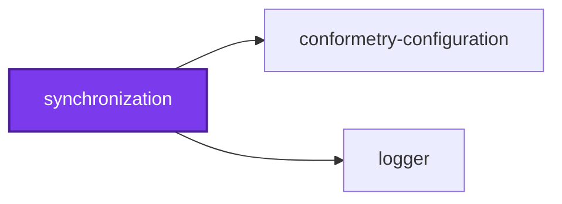
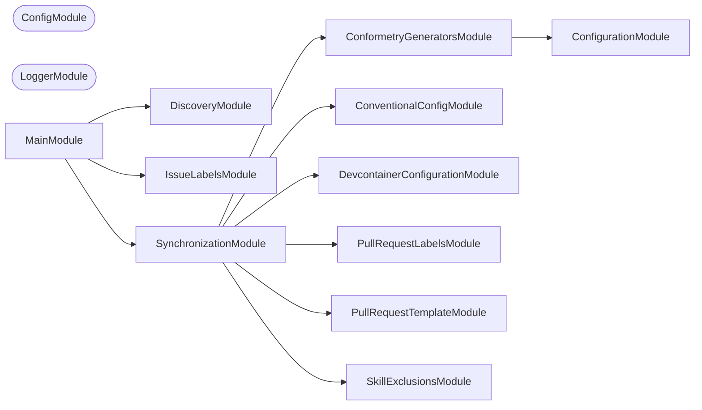

# ↔️ Synchronization

**Keep the derived files derived.**

Some files in this workspace are not really written — they are copies of, or
tables generated from, something else. The generator table in `AGENTS.md` comes
from the conformetry configuration. The cloud devcontainer shares most of its
fields with the local one. The PR template appears verbatim inside a skill.

Every one of those is a place where two files can quietly disagree.
Synchronization is the NestJS CLI that regenerates them, and the CI check that
fails when someone edits the copy instead of the source.

## Usage

Every synchronization command is its own Nx target on this project, run
directly rather than through a shared aggregate — the same way
[`codebase:codometer`](../../packages/codometer-cli/README.md) and
[`codebase:callidescope`](../../packages/callidescope-cli/README.md) are named
by their own callers instead of looping through one process:

```bash
nx run synchronization:conformetry-generators          # check (the default)
nx run synchronization:conformetry-generators:write     # regenerate
```

Every command runs in one of two modes:

| Mode    | Does                                                           |
| ------- | -------------------------------------------------------------- |
| `check` | Compares, writes nothing, exits non-zero on drift. The default |
| `write` | Regenerates the derived file from its source                   |

`start` runs every synchronization command in one process instead of one at a
time — the only target that does. No workflow or `lint-staged` pattern names
it; it exists purely for a human at a terminal who wants to check or write
everything in one command:

```bash
nx run synchronization:start          # check every synchronization
nx run synchronization:start:write    # write every synchronization
```

## Where each synchronization's drift is answered

Which runs check which synchronization is a property of the caller, not a
taxonomy the commands declare about themselves. Five of the six — every one
except `pull-request-labels` — are **derivations**: committed files derived
from configuration a pull request can also change, so `check` runs on a pull
request and `write` runs on the default branch's release. The
[🧑‍💻 Lint Codebase](../../.github/workflows/lint-codebase.yml) workflow and
[`configuration/lint-staged.config.ts`](../../configuration/lint-staged.config.ts)
each name every derivation target directly alongside `lint-codebase` in one
`nx affected` invocation, rather than reaching them through
[`lint-codebase`](../../AGENTS.md#code-quality)'s `dependsOn` — Nx forwards an
explicit configuration down `dependsOn`, so an edge there would let
`lint-codebase --configuration=write` publish from a branch.

`pull-request-labels` needs credentials: its destination is GitHub's label set
rather than a file in the tree, so reaching it needs a token that neither a
fork nor a developer's `lint-codebase` run has. It must not run in
`lint-codebase`, and it must not wait for the default branch either — a change
introducing a new scope needs that scope's label to exist before 🧾 Validate
Pull Request Metadata runs on the very same pull request. So the one caller
holding a token, [validate-conventions.yml](../../.github/workflows/validate-conventions.yml),
runs its `write` mode directly through `node` rather than through this Nx
target, on `opened`/`reopened`, and nothing else names it.

## What it synchronizes

| Command                      | Source                                   | Destination                                                                                           |
| ---------------------------- | ---------------------------------------- | ----------------------------------------------------------------------------------------------------- |
| `conformetry-generators`     | `configuration/conformetry.config.ts`    | The generator table in `AGENTS.md`, between marker comments                                           |
| `conventional-config`        | `configuration/conventional.config.cjs`  | The commit type and scope tables, commitlint, and release configuration                               |
| `devcontainer-configuration` | `.devcontainer/local/devcontainer.json`  | The shared fields of `.devcontainer/cloud/devcontainer.json`                                          |
| `pull-request-labels`        | `configuration/conventional.config.cjs`  | This repository's `type:`, `scope:`, and `source:` labels on GitHub. Needs credentials                |
| `pull-request-template`      | `.github/PULL_REQUEST_TEMPLATE.md`       | The template embedded in the PR skill files                                                           |
| `skill-exclusions`           | `skills-lock.json`                       | The installed-skill exclusion lists in five ignore files                                              |

### Pull request labels

`pull-request-labels` is the odd one out: its destination is GitHub rather than
a file. It reads `configuration/conventional.config.cjs` and reconciles the
repository's labels against it — every `type:<name>`, every lowercased
`scope:<name>`, and the three `do-not-merge`, `source:agent`, and
`source:human` labels that no configuration derives. It creates what is missing
and edits whatever color or description drifted.

It never deletes. A label the configuration dropped may still be on open pull
requests, and removing it there loses information no run can put back, so a
stale `type:`, `scope:`, or `source:` label is reported with the
`gh label delete` command that would remove it, for a human to decide on. This
repository has one standing already, which is why "nothing needed creating or
updating" is said explicitly rather than inferred from an empty report — the
report is never fully empty even on a perfectly reconciled run.

It also always succeeds. A missing label is a fact about the repository under
review rather than a defect in the pull request, and a `gh` that is absent,
read-only on a fork, or rate-limited is an environment rather than an answer —
both are warnings, so this can never be why a pull request goes red. Reads and
writes both go through the `gh` client, which already resolves the repository
from the checkout and the token from the environment.

Run it on its own through its own Nx target:

```bash
nx run synchronization:pull-request-labels:write
```

## Why callers name targets directly

Every synchronization command used to be selected through a shared aggregate's
`--kinds` flag, so a caller asked for a set of kinds rather than for the
commands it actually wanted. That flag needed a taxonomy describing which
commands each caller wanted, and the taxonomy kept stretching every time a new
caller's requirements did not fit the existing values.

Each command is its own Nx target instead, run directly the way
[`codebase:codometer`](../../packages/codometer-cli/README.md) and
[`codebase:callidescope`](../../packages/callidescope-cli/README.md) are named
by their own callers. Which commands a caller wants is a property of the
caller — the list of `--target` flags it passes — rather than something the
commands declare about themselves centrally. Each target declares its own
sources as `inputs`, so `nx affected` only reruns it when a file it actually
reads has changed, and each caller decides for itself which targets belong in
which invocation:

- [🧑‍💻 Lint Codebase](../../.github/workflows/lint-codebase.yml) and
  [`configuration/lint-staged.config.ts`](../../configuration/lint-staged.config.ts)
  each name every derivation target directly alongside `lint-codebase` in one
  `nx affected` invocation, so a pull request and a commit both check drift.
- The release workflow runs every derivation's `write` configuration through
  `nx run-many`, so one command still publishes everything.
- [validate-conventions.yml](../../.github/workflows/validate-conventions.yml)
  runs `pull-request-labels write` directly through `node`, bypassing Nx
  entirely, since it is the one caller with a token and needs no project graph.

None of these callers reach for `start`. `SynchronizationCommand` still exists
and still loops over every command in one process — that part of the old
design was never the problem, and Nx's own `run-many` gives no way to run a
plain Node command with no target of its own — but nothing selects a subset
through it, so it needs no taxonomy: `start` always means all of them.

## Adding a synchronizer

1. Generate a module: `nx g conformetry:nestjs-command-module --name=<domain> --project=synchronization`
2. Implement `SynchronizableCommand` — a `synchronizationLabel` and a
   `synchronize(mode)` returning whether the destination was already current.
3. Add a top-level target for it in `project.json`, with `check`/`write`
   configurations and its own source paths as `inputs`, the same shape as the
   existing six. That target is the whole declaration of where the command
   runs: name it directly wherever it belongs — `lint-codebase`'s dependents
   for a derivation, the release workflow's `run-many` for a report, or a
   caller with its own credentials for anything needing them.
4. Register the command in `SynchronizationCommand.getCommands()`, and import
   its module in `SynchronizationModule`, so `start` still drives it alongside
   every other synchronization.

## Start

```bash
nx run synchronization:start
```

## Test

```bash
nx run synchronization:vitest
```

## Development

```bash
nx run synchronization:repl
nx run synchronization:lint-codebase --configuration=write
```

## License

MIT — see [LICENSE](../../LICENSE).

## 👔 Conformetry

This project was generated from the [nestjs-command-project](../../configuration/conformetry-templates/nestjs-command-project) conformetry template.

<!-- CALL_STACKS_START -->

## 🔭 Callidescope

Call stacks traced through `tools/synchronization`, deepest first. Each frame shows what it takes, what it returns, and what its documentation says.

| Measure | Value |
| --- | --- |
| Callables | 203 |
| Files | 47 |
| Calls traced | 218 |
| Call stacks | 11 |
| Deepest stack | 10 |
| Stacks through recursion | 0 |
| Unfollowable calls | 8 |

### Call stacks (depth)

**1. `SynchronizationCommand.run`** — depth ≥ 10 · decorated-method

```text
🚀 SynchronizationCommand.run(passedParameters: string[]): Promise<void> [tools/synchronization/src/modules/synchronization/synchronization.command.ts:115]
   ↳ Runs every synchronization, exiting once if any reported drift.
  └─> SynchronizationCommand.synchronize(mode: SynchronizationMode): Promise<boolean> [tools/synchronization/src/modules/synchronization/synchronization.command.ts:137]
     ↳ Runs every synchronization and reports whether all succeeded.
    └─> ConventionalConfigCommand.synchronize(mode: SynchronizationMode): Promise<boolean> [tools/synchronization/src/modules/conventional-config/conventional-config.command.ts:70]
       ↳ Synchronizes conventional-commit config and reports success without exiting.
      └─> ConventionalConfigService.runSynchronization(mode: string): boolean [tools/synchronization/src/modules/conventional-config/conventional-config.service.ts:240]
         ↳ Runs the workflow in check or write mode, reporting whether it succeeded.
        └─> ConventionalConfigService.handleCheckMode(context: SyncContext): boolean [tools/synchronization/src/modules/conventional-config/conventional-config.service.ts:126]
           ↳ Check mode: validates all configuration files are in sync with conventional.config.cjs, reporting success rather than…
          └─> ConventionalConfigValidatorsService.checkAllSkillsSync(config: ConventionalConfig, skillFiles: string[]): boolean [tools/synchronization/src/modules/conventional-config/conventional-config-validators.service.ts:155]
             ↳ Validates that every configured skill file has synchronized type/scope tables.
            └─> ConventionalConfigValidatorsService.checkSkillSync(config: ConventionalConfig, skillFile: string): boolean [tools/synchronization/src/modules/conventional-config/conventional-config-validators.service.ts:293]
               ↳ Validates a skill file's type/scope markdown tables against source config.
              └─> ConventionalConfigValidatorsService.checkMarkerSync(…): boolean [tools/synchronization/src/modules/conventional-config/conventional-config-validators.service.ts:41]
                 ↳ Checks that a named marker block in a skill file matches the source config values.
                └─> ConventionalConfigValidatorsService.readMarkerValues(…): { skillValues: string[]; } | undefined [tools/synchronization/src/modules/conventional-config/conventional-config-validators.service.ts:76]
                   ↳ Extracts and returns parsed table values from a named marker block, or undefined if missing.
                  └─> ConventionalConfigIoService.extractMarkerContent(content: string, markerName: string): string | undefined [tools/synchronization/src/modules/conventional-config/conventional-config-io.service.ts:127]
                     ↳ Extracts text content between named HTML comment markers.
```

**2. `ConventionalConfigCommand.run`** — depth 9 · decorated-method

```text
🚀 ConventionalConfigCommand.run(passedParameters: string[], _options?: Record<string, unknown>): Promise<void> [tools/synchronization/src/modules/conventional-config/conventional-config.command.ts:51]
   ↳ Runs the conventional-config sync command, delegating to helpers and exiting 1 on drift.
  └─> ConventionalConfigCommand.synchronize(mode: SynchronizationMode): Promise<boolean> [tools/synchronization/src/modules/conventional-config/conventional-config.command.ts:70]
     ↳ Synchronizes conventional-commit config and reports success without exiting.
    └─> ConventionalConfigService.runSynchronization(mode: string): boolean [tools/synchronization/src/modules/conventional-config/conventional-config.service.ts:240]
       ↳ Runs the workflow in check or write mode, reporting whether it succeeded.
      └─> ConventionalConfigService.handleCheckMode(context: SyncContext): boolean [tools/synchronization/src/modules/conventional-config/conventional-config.service.ts:126]
         ↳ Check mode: validates all configuration files are in sync with conventional.config.cjs, reporting success rather than…
        └─> ConventionalConfigValidatorsService.checkAllSkillsSync(config: ConventionalConfig, skillFiles: string[]): boolean [tools/synchronization/src/modules/conventional-config/conventional-config-validators.service.ts:155]
           ↳ Validates that every configured skill file has synchronized type/scope tables.
          └─> ConventionalConfigValidatorsService.checkSkillSync(config: ConventionalConfig, skillFile: string): boolean [tools/synchronization/src/modules/conventional-config/conventional-config-validators.service.ts:293]
             ↳ Validates a skill file's type/scope markdown tables against source config.
            └─> ConventionalConfigValidatorsService.checkMarkerSync(…): boolean [tools/synchronization/src/modules/conventional-config/conventional-config-validators.service.ts:41]
               ↳ Checks that a named marker block in a skill file matches the source config values.
              └─> ConventionalConfigValidatorsService.readMarkerValues(…): { skillValues: string[]; } | undefined [tools/synchronization/src/modules/conventional-config/conventional-config-validators.service.ts:76]
                 ↳ Extracts and returns parsed table values from a named marker block, or undefined if missing.
                └─> ConventionalConfigIoService.extractMarkerContent(content: string, markerName: string): string | undefined [tools/synchronization/src/modules/conventional-config/conventional-config-io.service.ts:127]
                   ↳ Extracts text content between named HTML comment markers.
```

**3. `ConformetryGeneratorsCommand.run`** — depth ≥ 7 · decorated-method

```text
🚀 ConformetryGeneratorsCommand.run(passedParameters: string[], _options?: Record<string, unknown>): Promise<void> [tools/synchronization/src/modules/conformetry-generators/conformetry-generators.command.ts:204]
   ↳ Runs the conformetry-generators sync command in check or write mode.
  └─> ConformetryGeneratorsCommand.synchronize(mode: SynchronizationMode): Promise<boolean> [tools/synchronization/src/modules/conformetry-generators/conformetry-generators.command.ts:222]
     ↳ Synchronizes the generators table and reports success without exiting.
    └─> ConformetryGeneratorsCommand.checkSync(generators: ConformetryGeneratorMetadata[]): boolean [tools/synchronization/src/modules/conformetry-generators/conformetry-generators.command.ts:63]
       ↳ Compares the generated generators table against the stored content in every target file and reports any differences.
      └─> ConformetryGeneratorsCommand.filter(…)(targetFile: ConformetryGeneratorsTargetFile): boolean [tools/synchronization/src/modules/conformetry-generators/conformetry-generators.command.ts:65]
        └─> ConformetryGeneratorsCommand.generateGeneratorsTable(generators: ConformetryGeneratorMetadata[], includeAlias: boolean): string [tools/synchronization/src/modules/conformetry-generators/conformetry-generators.command.ts:102]
           ↳ Renders the list of generators as a markdown table for injection into a target file, optionally including the Alias…
          └─> ConformetryGeneratorsCommand.map(…)(gen: ConformetryGeneratorMetadata): string [tools/synchronization/src/modules/conformetry-generators/conformetry-generators.command.ts:109]
            └─> ConformetryGeneratorsCommand.map(…)(a: string): string [tools/synchronization/src/modules/conformetry-generators/conformetry-generators.command.ts:113]
```

<details>
<summary>8 more call stacks</summary>

**4. `PullRequestLabelsCommand.run`** — depth 7 · decorated-method

```text
🚀 PullRequestLabelsCommand.run(passedParameters: string[]): Promise<void> [tools/synchronization/src/modules/pull-request-labels/pull-request-labels.command.ts:281]
   ↳ Runs the pull-request-labels reconciliation in check or write mode.
  └─> PullRequestLabelsCommand.synchronize(mode: SynchronizationMode): Promise<boolean> [tools/synchronization/src/modules/pull-request-labels/pull-request-labels.command.ts:300]
     ↳ Reconciles the label vocabulary and always reports success.
    └─> PullRequestLabelsCommand.reconcile(mode: SynchronizationMode, reportLines: string[]): void [tools/synchronization/src/modules/pull-request-labels/pull-request-labels.command.ts:175]
       ↳ Reconciles the vocabulary, appending everything it did to the report.
      └─> PullRequestLabelsService.planReconciliation(…): LabelReconciliationPlan [tools/synchronization/src/modules/pull-request-labels/pull-request-labels.service.ts:66]
         ↳ Works out what reconciling would create, update, and leave behind.
        └─> PullRequestLabelsService.filter(…)(label: ConventionalLabel): boolean [tools/synchronization/src/modules/pull-request-labels/pull-request-labels.service.ts:82]
          └─> PullRequestLabelsService.isTrackedLabel(labelName: string): boolean [tools/synchronization/src/modules/pull-request-labels/pull-request-labels.service.ts:45]
             ↳ Whether this reconciliation owns the label with this name.
            └─> PullRequestLabelsService.some(…)(prefix: string): boolean [tools/synchronization/src/modules/pull-request-labels/pull-request-labels.service.ts:46]
```

**5. `PullRequestTemplateCommand.run`** — depth 6 · decorated-method

```text
🚀 PullRequestTemplateCommand.run(passedParameters: string[], _options?: Record<string, unknown>): Promise<void> [tools/synchronization/src/modules/pull-request-template/pull-request-template.command.ts:202]
   ↳ Runs the pull-request-template sync command in check or write mode.
  └─> PullRequestTemplateCommand.synchronize(mode: SynchronizationMode): Promise<boolean> [tools/synchronization/src/modules/pull-request-template/pull-request-template.command.ts:221]
     ↳ Synchronizes the PR template and reports success without exiting.
    └─> PullRequestTemplateCommand.handleWriteMode(templateContent: string, targetFiles: string[]): void [tools/synchronization/src/modules/pull-request-template/pull-request-template.command.ts:129]
       ↳ Writes the current PR template into any target files that are out of sync.
      └─> PullRequestTemplateCommand.filter(…)(targetFile: string): boolean [tools/synchronization/src/modules/pull-request-template/pull-request-template.command.ts:134]
        └─> PullRequestTemplateCommand.checkTargetSync(templateContent: string, targetFile: string): boolean [tools/synchronization/src/modules/pull-request-template/pull-request-template.command.ts:55]
           ↳ Checks whether the target file's marker block matches the current PR template.
          └─> PullRequestTemplateCommand.extractMarkerContent(content: string, markerName: string): string | undefined [tools/synchronization/src/modules/pull-request-template/pull-request-template.command.ts:90]
             ↳ Extracts the content between start and end marker comments from a file.
```

**6. `SkillExclusionsCommand.run`** — depth 6 · decorated-method

```text
🚀 SkillExclusionsCommand.run(passedParameters: string[]): Promise<void> [tools/synchronization/src/modules/skill-exclusions/skill-exclusions.command.ts:165]
   ↳ Runs the skill-exclusions sync command in check or write mode.
  └─> SkillExclusionsCommand.synchronize(mode: SynchronizationMode): Promise<boolean> [tools/synchronization/src/modules/skill-exclusions/skill-exclusions.command.ts:180]
     ↳ Synchronizes the exclusion lists and reports success without exiting.
    └─> SkillExclusionsCommand.findStaleFiles(skillNames: string[]): string[] [tools/synchronization/src/modules/skill-exclusions/skill-exclusions.command.ts:71]
       ↳ Every file whose generated block differs from what the lockfile implies.
      └─> SkillExclusionsCommand.filter(…)(file: SkillExclusionFile): boolean [tools/synchronization/src/modules/skill-exclusions/skill-exclusions.command.ts:72]
        └─> SkillExclusionsCommand.readExclusionFile(…): { afterMarker: string; beforeMarker: string; generatedContent: string; } [tools/synchronization/src/modules/skill-exclusions/skill-exclusions.command.ts:82]
           ↳ Splits one exclusion file around its generated block.
          └─> SkillExclusionsCommand.renderStartMarker(file: SkillExclusionFile): string [tools/synchronization/src/modules/skill-exclusions/skill-exclusions.command.ts:139]
             ↳ The comment opening this file's generated block, in its own syntax.
```

**7. `IssueLabelsCommand.run`** — depth 5 · decorated-method

```text
🚀 IssueLabelsCommand.run(): Promise<void> [tools/synchronization/src/modules/issue-labels/issue-labels.command.ts:158]
   ↳ Adds whichever type and scope labels the issue's body implies.
  └─> IssueLabelsCommand.resolvePlan(): undefined | { issueNumber: string; missingLabels: string[]; } [tools/synchronization/src/modules/issue-labels/issue-labels.command.ts:130]
     ↳ What this run needs to do, or `undefined` when there is nothing to add.
    └─> IssueLabelsCommand.readExistingLabelNames(): string[] [tools/synchronization/src/modules/issue-labels/issue-labels.command.ts:94]
       ↳ Reads the labels already on the issue, from `ISSUE_LABELS`.
      └─> IssueLabelsCommand.readLabelNames(entries: unknown[]): string[] [tools/synchronization/src/modules/issue-labels/issue-labels.command.ts:118]
         ↳ Every label name in this array, with the nameless entries dropped.
        └─> IssueLabelsCommand.filter(…)(name: string): boolean [tools/synchronization/src/modules/issue-labels/issue-labels.command.ts:121]
```

**8. `DevcontainerConfigurationCommand.run`** — depth 5 · decorated-method

```text
🚀 DevcontainerConfigurationCommand.run(passedParameters: string[], _options?: Record<string, unknown>): Promise<void> [tools/synchronization/src/modules/devcontainer-configuration/devcontainer-configuration.command.ts:266]
   ↳ Runs the devcontainer-configuration sync command in check or write mode.
  └─> DevcontainerConfigurationCommand.synchronize(mode: SynchronizationMode): Promise<boolean> [tools/synchronization/src/modules/devcontainer-configuration/devcontainer-configuration.command.ts:285]
     ↳ Synchronizes the cloud devcontainer config and reports success without exiting.
    └─> DevcontainerConfigurationCommand.applySync(…): DevcontainerConfiguration [tools/synchronization/src/modules/devcontainer-configuration/devcontainer-configuration.command.ts:59]
       ↳ Merges local devcontainer fields into a copy of the cloud config, preserving cloud-only keys.
      └─> DevcontainerConfigurationCommand.syncFeatures(…): void [tools/synchronization/src/modules/devcontainer-configuration/devcontainer-configuration.command.ts:180]
         ↳ Merges features from local and cloud configs, keeping Docker features from cloud.
        └─> DevcontainerConfigurationCommand.isDockerFeatureKey(key: string): boolean [tools/synchronization/src/modules/devcontainer-configuration/devcontainer-configuration.command.ts:127]
           ↳ Returns true if the feature key refers to a Docker-in-Docker or Docker-outside-of-Docker feature.
```

**9. `SynchronizationMarkersService.extractContent`** — depth 3 · orphan-root

```text
🚀 SynchronizationMarkersService.extractContent(content: string, markerName: string): string | undefined [tools/synchronization/src/modules/synchronization/synchronization-markers.service.ts:44]
   ↳ Returns the content between the markers, or undefined when absent.
  └─> SynchronizationMarkersService.locateMarkers(…): { endIndex: number; startIndex: number; } | undefined [tools/synchronization/src/modules/synchronization/synchronization-markers.service.ts:24]
     ↳ Returns the index range the markers enclose, or undefined when absent.
    └─> SynchronizationMarkersService.getStartMarker(markerName: string): string [tools/synchronization/src/modules/synchronization/synchronization-markers.service.ts:57]
       ↳ Renders the opening marker comment for a marker name.
```

**10. `SynchronizationMarkersService.replaceContent`** — depth 3 · orphan-root

```text
🚀 SynchronizationMarkersService.replaceContent(content: string, markerName: string, replacement: string): string [tools/synchronization/src/modules/synchronization/synchronization-markers.service.ts:65]
   ↳ Replaces the content between the markers, surrounding it with the blank lines markdown needs for the block to be parsed…
  └─> SynchronizationMarkersService.locateMarkers(…): { endIndex: number; startIndex: number; } | undefined [tools/synchronization/src/modules/synchronization/synchronization-markers.service.ts:24]
     ↳ Returns the index range the markers enclose, or undefined when absent.
    └─> SynchronizationMarkersService.getStartMarker(markerName: string): string [tools/synchronization/src/modules/synchronization/synchronization-markers.service.ts:57]
       ↳ Renders the opening marker comment for a marker name.
```

**11. `IssueLabelsCommand.nameOf`** — depth 2 · orphan-root

```text
🚀 IssueLabelsCommand.nameOf(entry: unknown): string [tools/synchronization/src/modules/issue-labels/issue-labels.command.ts:82]
   ↳ Reads one label entry's name, whichever shape it arrived in.
  └─> IssueLabelsCommand.isRecord(value: unknown): value is Record<string, unknown> [tools/synchronization/src/modules/issue-labels/issue-labels.command.ts:77]
     ↳ Whether this value can be read by property name at all.
```

</details>

### Module spread

None.

### Breadth

| Callable | Breadth | Calls directly | Location |
| --- | --- | --- | --- |
| `PullRequestLabelsCommand.reconcile` | 9 | `PullRequestLabelsGithubService.run`, `PullRequestLabelsCommand.appendToReport`, `PullRequestLabelsGithubService.describeFailure`, `PullRequestLabelsService.planReconciliation`, `PullRequestLabelsService.parseRepositoryLabels`, `PullRequestLabelsService.readExpectedLabels`, `PullRequestLabelsCommand.describeError`, `PullRequestLabelsCommand.reportPlan`, `PullRequestLabelsCommand.reportStaleLabels` | `tools/synchronization/src/modules/pull-request-labels/pull-request-labels.command.ts:175` |
| `SynchronizationCommand.synchronize` | 9 | `SynchronizationCommand.getCommands`, `ConformetryGeneratorsCommand.synchronize`, `ConventionalConfigCommand.synchronize`, `DevcontainerConfigurationCommand.synchronize`, `PullRequestLabelsCommand.synchronize`, `PullRequestTemplateCommand.synchronize`, `SkillExclusionsCommand.synchronize`, `SynchronizationCommand.reportResults`, `SynchronizationCommand.every(…)` | `tools/synchronization/src/modules/synchronization/synchronization.command.ts:137` |
| `ConventionalConfigService.handleCheckMode` | 8 | `ConventionalConfigValidatorsService.checkSettingsSync`, `ConventionalConfigValidatorsService.checkAllSkillsSync`, `ConventionalConfigValidatorsService.checkAllTemplatesSync`, `ConventionalConfigService.loadReleaseConfig`, `ConventionalConfigValidatorsService.checkReleaseRulesSync`, `ConventionalConfigIoService.getReleaseRulesTypes`, `ConventionalConfigValidatorsService.checkPresetConfigSync`, `ConventionalConfigIoService.getPresetConfigTypes` | `tools/synchronization/src/modules/conventional-config/conventional-config.service.ts:126` |

<details>
<summary>87 more callables</summary>

| Callable | Breadth | Calls directly | Location |
| --- | --- | --- | --- |
| `ConventionalConfigService.handleWriteMode` | 7 | `ConventionalConfigValidatorsService.checkSettingsSync`, `ConventionalConfigService.filter(…)`, `ConventionalConfigService.filter(…)`, `ConventionalConfigIoService.writeSettingsSync`, `ConventionalConfigIoService.writeSkillSync`, `ConventionalConfigIoService.writeIssueTemplateSync`, `ConventionalConfigService.syncReleaseConfigIfNeeded` | `tools/synchronization/src/modules/conventional-config/conventional-config.service.ts:182` |
| `ConventionalConfigIoService.writeReleaseConfigSync` | 6 | `ConventionalConfigIoService.map(…)`, `ConventionalConfigIoService.filter(…)`, `ConventionalConfigIoService.getReleaseRulesTypes`, `ConventionalConfigIoService.getPresetConfigTypes`, `ConventionalConfigIoService.appendToReleaseRules`, `ConventionalConfigIoService.appendToPresetTypes` | `tools/synchronization/src/modules/conventional-config/conventional-config-io.service.ts:290` |
| `ConventionalConfigService.runSynchronization` | 6 | `ConventionalConfigService.loadConventionalConfig`, `ConventionalConfigService.map(…)`, `ConventionalConfigIoService.parseSettingsScopes`, `ConventionalConfigService.map(…)`, `ConventionalConfigService.handleCheckMode`, `ConventionalConfigService.handleWriteMode` | `tools/synchronization/src/modules/conventional-config/conventional-config.service.ts:240` |
| `PullRequestLabelsService.planReconciliation` | 6 | `PullRequestLabelsService.map(…)`, `PullRequestLabelsService.map(…)`, `PullRequestLabelsService.filter(…)`, `PullRequestLabelsService.map(…)`, `PullRequestLabelsService.filter(…)`, `PullRequestLabelsService.filter(…)` | `tools/synchronization/src/modules/pull-request-labels/pull-request-labels.service.ts:66` |
| `ConventionalConfigService.syncReleaseConfigIfNeeded` | 5 | `ConventionalConfigService.loadReleaseConfig`, `ConventionalConfigService.filter(…)`, `ConventionalConfigIoService.getReleaseRulesTypes`, `ConventionalConfigIoService.getPresetConfigTypes`, `ConventionalConfigIoService.writeReleaseConfigSync` | `tools/synchronization/src/modules/conventional-config/conventional-config.service.ts:93` |
| `SynchronizationCommand.reportResults` | 5 | `SynchronizationCommand.filter(…)`, `SynchronizationCommand.map(…)`, `SynchronizationCommand.filter(…)`, `SynchronizationCommand.map(…)`, `SynchronizationCommand.filter(…)` | `tools/synchronization/src/modules/synchronization/synchronization.command.ts:84` |
| `IssueLabelsCommand.resolvePlan` | 4 | `IssueLabelsCommand.readIssueNumber`, `IssueLabelsService.parseFormAnswers`, `IssueLabelsCommand.readExistingLabelNames`, `IssueLabelsService.missingLabels` | `tools/synchronization/src/modules/issue-labels/issue-labels.command.ts:130` |
| `ConventionalConfigIoService.writeSkillSync` | 4 | `ConventionalConfigIoService.map(…)`, `ConventionalConfigIoService.map(…)`, `ConventionalConfigIoService.generateMarkdownTable`, `ConventionalConfigIoService.replaceMarkerContent` | `tools/synchronization/src/modules/conventional-config/conventional-config-io.service.ts:353` |
| `PullRequestLabelsCommand.reportPlan` | 4 | `PullRequestLabelsCommand.appendToReport`, `PullRequestLabelsCommand.describePlan`, `PullRequestLabelsCommand.createLabels`, `PullRequestLabelsCommand.updateLabels` | `tools/synchronization/src/modules/pull-request-labels/pull-request-labels.command.ts:215` |
| `PullRequestLabelsCommand.synchronize` | 4 | `PullRequestLabelsCommand.reconcile`, `PullRequestLabelsCommand.appendToReport`, `PullRequestLabelsCommand.describeError`, `PullRequestLabelsCommand.mirrorToStepSummary` | `tools/synchronization/src/modules/pull-request-labels/pull-request-labels.command.ts:300` |
| `PullRequestTemplateCommand.synchronize` | 4 | `PullRequestTemplateCommand.map(…)`, `PullRequestTemplateCommand.loadTemplate`, `PullRequestTemplateCommand.handleCheckMode`, `PullRequestTemplateCommand.handleWriteMode` | `tools/synchronization/src/modules/pull-request-template/pull-request-template.command.ts:221` |
| `IssueLabelsCommand.run` | 3 | `IssueLabelsCommand.resolvePlan`, `IssueLabelsGithubService.isAvailable`, `IssueLabelsCommand.addLabel` | `tools/synchronization/src/modules/issue-labels/issue-labels.command.ts:158` |
| `ConformetryGeneratorsCommand.synchronize` | 3 | `ConformetryGeneratorsCommand.readGenerators`, `ConformetryGeneratorsCommand.checkSync`, `ConformetryGeneratorsCommand.writeSync` | `tools/synchronization/src/modules/conformetry-generators/conformetry-generators.command.ts:222` |
| `ConventionalConfigIoService.writeIssueTemplateSync` | 3 | `ConventionalConfigIoService.writeIssueTemplateDropdown`, `ConventionalConfigIoService.map(…)`, `ConventionalConfigIoService.map(…)` | `tools/synchronization/src/modules/conventional-config/conventional-config-io.service.ts:258` |
| `ConventionalConfigValidatorsService.checkMarkerSync` | 3 | `ConventionalConfigValidatorsService.readMarkerValues`, `ConventionalConfigValidatorsService.getSourceValuesForMarker`, `ConventionalConfigValidatorsService.validateMarkerValues` | `tools/synchronization/src/modules/conventional-config/conventional-config-validators.service.ts:41` |
| `ConventionalConfigValidatorsService.checkIssueTemplateSync` | 3 | `ConventionalConfigValidatorsService.getSourceValuesForMarker`, `ConventionalConfigIoService.parseIssueTemplateDropdown`, `ConventionalConfigValidatorsService.validateMarkerValues` | `tools/synchronization/src/modules/conventional-config/conventional-config-validators.service.ts:185` |
| `DevcontainerConfigurationCommand.applySync` | 3 | `DevcontainerConfigurationCommand.syncVerbatimFields`, `DevcontainerConfigurationCommand.preserveRemoteEnvironment`, `DevcontainerConfigurationCommand.syncFeatures` | `tools/synchronization/src/modules/devcontainer-configuration/devcontainer-configuration.command.ts:59` |
| `DevcontainerConfigurationCommand.synchronize` | 3 | `DevcontainerConfigurationCommand.applySync`, `DevcontainerConfigurationCommand.check`, `DevcontainerConfigurationCommand.writeWhenDrifted` | `tools/synchronization/src/modules/devcontainer-configuration/devcontainer-configuration.command.ts:285` |
| `PullRequestLabelsCommand.createLabels` | 3 | `PullRequestLabelsGithubService.run`, `PullRequestLabelsCommand.appendToReport`, `PullRequestLabelsGithubService.describeFailure` | `tools/synchronization/src/modules/pull-request-labels/pull-request-labels.command.ts:85` |
| `PullRequestLabelsCommand.updateLabels` | 3 | `PullRequestLabelsGithubService.run`, `PullRequestLabelsCommand.appendToReport`, `PullRequestLabelsGithubService.describeFailure` | `tools/synchronization/src/modules/pull-request-labels/pull-request-labels.command.ts:251` |
| `SkillExclusionsCommand.writeSync` | 3 | `SkillExclusionsCommand.readExclusionFile`, `SkillExclusionsCommand.renderBlock`, `SkillExclusionsCommand.map(…)` | `tools/synchronization/src/modules/skill-exclusions/skill-exclusions.command.ts:144` |
| `SkillExclusionsCommand.synchronize` | 3 | `SkillExclusionsCommand.readSkillNames`, `SkillExclusionsCommand.writeSync`, `SkillExclusionsCommand.findStaleFiles` | `tools/synchronization/src/modules/skill-exclusions/skill-exclusions.command.ts:180` |
| `IssueLabelsService.missingLabels` | 2 | `IssueLabelsService.filter(…)`, `IssueLabelsService.labelsFromAnswers` | `tools/synchronization/src/modules/issue-labels/issue-labels.service.ts:77` |
| `IssueLabelsCommand.addLabel` | 2 | `IssueLabelsGithubService.run`, `IssueLabelsGithubService.describeFailure` | `tools/synchronization/src/modules/issue-labels/issue-labels.command.ts:57` |
| `IssueLabelsCommand.readLabelNames` | 2 | `IssueLabelsCommand.filter(…)`, `IssueLabelsCommand.map(…)` | `tools/synchronization/src/modules/issue-labels/issue-labels.command.ts:118` |
| `SynchronizationService.resolveSynchronizationModeOrExit` | 2 | `SynchronizationService.resolveModeValue`, `SynchronizationService.exitInvalidMode` | `tools/synchronization/src/modules/synchronization/synchronization.service.ts:59` |
| `ConformetryGeneratorsCommand.checkSync` | 2 | `ConformetryGeneratorsCommand.map(…)`, `ConformetryGeneratorsCommand.filter(…)` | `tools/synchronization/src/modules/conformetry-generators/conformetry-generators.command.ts:63` |
| `ConformetryGeneratorsCommand.filter(…)` | 2 | `ConformetryGeneratorsCommand.generateGeneratorsTable`, `ConformetryGeneratorsCommand.readMarkedFile` | `tools/synchronization/src/modules/conformetry-generators/conformetry-generators.command.ts:65` |
| `ConformetryGeneratorsCommand.readGenerators` | 2 | `ConfigurationService.loadConformetryConfiguration`, `ConformetryGeneratorsCommand.map(…)` | `tools/synchronization/src/modules/conformetry-generators/conformetry-generators.command.ts:122` |
| `ConformetryGeneratorsCommand.writeSync` | 2 | `ConformetryGeneratorsCommand.generateGeneratorsTable`, `ConformetryGeneratorsCommand.readMarkedFile` | `tools/synchronization/src/modules/conformetry-generators/conformetry-generators.command.ts:178` |
| `ConformetryGeneratorsCommand.run` | 2 | `SynchronizationService.resolveSynchronizationModeOrExit`, `ConformetryGeneratorsCommand.synchronize` | `tools/synchronization/src/modules/conformetry-generators/conformetry-generators.command.ts:204` |
| `ConventionalConfigIoService.map(…)` | 2 | `ConventionalConfigIoService.find(…)`, `ConventionalConfigIoService.capitalize` | `tools/synchronization/src/modules/conventional-config/conventional-config-io.service.ts:93` |
| `ConventionalConfigIoService.getReleaseRulesTypes` | 2 | `ConventionalConfigIoService.filter(…)`, `ConventionalConfigIoService.map(…)` | `tools/synchronization/src/modules/conventional-config/conventional-config-io.service.ts:184` |
| `ConventionalConfigValidatorsService.getSourceValuesForMarker` | 2 | `ConventionalConfigValidatorsService.map(…)`, `ConventionalConfigValidatorsService.map(…)` | `tools/synchronization/src/modules/conventional-config/conventional-config-validators.service.ts:64` |
| `ConventionalConfigValidatorsService.readMarkerValues` | 2 | `ConventionalConfigIoService.extractMarkerContent`, `ConventionalConfigIoService.parseMarkdownTableValues` | `tools/synchronization/src/modules/conventional-config/conventional-config-validators.service.ts:76` |
| `ConventionalConfigCommand.run` | 2 | `SynchronizationService.resolveSynchronizationModeOrExit`, `ConventionalConfigCommand.synchronize` | `tools/synchronization/src/modules/conventional-config/conventional-config.command.ts:51` |
| `DevcontainerConfigurationCommand.check` | 2 | `DevcontainerConfigurationCommand.isCurrent`, `DevcontainerConfigurationCommand.reportDifferences` | `tools/synchronization/src/modules/devcontainer-configuration/devcontainer-configuration.command.ts:80` |
| `DevcontainerConfigurationCommand.writeWhenDrifted` | 2 | `DevcontainerConfigurationCommand.isCurrent`, `DevcontainerConfigurationCommand.write` | `tools/synchronization/src/modules/devcontainer-configuration/devcontainer-configuration.command.ts:242` |
| `DevcontainerConfigurationCommand.run` | 2 | `SynchronizationService.resolveSynchronizationModeOrExit`, `DevcontainerConfigurationCommand.synchronize` | `tools/synchronization/src/modules/devcontainer-configuration/devcontainer-configuration.command.ts:266` |
| `PullRequestLabelsService.readExpectedLabels` | 2 | `PullRequestLabelsService.map(…)`, `PullRequestLabelsService.map(…)` | `tools/synchronization/src/modules/pull-request-labels/pull-request-labels.service.ts:106` |
| `PullRequestLabelsCommand.run` | 2 | `SynchronizationService.resolveSynchronizationModeOrExit`, `PullRequestLabelsCommand.synchronize` | `tools/synchronization/src/modules/pull-request-labels/pull-request-labels.command.ts:281` |
| `PullRequestTemplateCommand.checkTargetSync` | 2 | `PullRequestTemplateCommand.extractMarkerContent`, `PullRequestTemplateCommand.wrapInCodeBlock` | `tools/synchronization/src/modules/pull-request-template/pull-request-template.command.ts:55` |
| `PullRequestTemplateCommand.handleWriteMode` | 2 | `PullRequestTemplateCommand.filter(…)`, `PullRequestTemplateCommand.writeTargetSync` | `tools/synchronization/src/modules/pull-request-template/pull-request-template.command.ts:129` |
| `PullRequestTemplateCommand.writeTargetSync` | 2 | `PullRequestTemplateCommand.wrapInCodeBlock`, `PullRequestTemplateCommand.replaceMarkerContent` | `tools/synchronization/src/modules/pull-request-template/pull-request-template.command.ts:176` |
| `PullRequestTemplateCommand.run` | 2 | `SynchronizationService.resolveSynchronizationModeOrExit`, `PullRequestTemplateCommand.synchronize` | `tools/synchronization/src/modules/pull-request-template/pull-request-template.command.ts:202` |
| `SkillExclusionsCommand.findStaleFiles` | 2 | `SkillExclusionsCommand.map(…)`, `SkillExclusionsCommand.filter(…)` | `tools/synchronization/src/modules/skill-exclusions/skill-exclusions.command.ts:71` |
| `SkillExclusionsCommand.filter(…)` | 2 | `SkillExclusionsCommand.readExclusionFile`, `SkillExclusionsCommand.renderBlock` | `tools/synchronization/src/modules/skill-exclusions/skill-exclusions.command.ts:72` |
| `SkillExclusionsCommand.readExclusionFile` | 2 | `SkillExclusionsCommand.renderStartMarker`, `SkillExclusionsCommand.renderEndMarker` | `tools/synchronization/src/modules/skill-exclusions/skill-exclusions.command.ts:82` |
| `SkillExclusionsCommand.run` | 2 | `SynchronizationService.resolveSynchronizationModeOrExit`, `SkillExclusionsCommand.synchronize` | `tools/synchronization/src/modules/skill-exclusions/skill-exclusions.command.ts:165` |
| `SynchronizationCommand.run` | 2 | `SynchronizationService.resolveSynchronizationModeOrExit`, `SynchronizationCommand.synchronize` | `tools/synchronization/src/modules/synchronization/synchronization.command.ts:115` |
| `SynchronizationMarkersService.locateMarkers` | 2 | `SynchronizationMarkersService.getStartMarker`, `SynchronizationMarkersService.getEndMarker` | `tools/synchronization/src/modules/synchronization/synchronization-markers.service.ts:24` |
| `IssueLabelsGithubService.describeFailure` | 1 | `IssueLabelsGithubService.filter(…)` | `tools/synchronization/src/modules/issue-labels/issue-labels-github.service.ts:43` |
| `IssueLabelsGithubService.isAvailable` | 1 | `IssueLabelsGithubService.run` | `tools/synchronization/src/modules/issue-labels/issue-labels-github.service.ts:52` |
| `IssueLabelsService.parseFormAnswers` | 1 | `IssueLabelsService.extractFormField` | `tools/synchronization/src/modules/issue-labels/issue-labels.service.ts:90` |
| `IssueLabelsCommand.nameOf` | 1 | `IssueLabelsCommand.isRecord` | `tools/synchronization/src/modules/issue-labels/issue-labels.command.ts:82` |
| `IssueLabelsCommand.readExistingLabelNames` | 1 | `IssueLabelsCommand.readLabelNames` | `tools/synchronization/src/modules/issue-labels/issue-labels.command.ts:94` |
| `SynchronizationService.resolveModeValue` | 1 | `SynchronizationService.isSynchronizationMode` | `tools/synchronization/src/modules/synchronization/synchronization.service.ts:40` |
| `ConformetryGeneratorsCommand.generateGeneratorsTable` | 1 | `ConformetryGeneratorsCommand.map(…)` | `tools/synchronization/src/modules/conformetry-generators/conformetry-generators.command.ts:102` |
| `ConformetryGeneratorsCommand.map(…)` | 1 | `ConformetryGeneratorsCommand.map(…)` | `tools/synchronization/src/modules/conformetry-generators/conformetry-generators.command.ts:109` |
| `ConventionalConfigIoService.writeIssueTemplateDropdown` | 1 | `ConventionalConfigIoService.generateYamlDropdownOptions` | `tools/synchronization/src/modules/conventional-config/conventional-config-io.service.ts:62` |
| `ConventionalConfigIoService.appendToPresetTypes` | 1 | `ConventionalConfigIoService.map(…)` | `tools/synchronization/src/modules/conventional-config/conventional-config-io.service.ts:86` |
| `ConventionalConfigIoService.appendToReleaseRules` | 1 | `ConventionalConfigIoService.map(…)` | `tools/synchronization/src/modules/conventional-config/conventional-config-io.service.ts:110` |
| `ConventionalConfigIoService.formatScopesForSettings` | 1 | `ConventionalConfigIoService.map(…)` | `tools/synchronization/src/modules/conventional-config/conventional-config-io.service.ts:141` |
| `ConventionalConfigIoService.generateYamlDropdownOptions` | 1 | `ConventionalConfigIoService.map(…)` | `tools/synchronization/src/modules/conventional-config/conventional-config-io.service.ts:170` |
| `ConventionalConfigIoService.getPresetConfigTypes` | 1 | `ConventionalConfigIoService.map(…)` | `tools/synchronization/src/modules/conventional-config/conventional-config-io.service.ts:177` |
| `ConventionalConfigIoService.writeSettingsSync` | 1 | `ConventionalConfigIoService.formatScopesForSettings` | `tools/synchronization/src/modules/conventional-config/conventional-config-io.service.ts:327` |
| `ConventionalConfigValidatorsService.validateMarkerValues` | 1 | `ConventionalConfigValidatorsService.showDifference` | `tools/synchronization/src/modules/conventional-config/conventional-config-validators.service.ts:123` |
| `ConventionalConfigValidatorsService.checkAllSkillsSync` | 1 | `ConventionalConfigValidatorsService.checkSkillSync` | `tools/synchronization/src/modules/conventional-config/conventional-config-validators.service.ts:155` |
| `ConventionalConfigValidatorsService.checkAllTemplatesSync` | 1 | `ConventionalConfigValidatorsService.checkIssueTemplateSync` | `tools/synchronization/src/modules/conventional-config/conventional-config-validators.service.ts:169` |
| `ConventionalConfigValidatorsService.checkReleaseRulesSync` | 1 | `ConventionalConfigValidatorsService.filter(…)` | `tools/synchronization/src/modules/conventional-config/conventional-config-validators.service.ts:244` |
| `ConventionalConfigValidatorsService.checkSettingsSync` | 1 | `ConventionalConfigValidatorsService.showDifference` | `tools/synchronization/src/modules/conventional-config/conventional-config-validators.service.ts:269` |
| `ConventionalConfigValidatorsService.checkSkillSync` | 1 | `ConventionalConfigValidatorsService.checkMarkerSync` | `tools/synchronization/src/modules/conventional-config/conventional-config-validators.service.ts:293` |
| `ConventionalConfigService.filter(…)` | 1 | `ConventionalConfigValidatorsService.checkSkillSync` | `tools/synchronization/src/modules/conventional-config/conventional-config.service.ts:190` |
| `ConventionalConfigService.filter(…)` | 1 | `ConventionalConfigValidatorsService.checkIssueTemplateSync` | `tools/synchronization/src/modules/conventional-config/conventional-config.service.ts:197` |
| `ConventionalConfigCommand.synchronize` | 1 | `ConventionalConfigService.runSynchronization` | `tools/synchronization/src/modules/conventional-config/conventional-config.command.ts:70` |
| `DevcontainerConfigurationCommand.syncFeatures` | 1 | `DevcontainerConfigurationCommand.isDockerFeatureKey` | `tools/synchronization/src/modules/devcontainer-configuration/devcontainer-configuration.command.ts:180` |
| `PullRequestLabelsGithubService.describeFailure` | 1 | `PullRequestLabelsGithubService.filter(…)` | `tools/synchronization/src/modules/pull-request-labels/pull-request-labels-github.service.ts:42` |
| `PullRequestLabelsService.isTrackedLabel` | 1 | `PullRequestLabelsService.some(…)` | `tools/synchronization/src/modules/pull-request-labels/pull-request-labels.service.ts:45` |
| `PullRequestLabelsService.filter(…)` | 1 | `PullRequestLabelsService.isTrackedLabel` | `tools/synchronization/src/modules/pull-request-labels/pull-request-labels.service.ts:82` |
| `PullRequestLabelsCommand.describePlan` | 1 | `PullRequestLabelsCommand.appendToReport` | `tools/synchronization/src/modules/pull-request-labels/pull-request-labels.command.ts:118` |
| `PullRequestLabelsCommand.reportStaleLabels` | 1 | `PullRequestLabelsCommand.appendToReport` | `tools/synchronization/src/modules/pull-request-labels/pull-request-labels.command.ts:238` |
| `PullRequestTemplateCommand.handleCheckMode` | 1 | `PullRequestTemplateCommand.checkTargetSync` | `tools/synchronization/src/modules/pull-request-template/pull-request-template.command.ts:106` |
| `PullRequestTemplateCommand.filter(…)` | 1 | `PullRequestTemplateCommand.checkTargetSync` | `tools/synchronization/src/modules/pull-request-template/pull-request-template.command.ts:134` |
| `SkillExclusionsCommand.readSkillNames` | 1 | `SkillExclusionsCommand.toSorted(…)` | `tools/synchronization/src/modules/skill-exclusions/skill-exclusions.command.ts:115` |
| `SkillExclusionsCommand.renderBlock` | 1 | `SkillExclusionsCommand.map(…)` | `tools/synchronization/src/modules/skill-exclusions/skill-exclusions.command.ts:127` |
| `SynchronizationMarkersService.extractContent` | 1 | `SynchronizationMarkersService.locateMarkers` | `tools/synchronization/src/modules/synchronization/synchronization-markers.service.ts:44` |
| `SynchronizationMarkersService.replaceContent` | 1 | `SynchronizationMarkersService.locateMarkers` | `tools/synchronization/src/modules/synchronization/synchronization-markers.service.ts:65` |

</details>

### Possibly misplaced

None.
<!-- CALL_STACKS_END -->

## 🕸️ Codependix

Dependency graphs exported by [codependix](https://github.com/JimmyPaolini/codebase/tree/main/packages/codependix-cli), regenerated by `nx run codebase:codependix:write`.

### Nx Neighborhood

<!-- codependix:start name="codependix-nx" -->

<!-- codependix:end name="codependix-nx" -->

### NestJS Module Graph

<!-- codependix:start name="codependix-nestjs" -->


_Rounded modules are global: every module can inject them, so their edges are left out._
<!-- codependix:end name="codependix-nestjs" -->

### File Imports

<!-- codependix:start name="codependix-imports" -->
```mermaid
graph LR
  file_codometer_config_ts["codometer.config.ts"]
  file_eslint_config_ts["eslint.config.ts"]
  file_src_constants_ts["src/constants.ts"]
  file_src_main_end_to_end_test_ts["src/main.end-to-end.test.ts"]
  file_src_main_module_ts["src/main.module.ts"]
  file_src_main_ts["src/main.ts"]
  file_src_main_unit_test_ts["src/main.unit.test.ts"]
  file_src_modules_conformetry_generators_conformetry_generators_command_ts["src/modules/conformetry-generators/conformetry-generators.command.ts"]
  file_src_modules_conformetry_generators_conformetry_generators_command_unit_test_ts["src/modules/conformetry-generators/conformetry-generators.command.unit.test.ts"]
  file_src_modules_conformetry_generators_conformetry_generators_constants_ts["src/modules/conformetry-generators/conformetry-generators.constants.ts"]
  file_src_modules_conformetry_generators_conformetry_generators_module_ts["src/modules/conformetry-generators/conformetry-generators.module.ts"]
  file_src_modules_conformetry_generators_conformetry_generators_types_ts["src/modules/conformetry-generators/conformetry-generators.types.ts"]
  file_src_modules_conventional_config_conventional_config_io_service_ts["src/modules/conventional-config/conventional-config-io.service.ts"]
  file_src_modules_conventional_config_conventional_config_io_service_unit_test_ts["src/modules/conventional-config/conventional-config-io.service.unit.test.ts"]
  file_src_modules_conventional_config_conventional_config_validators_service_ts["src/modules/conventional-config/conventional-config-validators.service.ts"]
  file_src_modules_conventional_config_conventional_config_validators_service_unit_test_ts["src/modules/conventional-config/conventional-config-validators.service.unit.test.ts"]
  file_src_modules_conventional_config_conventional_config_command_ts["src/modules/conventional-config/conventional-config.command.ts"]
  file_src_modules_conventional_config_conventional_config_command_unit_test_ts["src/modules/conventional-config/conventional-config.command.unit.test.ts"]
  file_src_modules_conventional_config_conventional_config_constants_ts["src/modules/conventional-config/conventional-config.constants.ts"]
  file_src_modules_conventional_config_conventional_config_module_ts["src/modules/conventional-config/conventional-config.module.ts"]
  file_src_modules_conventional_config_conventional_config_service_ts["src/modules/conventional-config/conventional-config.service.ts"]
  file_src_modules_conventional_config_conventional_config_service_unit_test_ts["src/modules/conventional-config/conventional-config.service.unit.test.ts"]
  file_src_modules_conventional_config_conventional_config_types_ts["src/modules/conventional-config/conventional-config.types.ts"]
  file_src_modules_devcontainer_configuration_devcontainer_configuration_command_ts["src/modules/devcontainer-configuration/devcontainer-configuration.command.ts"]
  file_src_modules_devcontainer_configuration_devcontainer_configuration_command_unit_test_ts["src/modules/devcontainer-configuration/devcontainer-configuration.command.unit.test.ts"]
  file_src_modules_devcontainer_configuration_devcontainer_configuration_constants_ts["src/modules/devcontainer-configuration/devcontainer-configuration.constants.ts"]
  file_src_modules_devcontainer_configuration_devcontainer_configuration_module_ts["src/modules/devcontainer-configuration/devcontainer-configuration.module.ts"]
  file_src_modules_devcontainer_configuration_devcontainer_configuration_types_ts["src/modules/devcontainer-configuration/devcontainer-configuration.types.ts"]
  file_src_modules_issue_labels_issue_labels_github_service_ts["src/modules/issue-labels/issue-labels-github.service.ts"]
  file_src_modules_issue_labels_issue_labels_github_service_unit_test_ts["src/modules/issue-labels/issue-labels-github.service.unit.test.ts"]
  file_src_modules_issue_labels_issue_labels_command_ts["src/modules/issue-labels/issue-labels.command.ts"]
  file_src_modules_issue_labels_issue_labels_command_unit_test_ts["src/modules/issue-labels/issue-labels.command.unit.test.ts"]
  file_src_modules_issue_labels_issue_labels_constants_ts["src/modules/issue-labels/issue-labels.constants.ts"]
  file_src_modules_issue_labels_issue_labels_module_ts["src/modules/issue-labels/issue-labels.module.ts"]
  file_src_modules_issue_labels_issue_labels_module_unit_test_ts["src/modules/issue-labels/issue-labels.module.unit.test.ts"]
  file_src_modules_issue_labels_issue_labels_service_ts["src/modules/issue-labels/issue-labels.service.ts"]
  file_src_modules_issue_labels_issue_labels_service_unit_test_ts["src/modules/issue-labels/issue-labels.service.unit.test.ts"]
  file_src_modules_issue_labels_issue_labels_types_ts["src/modules/issue-labels/issue-labels.types.ts"]
  file_src_modules_pull_request_labels_pull_request_labels_github_service_ts["src/modules/pull-request-labels/pull-request-labels-github.service.ts"]
  file_src_modules_pull_request_labels_pull_request_labels_github_service_unit_test_ts["src/modules/pull-request-labels/pull-request-labels-github.service.unit.test.ts"]
  file_src_modules_pull_request_labels_pull_request_labels_command_ts["src/modules/pull-request-labels/pull-request-labels.command.ts"]
  file_src_modules_pull_request_labels_pull_request_labels_command_unit_test_ts["src/modules/pull-request-labels/pull-request-labels.command.unit.test.ts"]
  file_src_modules_pull_request_labels_pull_request_labels_constants_ts["src/modules/pull-request-labels/pull-request-labels.constants.ts"]
  file_src_modules_pull_request_labels_pull_request_labels_module_ts["src/modules/pull-request-labels/pull-request-labels.module.ts"]
  file_src_modules_pull_request_labels_pull_request_labels_service_ts["src/modules/pull-request-labels/pull-request-labels.service.ts"]
  file_src_modules_pull_request_labels_pull_request_labels_service_unit_test_ts["src/modules/pull-request-labels/pull-request-labels.service.unit.test.ts"]
  file_src_modules_pull_request_labels_pull_request_labels_types_ts["src/modules/pull-request-labels/pull-request-labels.types.ts"]
  file_src_modules_pull_request_template_pull_request_template_command_ts["src/modules/pull-request-template/pull-request-template.command.ts"]
  file_src_modules_pull_request_template_pull_request_template_command_unit_test_ts["src/modules/pull-request-template/pull-request-template.command.unit.test.ts"]
  file_src_modules_pull_request_template_pull_request_template_constants_ts["src/modules/pull-request-template/pull-request-template.constants.ts"]
  file_src_modules_pull_request_template_pull_request_template_module_ts["src/modules/pull-request-template/pull-request-template.module.ts"]
  file_src_modules_pull_request_template_pull_request_template_types_ts["src/modules/pull-request-template/pull-request-template.types.ts"]
  file_src_modules_skill_exclusions_skill_exclusions_command_ts["src/modules/skill-exclusions/skill-exclusions.command.ts"]
  file_src_modules_skill_exclusions_skill_exclusions_command_unit_test_ts["src/modules/skill-exclusions/skill-exclusions.command.unit.test.ts"]
  file_src_modules_skill_exclusions_skill_exclusions_constants_ts["src/modules/skill-exclusions/skill-exclusions.constants.ts"]
  file_src_modules_skill_exclusions_skill_exclusions_module_ts["src/modules/skill-exclusions/skill-exclusions.module.ts"]
  file_src_modules_skill_exclusions_skill_exclusions_types_ts["src/modules/skill-exclusions/skill-exclusions.types.ts"]
  file_src_modules_synchronization_synchronization_markers_service_ts["src/modules/synchronization/synchronization-markers.service.ts"]
  file_src_modules_synchronization_synchronization_markers_service_unit_test_ts["src/modules/synchronization/synchronization-markers.service.unit.test.ts"]
  file_src_modules_synchronization_synchronization_command_ts["src/modules/synchronization/synchronization.command.ts"]
  file_src_modules_synchronization_synchronization_command_unit_test_ts["src/modules/synchronization/synchronization.command.unit.test.ts"]
  file_src_modules_synchronization_synchronization_constants_ts["src/modules/synchronization/synchronization.constants.ts"]
  file_src_modules_synchronization_synchronization_module_ts["src/modules/synchronization/synchronization.module.ts"]
  file_src_modules_synchronization_synchronization_module_unit_test_ts["src/modules/synchronization/synchronization.module.unit.test.ts"]
  file_src_modules_synchronization_synchronization_service_ts["src/modules/synchronization/synchronization.service.ts"]
  file_src_modules_synchronization_synchronization_service_unit_test_ts["src/modules/synchronization/synchronization.service.unit.test.ts"]
  file_src_modules_synchronization_synchronization_types_ts["src/modules/synchronization/synchronization.types.ts"]
  file_src_repl_ts["src/repl.ts"]
  file_src_repl_unit_test_ts["src/repl.unit.test.ts"]
  file_testing_mocks_ts["testing/mocks.ts"]
  file_testing_setup_ts["testing/setup.ts"]
  file_vitest_config_ts["vitest.config.ts"]
  file_src_main_end_to_end_test_ts --> file_src_constants_ts
  file_src_main_module_ts --> file_src_constants_ts
  file_src_main_module_ts --> file_src_modules_issue_labels_issue_labels_module_ts
  file_src_main_module_ts --> file_src_modules_synchronization_synchronization_module_ts
  file_src_main_ts --> file_src_main_module_ts
  file_src_main_unit_test_ts --> file_src_modules_issue_labels_issue_labels_module_ts
  file_src_main_unit_test_ts --> file_src_modules_synchronization_synchronization_module_ts
  file_src_modules_conformetry_generators_conformetry_generators_command_ts --> file_src_modules_conformetry_generators_conformetry_generators_types_ts
  file_src_modules_conformetry_generators_conformetry_generators_command_ts --> file_src_modules_synchronization_synchronization_service_ts
  file_src_modules_conformetry_generators_conformetry_generators_command_ts --> file_src_modules_synchronization_synchronization_types_ts
  file_src_modules_conformetry_generators_conformetry_generators_command_unit_test_ts --> file_src_modules_conformetry_generators_conformetry_generators_command_ts
  file_src_modules_conformetry_generators_conformetry_generators_command_unit_test_ts --> file_src_modules_synchronization_synchronization_service_ts
  file_src_modules_conformetry_generators_conformetry_generators_command_unit_test_ts --> file_testing_mocks_ts
  file_src_modules_conformetry_generators_conformetry_generators_module_ts --> file_src_modules_conformetry_generators_conformetry_generators_command_ts
  file_src_modules_conformetry_generators_conformetry_generators_module_ts --> file_src_modules_synchronization_synchronization_service_ts
  file_src_modules_conventional_config_conventional_config_io_service_ts --> file_src_modules_conventional_config_conventional_config_constants_ts
  file_src_modules_conventional_config_conventional_config_io_service_ts --> file_src_modules_conventional_config_conventional_config_types_ts
  file_src_modules_conventional_config_conventional_config_io_service_unit_test_ts --> file_src_modules_conventional_config_conventional_config_io_service_ts
  file_src_modules_conventional_config_conventional_config_io_service_unit_test_ts --> file_src_modules_conventional_config_conventional_config_types_ts
  file_src_modules_conventional_config_conventional_config_validators_service_ts --> file_src_modules_conventional_config_conventional_config_io_service_ts
  file_src_modules_conventional_config_conventional_config_validators_service_ts --> file_src_modules_conventional_config_conventional_config_constants_ts
  file_src_modules_conventional_config_conventional_config_validators_service_ts --> file_src_modules_conventional_config_conventional_config_types_ts
  file_src_modules_conventional_config_conventional_config_validators_service_unit_test_ts --> file_src_modules_conventional_config_conventional_config_io_service_ts
  file_src_modules_conventional_config_conventional_config_validators_service_unit_test_ts --> file_src_modules_conventional_config_conventional_config_validators_service_ts
  file_src_modules_conventional_config_conventional_config_validators_service_unit_test_ts --> file_src_modules_conventional_config_conventional_config_types_ts
  file_src_modules_conventional_config_conventional_config_command_ts --> file_src_modules_conventional_config_conventional_config_service_ts
  file_src_modules_conventional_config_conventional_config_command_ts --> file_src_modules_synchronization_synchronization_service_ts
  file_src_modules_conventional_config_conventional_config_command_ts --> file_src_modules_synchronization_synchronization_types_ts
  file_src_modules_conventional_config_conventional_config_command_unit_test_ts --> file_src_modules_conventional_config_conventional_config_command_ts
  file_src_modules_conventional_config_conventional_config_command_unit_test_ts --> file_src_modules_conventional_config_conventional_config_service_ts
  file_src_modules_conventional_config_conventional_config_command_unit_test_ts --> file_src_modules_synchronization_synchronization_service_ts
  file_src_modules_conventional_config_conventional_config_command_unit_test_ts --> file_testing_mocks_ts
  file_src_modules_conventional_config_conventional_config_module_ts --> file_src_modules_conventional_config_conventional_config_io_service_ts
  file_src_modules_conventional_config_conventional_config_module_ts --> file_src_modules_conventional_config_conventional_config_validators_service_ts
  file_src_modules_conventional_config_conventional_config_module_ts --> file_src_modules_conventional_config_conventional_config_command_ts
  file_src_modules_conventional_config_conventional_config_module_ts --> file_src_modules_conventional_config_conventional_config_service_ts
  file_src_modules_conventional_config_conventional_config_module_ts --> file_src_modules_synchronization_synchronization_service_ts
  file_src_modules_conventional_config_conventional_config_service_ts --> file_src_modules_conventional_config_conventional_config_io_service_ts
  file_src_modules_conventional_config_conventional_config_service_ts --> file_src_modules_conventional_config_conventional_config_validators_service_ts
  file_src_modules_conventional_config_conventional_config_service_ts --> file_src_modules_conventional_config_conventional_config_constants_ts
  file_src_modules_conventional_config_conventional_config_service_ts --> file_src_modules_conventional_config_conventional_config_types_ts
  file_src_modules_conventional_config_conventional_config_service_unit_test_ts --> file_src_modules_conventional_config_conventional_config_io_service_ts
  file_src_modules_conventional_config_conventional_config_service_unit_test_ts --> file_src_modules_conventional_config_conventional_config_validators_service_ts
  file_src_modules_conventional_config_conventional_config_service_unit_test_ts --> file_src_modules_conventional_config_conventional_config_constants_ts
  file_src_modules_conventional_config_conventional_config_service_unit_test_ts --> file_src_modules_conventional_config_conventional_config_service_ts
  file_src_modules_conventional_config_conventional_config_service_unit_test_ts --> file_src_modules_conventional_config_conventional_config_types_ts
  file_src_modules_devcontainer_configuration_devcontainer_configuration_command_ts --> file_src_modules_devcontainer_configuration_devcontainer_configuration_constants_ts
  file_src_modules_devcontainer_configuration_devcontainer_configuration_command_ts --> file_src_modules_devcontainer_configuration_devcontainer_configuration_types_ts
  file_src_modules_devcontainer_configuration_devcontainer_configuration_command_ts --> file_src_modules_synchronization_synchronization_service_ts
  file_src_modules_devcontainer_configuration_devcontainer_configuration_command_ts --> file_src_modules_synchronization_synchronization_types_ts
  file_src_modules_devcontainer_configuration_devcontainer_configuration_command_unit_test_ts --> file_src_modules_devcontainer_configuration_devcontainer_configuration_command_ts
  file_src_modules_devcontainer_configuration_devcontainer_configuration_command_unit_test_ts --> file_src_modules_synchronization_synchronization_service_ts
  file_src_modules_devcontainer_configuration_devcontainer_configuration_command_unit_test_ts --> file_testing_mocks_ts
  file_src_modules_devcontainer_configuration_devcontainer_configuration_module_ts --> file_src_modules_devcontainer_configuration_devcontainer_configuration_command_ts
  file_src_modules_devcontainer_configuration_devcontainer_configuration_module_ts --> file_src_modules_synchronization_synchronization_service_ts
  file_src_modules_issue_labels_issue_labels_github_service_ts --> file_src_modules_issue_labels_issue_labels_constants_ts
  file_src_modules_issue_labels_issue_labels_github_service_ts --> file_src_modules_issue_labels_issue_labels_types_ts
  file_src_modules_issue_labels_issue_labels_github_service_unit_test_ts --> file_src_modules_issue_labels_issue_labels_github_service_ts
  file_src_modules_issue_labels_issue_labels_github_service_unit_test_ts --> file_src_modules_issue_labels_issue_labels_constants_ts
  file_src_modules_issue_labels_issue_labels_command_ts --> file_src_modules_issue_labels_issue_labels_github_service_ts
  file_src_modules_issue_labels_issue_labels_command_ts --> file_src_modules_issue_labels_issue_labels_constants_ts
  file_src_modules_issue_labels_issue_labels_command_ts --> file_src_modules_issue_labels_issue_labels_service_ts
  file_src_modules_issue_labels_issue_labels_command_unit_test_ts --> file_src_modules_issue_labels_issue_labels_github_service_ts
  file_src_modules_issue_labels_issue_labels_command_unit_test_ts --> file_src_modules_issue_labels_issue_labels_command_ts
  file_src_modules_issue_labels_issue_labels_command_unit_test_ts --> file_src_modules_issue_labels_issue_labels_service_ts
  file_src_modules_issue_labels_issue_labels_command_unit_test_ts --> file_src_modules_issue_labels_issue_labels_types_ts
  file_src_modules_issue_labels_issue_labels_module_ts --> file_src_modules_issue_labels_issue_labels_github_service_ts
  file_src_modules_issue_labels_issue_labels_module_ts --> file_src_modules_issue_labels_issue_labels_command_ts
  file_src_modules_issue_labels_issue_labels_module_ts --> file_src_modules_issue_labels_issue_labels_service_ts
  file_src_modules_issue_labels_issue_labels_module_unit_test_ts --> file_src_modules_issue_labels_issue_labels_github_service_ts
  file_src_modules_issue_labels_issue_labels_module_unit_test_ts --> file_src_modules_issue_labels_issue_labels_command_ts
  file_src_modules_issue_labels_issue_labels_module_unit_test_ts --> file_src_modules_issue_labels_issue_labels_module_ts
  file_src_modules_issue_labels_issue_labels_module_unit_test_ts --> file_src_modules_issue_labels_issue_labels_service_ts
  file_src_modules_issue_labels_issue_labels_service_ts --> file_src_modules_issue_labels_issue_labels_constants_ts
  file_src_modules_issue_labels_issue_labels_service_ts --> file_src_modules_issue_labels_issue_labels_types_ts
  file_src_modules_issue_labels_issue_labels_service_unit_test_ts --> file_src_modules_issue_labels_issue_labels_service_ts
  file_src_modules_pull_request_labels_pull_request_labels_github_service_ts --> file_src_modules_pull_request_labels_pull_request_labels_constants_ts
  file_src_modules_pull_request_labels_pull_request_labels_github_service_ts --> file_src_modules_pull_request_labels_pull_request_labels_types_ts
  file_src_modules_pull_request_labels_pull_request_labels_github_service_unit_test_ts --> file_src_modules_pull_request_labels_pull_request_labels_github_service_ts
  file_src_modules_pull_request_labels_pull_request_labels_command_ts --> file_src_modules_pull_request_labels_pull_request_labels_github_service_ts
  file_src_modules_pull_request_labels_pull_request_labels_command_ts --> file_src_modules_pull_request_labels_pull_request_labels_constants_ts
  file_src_modules_pull_request_labels_pull_request_labels_command_ts --> file_src_modules_pull_request_labels_pull_request_labels_service_ts
  file_src_modules_pull_request_labels_pull_request_labels_command_ts --> file_src_modules_pull_request_labels_pull_request_labels_types_ts
  file_src_modules_pull_request_labels_pull_request_labels_command_ts --> file_src_modules_synchronization_synchronization_service_ts
  file_src_modules_pull_request_labels_pull_request_labels_command_ts --> file_src_modules_synchronization_synchronization_types_ts
  file_src_modules_pull_request_labels_pull_request_labels_command_unit_test_ts --> file_src_modules_pull_request_labels_pull_request_labels_github_service_ts
  file_src_modules_pull_request_labels_pull_request_labels_command_unit_test_ts --> file_src_modules_pull_request_labels_pull_request_labels_command_ts
  file_src_modules_pull_request_labels_pull_request_labels_command_unit_test_ts --> file_src_modules_pull_request_labels_pull_request_labels_constants_ts
  file_src_modules_pull_request_labels_pull_request_labels_command_unit_test_ts --> file_src_modules_pull_request_labels_pull_request_labels_service_ts
  file_src_modules_pull_request_labels_pull_request_labels_command_unit_test_ts --> file_src_modules_pull_request_labels_pull_request_labels_types_ts
  file_src_modules_pull_request_labels_pull_request_labels_command_unit_test_ts --> file_src_modules_synchronization_synchronization_service_ts
  file_src_modules_pull_request_labels_pull_request_labels_command_unit_test_ts --> file_testing_mocks_ts
  file_src_modules_pull_request_labels_pull_request_labels_constants_ts --> file_src_modules_pull_request_labels_pull_request_labels_types_ts
  file_src_modules_pull_request_labels_pull_request_labels_module_ts --> file_src_modules_pull_request_labels_pull_request_labels_github_service_ts
  file_src_modules_pull_request_labels_pull_request_labels_module_ts --> file_src_modules_pull_request_labels_pull_request_labels_command_ts
  file_src_modules_pull_request_labels_pull_request_labels_module_ts --> file_src_modules_pull_request_labels_pull_request_labels_service_ts
  file_src_modules_pull_request_labels_pull_request_labels_module_ts --> file_src_modules_synchronization_synchronization_service_ts
  file_src_modules_pull_request_labels_pull_request_labels_service_ts --> file_src_modules_pull_request_labels_pull_request_labels_constants_ts
  file_src_modules_pull_request_labels_pull_request_labels_service_ts --> file_src_modules_pull_request_labels_pull_request_labels_types_ts
  file_src_modules_pull_request_labels_pull_request_labels_service_unit_test_ts --> file_src_modules_pull_request_labels_pull_request_labels_service_ts
  file_src_modules_pull_request_labels_pull_request_labels_service_unit_test_ts --> file_src_modules_pull_request_labels_pull_request_labels_types_ts
  file_src_modules_pull_request_template_pull_request_template_command_ts --> file_src_modules_pull_request_template_pull_request_template_constants_ts
  file_src_modules_pull_request_template_pull_request_template_command_ts --> file_src_modules_synchronization_synchronization_service_ts
  file_src_modules_pull_request_template_pull_request_template_command_ts --> file_src_modules_synchronization_synchronization_types_ts
  file_src_modules_pull_request_template_pull_request_template_command_unit_test_ts --> file_src_modules_pull_request_template_pull_request_template_command_ts
  file_src_modules_pull_request_template_pull_request_template_command_unit_test_ts --> file_src_modules_pull_request_template_pull_request_template_constants_ts
  file_src_modules_pull_request_template_pull_request_template_command_unit_test_ts --> file_src_modules_synchronization_synchronization_service_ts
  file_src_modules_pull_request_template_pull_request_template_command_unit_test_ts --> file_testing_mocks_ts
  file_src_modules_pull_request_template_pull_request_template_module_ts --> file_src_modules_pull_request_template_pull_request_template_command_ts
  file_src_modules_pull_request_template_pull_request_template_module_ts --> file_src_modules_synchronization_synchronization_service_ts
  file_src_modules_skill_exclusions_skill_exclusions_command_ts --> file_src_modules_skill_exclusions_skill_exclusions_constants_ts
  file_src_modules_skill_exclusions_skill_exclusions_command_ts --> file_src_modules_skill_exclusions_skill_exclusions_types_ts
  file_src_modules_skill_exclusions_skill_exclusions_command_ts --> file_src_modules_synchronization_synchronization_service_ts
  file_src_modules_skill_exclusions_skill_exclusions_command_ts --> file_src_modules_synchronization_synchronization_types_ts
  file_src_modules_skill_exclusions_skill_exclusions_command_unit_test_ts --> file_src_modules_skill_exclusions_skill_exclusions_command_ts
  file_src_modules_skill_exclusions_skill_exclusions_command_unit_test_ts --> file_src_modules_skill_exclusions_skill_exclusions_constants_ts
  file_src_modules_skill_exclusions_skill_exclusions_command_unit_test_ts --> file_src_modules_skill_exclusions_skill_exclusions_types_ts
  file_src_modules_skill_exclusions_skill_exclusions_command_unit_test_ts --> file_src_modules_synchronization_synchronization_service_ts
  file_src_modules_skill_exclusions_skill_exclusions_command_unit_test_ts --> file_testing_mocks_ts
  file_src_modules_skill_exclusions_skill_exclusions_constants_ts --> file_src_modules_skill_exclusions_skill_exclusions_types_ts
  file_src_modules_skill_exclusions_skill_exclusions_module_ts --> file_src_modules_skill_exclusions_skill_exclusions_command_ts
  file_src_modules_skill_exclusions_skill_exclusions_module_ts --> file_src_modules_synchronization_synchronization_service_ts
  file_src_modules_synchronization_synchronization_markers_service_unit_test_ts --> file_src_modules_synchronization_synchronization_markers_service_ts
  file_src_modules_synchronization_synchronization_command_ts --> file_src_modules_conformetry_generators_conformetry_generators_command_ts
  file_src_modules_synchronization_synchronization_command_ts --> file_src_modules_conventional_config_conventional_config_command_ts
  file_src_modules_synchronization_synchronization_command_ts --> file_src_modules_devcontainer_configuration_devcontainer_configuration_command_ts
  file_src_modules_synchronization_synchronization_command_ts --> file_src_modules_pull_request_labels_pull_request_labels_command_ts
  file_src_modules_synchronization_synchronization_command_ts --> file_src_modules_pull_request_template_pull_request_template_command_ts
  file_src_modules_synchronization_synchronization_command_ts --> file_src_modules_skill_exclusions_skill_exclusions_command_ts
  file_src_modules_synchronization_synchronization_command_ts --> file_src_modules_synchronization_synchronization_service_ts
  file_src_modules_synchronization_synchronization_command_ts --> file_src_modules_synchronization_synchronization_types_ts
  file_src_modules_synchronization_synchronization_command_unit_test_ts --> file_src_modules_conformetry_generators_conformetry_generators_command_ts
  file_src_modules_synchronization_synchronization_command_unit_test_ts --> file_src_modules_conventional_config_conventional_config_command_ts
  file_src_modules_synchronization_synchronization_command_unit_test_ts --> file_src_modules_devcontainer_configuration_devcontainer_configuration_command_ts
  file_src_modules_synchronization_synchronization_command_unit_test_ts --> file_src_modules_pull_request_labels_pull_request_labels_command_ts
  file_src_modules_synchronization_synchronization_command_unit_test_ts --> file_src_modules_pull_request_template_pull_request_template_command_ts
  file_src_modules_synchronization_synchronization_command_unit_test_ts --> file_src_modules_skill_exclusions_skill_exclusions_command_ts
  file_src_modules_synchronization_synchronization_command_unit_test_ts --> file_src_modules_synchronization_synchronization_command_ts
  file_src_modules_synchronization_synchronization_command_unit_test_ts --> file_src_modules_synchronization_synchronization_service_ts
  file_src_modules_synchronization_synchronization_command_unit_test_ts --> file_src_modules_synchronization_synchronization_types_ts
  file_src_modules_synchronization_synchronization_command_unit_test_ts --> file_testing_mocks_ts
  file_src_modules_synchronization_synchronization_module_ts --> file_src_modules_conformetry_generators_conformetry_generators_module_ts
  file_src_modules_synchronization_synchronization_module_ts --> file_src_modules_conventional_config_conventional_config_module_ts
  file_src_modules_synchronization_synchronization_module_ts --> file_src_modules_devcontainer_configuration_devcontainer_configuration_module_ts
  file_src_modules_synchronization_synchronization_module_ts --> file_src_modules_pull_request_labels_pull_request_labels_module_ts
  file_src_modules_synchronization_synchronization_module_ts --> file_src_modules_pull_request_template_pull_request_template_module_ts
  file_src_modules_synchronization_synchronization_module_ts --> file_src_modules_skill_exclusions_skill_exclusions_module_ts
  file_src_modules_synchronization_synchronization_module_ts --> file_src_modules_synchronization_synchronization_command_ts
  file_src_modules_synchronization_synchronization_module_ts --> file_src_modules_synchronization_synchronization_service_ts
  file_src_modules_synchronization_synchronization_module_unit_test_ts --> file_src_modules_conformetry_generators_conformetry_generators_module_ts
  file_src_modules_synchronization_synchronization_module_unit_test_ts --> file_src_modules_conventional_config_conventional_config_module_ts
  file_src_modules_synchronization_synchronization_module_unit_test_ts --> file_src_modules_devcontainer_configuration_devcontainer_configuration_module_ts
  file_src_modules_synchronization_synchronization_module_unit_test_ts --> file_src_modules_pull_request_labels_pull_request_labels_module_ts
  file_src_modules_synchronization_synchronization_module_unit_test_ts --> file_src_modules_pull_request_template_pull_request_template_module_ts
  file_src_modules_synchronization_synchronization_module_unit_test_ts --> file_src_modules_skill_exclusions_skill_exclusions_module_ts
  file_src_modules_synchronization_synchronization_module_unit_test_ts --> file_src_modules_synchronization_synchronization_command_ts
  file_src_modules_synchronization_synchronization_module_unit_test_ts --> file_src_modules_synchronization_synchronization_module_ts
  file_src_modules_synchronization_synchronization_module_unit_test_ts --> file_src_modules_synchronization_synchronization_service_ts
  file_src_modules_synchronization_synchronization_service_ts --> file_src_modules_synchronization_synchronization_types_ts
  file_src_modules_synchronization_synchronization_service_unit_test_ts --> file_src_modules_synchronization_synchronization_service_ts
  file_src_repl_ts --> file_src_main_module_ts
  file_src_repl_unit_test_ts --> file_src_modules_synchronization_synchronization_module_ts
```
<!-- codependix:end name="codependix-imports" -->

<!-- CODE_STATISTICS_START -->

## ⏲️ Codometer

### Project


### TypeScript


### JavaScript


### Python


### JSON


### YAML


### TOML


### Shell


### SQL


### HCL


### CSS


### Conventions


### Jupyter


### Markdown


<!-- CODE_STATISTICS_END -->
