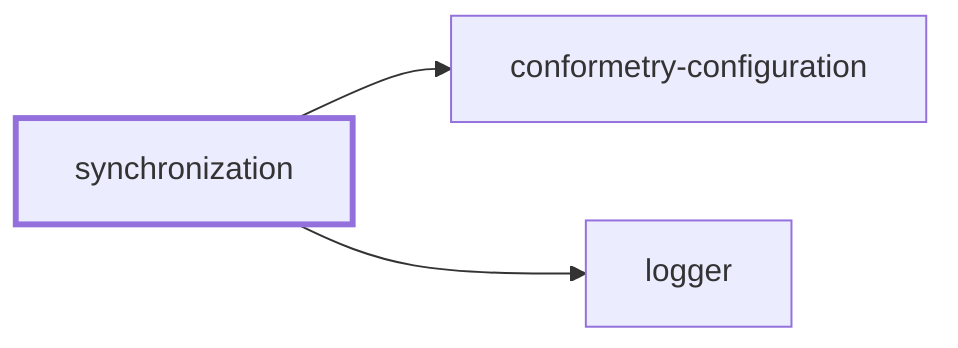
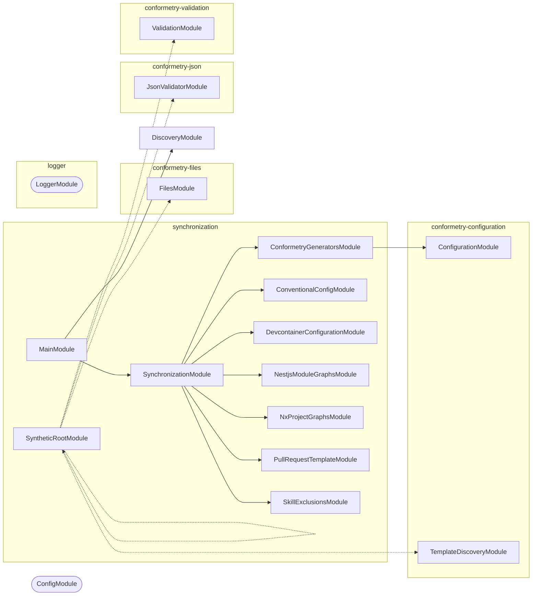

# ↔️ Synchronization

**Keep the derived files derived.**

Some files in this workspace are not really written — they are copies of, or
tables generated from, something else. The generator table in `AGENTS.md` comes
from the conformetry configuration. The cloud devcontainer shares most of its
fields with the local one. The PR template appears verbatim inside a skill.

Every one of those is a place where two files can quietly disagree.
Synchronization is the NestJS CLI that regenerates them, and the CI check that
fails when someone edits the copy instead of the source.

## Usage

```bash
nx run synchronization:start            # Check every source (default)
nx run synchronization:start:write      # Regenerate every derived file
```

Every command runs in one of two modes:

| Mode | Does |
| ---- | ---- |
| `check` | Compares, writes nothing, exits non-zero on drift. The default |
| `write` | Regenerates the derived file from its source |

`check` is what the [🧑‍💻 Lint Codebase](../../.github/workflows/lint-codebase.yml)
workflow runs, so drift fails a pull request rather than surviving into `main` —
for the synchronizations whose drift a pull request should answer for. Which
those are is the second axis, below. It is also what
[`configuration/lint-staged.config.ts`](../../configuration/lint-staged.config.ts)
runs, so a commit catches drift too. Both name the `synchronize` target
themselves rather than reaching it through
[`lint-codebase`](../../AGENTS.md#code-quality)'s `dependsOn`, because `write`
here publishes reports and Nx forwards an explicit configuration down
`dependsOn`.

## Two kinds of synchronization

A mode says what a run does. A **kind** says which runs a synchronization
belongs in, and each command declares its own:

| Kind | What it synchronizes | Where its drift is answered |
| ---- | -------------------- | --------------------------- |
| `derivation` | A committed file derived from configuration | Checked on a pull request. The change that touched the configuration is the change that regenerates the file |
| `report` | A report generated from the code it describes | Published on the default branch. A branch being behind the published report is not a mistake the branch made |

`--kinds` narrows a run to a comma-separated set of them:

```bash
nx run synchronization:synchronize                # check every derivation
nx run synchronization:synchronize:write          # write derivations, publish reports
nx run synchronization:start                      # every kind, interactively
```

Absent, `--kinds` selects every kind, because the flag narrows a run rather
than enabling one. A flag carrying no value is refused: read as "every kind" it
would publish reports from a pull request, and read as "none" it would report
success over a synchronization nobody ran. A selection matching no command
fails for the same reason.

Only `nestjs-module-graphs` is a `report` today. Its diagram moves whenever any
module gains or loses an import, so gating a pull request on its freshness
failed branches for being behind `main` rather than for anything they did — the
same trap [codometer](../../packages/codometer-cli/README.md) and
[callidescope](../../packages/callidescope-cli/README.md) publish on `main` to
avoid.

## What it synchronizes

| Command | Source | Destination |
| ------- | ------ | ----------- |
| `conformetry-generators` | `configuration/conformetry.config.ts` | The generator table in `AGENTS.md`, between marker comments |
| `conventional-config` | `configuration/conventional.config.cjs` | The commit type and scope tables, commitlint, and release configuration |
| `devcontainer-configuration` | `.devcontainer/local/devcontainer.json` | The shared fields of `.devcontainer/cloud/devcontainer.json` |
| `nestjs-module-graphs` | The NestJS container each project builds | The mermaid module graph in that project's `AGENTS.md` and `README.md`. A `report`, published on `main` |
| `nx-project-graphs` | The Nx project graph | The mermaid project graph in every project's `README.md` |
| `pull-request-template` | `.github/PULL_REQUEST_TEMPLATE.md` | The template embedded in the PR skill files |

### Module graphs

`nestjs-module-graphs` finds every project tagged `framework:nestjs`, explores
the container it builds with
[nestjs-spelunker](https://github.com/jmcdo29/nestjs-spelunker), and writes a
mermaid diagram into that project's `AGENTS.md` and `README.md`.

The container is built in NestJS **preview mode**, which registers every module
and provider without instantiating any of them. That is what makes exploring
safe from a workstation or from CI: `lexico-ingestion` builds its
`TypeOrmModule.forRootAsync` options without a database ever being contacted.
Loading the module files is still a real import, though, so a project that
cannot be imported at all fails this command rather than being skipped.

An application is rooted in its `src/main.module.ts`. A library package has
nothing to bootstrap, so it is rooted in a `SyntheticRootModule` importing
every module it defines — along with a global `ConfigModule`, without which a
package that reads configuration in a `useFactory` cannot be scanned at all.
Both are kept out of the diagram, as are the `ConfigHostModule` and
`TypeOrmCoreModule` that NestJS builds underneath a `forRoot`: they are
implementation details of a dynamic module rather than anything a project
designs. `TypeOrmModule` itself stays.

Two more things are left out, for a reason worth knowing when the diagram looks
sparser than the code reads. `explore` reports the container's view rather than
the decorators', so a `@Global()` module — `LoggerModule`, or a global
`ConfigModule` — is listed as an import of _every_ module in the project. Drawn
literally, one of those contributes an edge per module and buries everything
worth reading, so a module that every other module imports is treated as
ambient: its edges are dropped and it is kept as a node on its own. Nothing a
project actually designs comes close to that threshold.

Modules are grouped by the project that defines them. Ownership is decided by
name, which needs several rules because names collide: the graphed project wins
outright (every application defines a `MainModule`); a name NestJS itself
exports is credited to nobody, because a name cannot distinguish
`@nestjs/core`'s module from a workspace one; otherwise the project's own
source settles it, since two packages here define a `ConfigurationModule` and
the import statement says which one was taken; and a name reached transitively
falls back to its only definition.

None of that consults the Nx project graph. A diagram of imports is derived
from the imports — the source of the project being graphed, and its manifest —
so the two graphs are independent readings of the same workspace rather than
one deriving from the other.

Where a name would otherwise be genuinely ambiguous in a single container —
`conformetry-cli` imports `@nestjs/core`'s `DiscoveryModule` and
`@conformetry/configuration`'s in the same application — the fix is to rename
the module rather than to guess. Spelunker reports modules by name, so two
different modules sharing one would collapse into a single node no rule can
separate.

### When the two graphs disagree

A project dependency can be real and still contribute no module, so the module
graph names those below the diagram rather than leaving a reader to wonder why
the two disagree. It distinguishes the two reasons, because it can tell them
apart from the source: a dependency every import of which is an `import type`
declares no module by nature — `conformetry-json` takes `ConformetryError` from
`@conformetry/core` and nothing else — while one the manifest declares but the
source never imports is reached at runtime, which is how
`conformetry-validation` loads its language packages through
`LazyModuleLoader`.

A module loaded at runtime is inferred rather than left to prose, in the way
Nx infers a runtime dependency between projects: a module named as a string
literal is evidence of a dependency the container cannot show, so
`conformetry-validation`'s `LANGUAGE_PACKAGES` table turns into six dotted
edges to the validator modules it loads. A name is only believed when exactly
one project in the workspace defines it — every application defines a
`MainModule`, and this command's own constants name one, so an ambiguous name
buys nothing.

Type-only dependencies have no equivalent, because there is no module to infer.
`conformetry-json` takes `ConformetryError` from `@conformetry/core` — an
interface, not a module — and nothing is registered in any container as a
result. Importing `ErrorsModule` to draw the edge would create a runtime
dependency the code does not have and enlarge every validator package's
container to make a diagram look tidier. The note is the honest answer; the
edge would be a fiction.

The reverse also happens and is equally correct: the module graph reaches
transitively, so it can show a module from a project the one-hop project graph
does not list.

A target file that exists but has no marker comments counts as drift. Which
files a project must keep is conformetry's rule rather than this command's:
the markers live in the NestJS project templates, so validation fails a project
whose `README.md` or `AGENTS.md` has dropped them.

### Project graphs

`nx-project-graphs` is the level above. It reads the Nx project graph once and
writes each project's own neighborhood into its `README.md`: what it depends
on, and what depends on it. One hop in each direction is deliberate — a
project's README should say what it needs and who would break if it changed,
not redraw the workspace.

A dependency Nx inferred from an import is drawn solid, and one declared in
configuration alone is drawn dotted. A project connected to nothing gets a
sentence saying so rather than a diagram of one box.

This one covers every project, not only the NestJS ones, so its markers live in
all four project templates — `jupyter-notebook-application` as well as the
three NestJS ones. The projects no template governs (`lexico`,
`lexico-components`, `lexico-entities`, and `logger`) still get a graph; there
is simply no template to fail them if they drop the block.

Run one on its own with its named configuration:

```bash
nx run synchronization:start:conformetry-generators-write
nx run synchronization:start:devcontainer-configuration-check
```

## Why one aggregate command

The `synchronization` command drives all six in a single process. Each `nx
run` rebuilds the project graph, so six targets cost six graph builds where one
costs one.

The aggregate also reports _all_ drift at once rather than stopping at the
first failure: each command's `synchronize` returns whether it succeeded, and
exiting stays in each command's own `run`, where it belongs. A contributor gets
one list of what to regenerate instead of discovering the next problem after
fixing the last.

## The `synchronize` target

```bash
nx run synchronization:synchronize                            # check derivations
nx run synchronization:synchronize --configuration=write      # write derivations, publish reports
```

This exists alongside `start` because other projects use that target name to
launch an application, and a workflow naming `start` would be naming a target
whose meaning changes per project. It is cached and declares its sources as
inputs, so it only reruns when one of the files it watches actually changes.

Two configurations, and no third for the release. `check` passes `--kinds
derivation`, so a pull request answers only for drift its author caused, and a
report block that has fallen behind `main` fails nothing. `write` passes
`--kinds derivation,report`, so it both regenerates derivations and publishes
reports, and the release workflow is what runs it on the default branch. It
names both kinds rather than leaving `--kinds` off, so the target states what it
writes; the absent flag meaning every kind is what `start` uses interactively.

There is no `publish` configuration because there is no `dependsOn` edge to
defend against. `lint-codebase` does not depend on this target — Nx forwards an
explicit configuration down `dependsOn`, so if it did, `lint-codebase
--configuration=write` would publish report blocks from a branch. The same
reasoning already keeps `codebase:codometer` out of that list. Losing the edge
costs no gating: the
[🧑‍💻 Lint Codebase](../../.github/workflows/lint-codebase.yml) workflow and
[`configuration/lint-staged.config.ts`](../../configuration/lint-staged.config.ts)
each name `synchronize` alongside `lint-codebase` in one `nx affected`
invocation, so a pull request and a commit both check drift.

One gap the commit path cannot close. `affected` selects this project from the
staged paths, and nothing in its `inputs` globs `package.json` — so a commit
staging only a manifest changes the Nx project graph, drifts
`nx-project-graphs`, and never selects it. The pull request catches that,
resolving `affected` against the merge base rather than a staged path list.
Conformetry answers the same problem by running unscoped on every commit; this
target stays scoped, because removing that scope would put every
synchronization in every commit path.

## Project Graph

Where this project sits in the Nx project graph: what it depends on, and what depends on it. Regenerated by `nx run synchronization:synchronize --configuration=write`.

<!-- nx-project-graph-start -->



<!-- nx-project-graph-end -->

## Module Graph

The modules this project defines and the imports between them, published by `nx run synchronization:synchronize --configuration=write`.

<!-- nestjs-module-graph-start -->



_Rounded modules are global: every module can inject them, so their edges are left out._

_Dotted edges are modules named for a runtime load rather than imported._

<!-- nestjs-module-graph-end -->

## Adding a synchronizer

1. Generate a module: `nx g conformetry:nestjs-command-module --name=<domain> --project=synchronization`
2. Implement `SynchronizableCommand` — a `synchronizationLabel`, a
   `synchronizationKind`, and a `synchronize(mode)` returning whether the
   destination was already current.
3. Pick the kind: `SYNCHRONIZATION_KIND_DERIVATION` when the destination is
   derived from configuration a pull request can also change, and
   `SYNCHRONIZATION_KIND_REPORT` when it is generated from the code it
   describes. That one field is the whole declaration — no workflow file, Nx
   target, or central list names it again.
4. Register the command in `SynchronizationCommand.getCommands()`.
5. Add the source path to the `synchronize` target's `inputs` in
   `project.json`, or Nx will serve a stale cached result when it changes.

## Start

```bash
nx run synchronization:start
```

## Test

```bash
nx run synchronization:vitest
```

## Development

```bash
nx run synchronization:repl
nx run synchronization:lint-codebase --configuration=write
```

## License

MIT — see [LICENSE](../../LICENSE).

<!-- CALL_STACKS_START -->

## 🔭 Callidescope

Call stacks traced through `synchronization`, deepest first. Each frame shows what it takes, what it returns, and what its documentation says.

| Measure | Value |
| --- | --- |
| Callables | 265 |
| Files | 49 |
| Calls traced | 350 |
| Call stacks | 24 |
| Deepest stack | 14 |
| Stacks through recursion | 0 |
| Unfollowable calls | 10 |

### Call stacks

**1. `SynchronizationCommand.run`** — depth ≥ 14 · decorated-method

```text
🚀 SynchronizationCommand.run(…): Promise<void> [tools/synchronization/src/modules/synchronization/synchronization.command.ts:144]
   ↳ Runs the selected synchronizations, exiting once if any reported drift.
  └─> SynchronizationCommand.synchronize(…): Promise<boolean> [tools/synchronization/src/modules/synchronization/synchronization.command.ts:182]
     ↳ Runs the selected synchronizations and reports whether all succeeded.
    └─> ConventionalConfigCommand.synchronize(mode: SynchronizationMode): Promise<boolean> [tools/synchronization/src/modules/conventional-config/conventional-config.command.ts:74]
       ↳ Synchronizes conventional-commit config and reports success without exiting.
      └─> ConventionalConfigService.runSynchronization(mode: string): boolean [tools/synchronization/src/modules/conventional-config/conventional-config.service.ts:233]
         ↳ Runs the workflow in check or write mode, reporting whether it succeeded.
        └─> ConventionalConfigService.handleCheckMode(context: SyncContext): boolean [tools/synchronization/src/modules/conventional-config/conventional-config.service.ts:126]
           ↳ Check mode: validates all configuration files are in sync with conventional.config.cjs, reporting success rather than…
          └─> ConventionalConfigValidatorsService.checkAllSkillsSync(config: ConventionalConfig, skillFiles: string[]): boolean [tools/synchronization/src/modules/conventional-config/conventional-config-validators.service.ts:149]
             ↳ Validates that every configured skill file has synchronized type/scope tables.
            └─> ConventionalConfigValidatorsService.checkSkillSync(config: ConventionalConfig, skillFile: string): boolean [tools/synchronization/src/modules/conventional-config/conventional-config-validators.service.ts:281]
               ↳ Validates a skill file's type/scope markdown tables against source config.
              └─> ConventionalConfigValidatorsService.checkMarkerSync(…): boolean [tools/synchronization/src/modules/conventional-config/conventional-config-validators.service.ts:41]
                 ↳ Checks that a named marker block in a skill file matches the source config values.
                └─> ConventionalConfigValidatorsService.validateMarkerValues(…): boolean [tools/synchronization/src/modules/conventional-config/conventional-config-validators.service.ts:121]
                   ↳ Compares skill marker values against source values and logs any mismatch.
                  └─> ConventionalConfigValidatorsService.showDifference(source: string[], target: string[], targetName: string): void [tools/synchronization/src/modules/conventional-config/conventional-config-validators.service.ts:102]
                     ↳ Logs the items missing from and extra in the target compared to the source.
                    └─> LoggerService.log(message: unknown, context?: string, data?: LogData): void [packages/logger/src/modules/logger/logger.service.ts:276]
                       ↳ Logs an informational message at the `info` level.
                      └─> LoggerService.buildBindings(…): Record<string, unknown> [packages/logger/src/modules/logger/logger.service.ts:140]
                         ↳ Assembles the object pino merges into the line.
                        └─> LoggerService.assertConventionalMessage(args: { context: string | undefined; parsed: ParsedLogMessage; }): void [packages/logger/src/modules/logger/logger.service.ts:107]
                           ↳ Fails a malformed message in development, and never in production.
                          └─> LoggerService.isConventionalVerb(word: string): boolean [packages/logger/src/modules/logger/logger.service.ts:165]
                             ↳ Whether a word is a verb in one of the two tenses the convention allows.
```

**2. `ConventionalConfigCommand.run`** — depth 13 · decorated-method

```text
🚀 ConventionalConfigCommand.run(passedParameters: string[], _options?: Record<string, unknown>): Promise<void> [tools/synchronization/src/modules/conventional-config/conventional-config.command.ts:55]
   ↳ Runs the conventional-config sync command, delegating to helpers and exiting 1 on drift.
  └─> ConventionalConfigCommand.synchronize(mode: SynchronizationMode): Promise<boolean> [tools/synchronization/src/modules/conventional-config/conventional-config.command.ts:74]
     ↳ Synchronizes conventional-commit config and reports success without exiting.
    └─> ConventionalConfigService.runSynchronization(mode: string): boolean [tools/synchronization/src/modules/conventional-config/conventional-config.service.ts:233]
       ↳ Runs the workflow in check or write mode, reporting whether it succeeded.
      └─> ConventionalConfigService.handleCheckMode(context: SyncContext): boolean [tools/synchronization/src/modules/conventional-config/conventional-config.service.ts:126]
         ↳ Check mode: validates all configuration files are in sync with conventional.config.cjs, reporting success rather than…
        └─> ConventionalConfigValidatorsService.checkAllSkillsSync(config: ConventionalConfig, skillFiles: string[]): boolean [tools/synchronization/src/modules/conventional-config/conventional-config-validators.service.ts:149]
           ↳ Validates that every configured skill file has synchronized type/scope tables.
          └─> ConventionalConfigValidatorsService.checkSkillSync(config: ConventionalConfig, skillFile: string): boolean [tools/synchronization/src/modules/conventional-config/conventional-config-validators.service.ts:281]
             ↳ Validates a skill file's type/scope markdown tables against source config.
            └─> ConventionalConfigValidatorsService.checkMarkerSync(…): boolean [tools/synchronization/src/modules/conventional-config/conventional-config-validators.service.ts:41]
               ↳ Checks that a named marker block in a skill file matches the source config values.
              └─> ConventionalConfigValidatorsService.validateMarkerValues(…): boolean [tools/synchronization/src/modules/conventional-config/conventional-config-validators.service.ts:121]
                 ↳ Compares skill marker values against source values and logs any mismatch.
                └─> ConventionalConfigValidatorsService.showDifference(source: string[], target: string[], targetName: string): void [tools/synchronization/src/modules/conventional-config/conventional-config-validators.service.ts:102]
                   ↳ Logs the items missing from and extra in the target compared to the source.
                  └─> LoggerService.log(message: unknown, context?: string, data?: LogData): void [packages/logger/src/modules/logger/logger.service.ts:276]
                     ↳ Logs an informational message at the `info` level.
                    └─> LoggerService.buildBindings(…): Record<string, unknown> [packages/logger/src/modules/logger/logger.service.ts:140]
                       ↳ Assembles the object pino merges into the line.
                      └─> LoggerService.assertConventionalMessage(args: { context: string | undefined; parsed: ParsedLogMessage; }): void [packages/logger/src/modules/logger/logger.service.ts:107]
                         ↳ Fails a malformed message in development, and never in production.
                        └─> LoggerService.isConventionalVerb(word: string): boolean [packages/logger/src/modules/logger/logger.service.ts:165]
                           ↳ Whether a word is a verb in one of the two tenses the convention allows.
```

**3. `NestjsModuleGraphsCommand.run`** — depth ≥ 9 · decorated-method

```text
🚀 NestjsModuleGraphsCommand.run(passedParameters: string[], _options?: Record<string, unknown>): Promise<void> [tools/synchronization/src/modules/nestjs-module-graphs/nestjs-module-graphs.command.ts:169]
   ↳ Runs the nestjs-module-graphs sync command in check or write mode.
  └─> NestjsModuleGraphsCommand.synchronize(mode: SynchronizationMode): Promise<boolean> [tools/synchronization/src/modules/nestjs-module-graphs/nestjs-module-graphs.command.ts:188]
     ↳ Synchronizes every project's module graph and reports success without exiting.
    └─> NestjsModuleGraphsCommand.synchronizeProject(…): Promise<string[]> [tools/synchronization/src/modules/nestjs-module-graphs/nestjs-module-graphs.command.ts:138]
       ↳ Explores one project and syncs its graph into every target markdown file.
      └─> NestjsModuleGraphsCommand.filter(…)(fileName: string): boolean [tools/synchronization/src/modules/nestjs-module-graphs/nestjs-module-graphs.command.ts:159]
        └─> NestjsModuleGraphsCommand.synchronizeFile(…): boolean [tools/synchronization/src/modules/nestjs-module-graphs/nestjs-module-graphs.command.ts:95]
           ↳ Checks or rewrites one markdown file's graph block.
          └─> LoggerService.log(message: unknown, context?: string, data?: LogData): void [packages/logger/src/modules/logger/logger.service.ts:276]
             ↳ Logs an informational message at the `info` level.
            └─> LoggerService.buildBindings(…): Record<string, unknown> [packages/logger/src/modules/logger/logger.service.ts:140]
               ↳ Assembles the object pino merges into the line.
              └─> LoggerService.assertConventionalMessage(args: { context: string | undefined; parsed: ParsedLogMessage; }): void [packages/logger/src/modules/logger/logger.service.ts:107]
                 ↳ Fails a malformed message in development, and never in production.
                └─> LoggerService.isConventionalVerb(word: string): boolean [packages/logger/src/modules/logger/logger.service.ts:165]
                   ↳ Whether a word is a verb in one of the two tenses the convention allows.
```

<details>
<summary>21 more call stacks</summary>

**4. `NxProjectGraphsCommand.run`** — depth 9 · decorated-method

```text
🚀 NxProjectGraphsCommand.run(passedParameters: string[], _options?: Record<string, unknown>): Promise<void> [tools/synchronization/src/modules/nx-project-graphs/nx-project-graphs.command.ts:151]
   ↳ Runs the nx-project-graphs sync command in check or write mode.
  └─> NxProjectGraphsCommand.synchronize(mode: SynchronizationMode): Promise<boolean> [tools/synchronization/src/modules/nx-project-graphs/nx-project-graphs.command.ts:170]
     ↳ Synchronizes every project's graph and reports success without exiting.
    └─> NxProjectGraphsCommand.filter(…)(project: NxProject): boolean [tools/synchronization/src/modules/nx-project-graphs/nx-project-graphs.command.ts:184]
      └─> NxProjectGraphsCommand.synchronizeProject(…): boolean [tools/synchronization/src/modules/nx-project-graphs/nx-project-graphs.command.ts:118]
         ↳ Checks or rewrites one project's README graph block.
        └─> NxProjectGraphsCommand.applyMode(…): boolean [tools/synchronization/src/modules/nx-project-graphs/nx-project-graphs.command.ts:68]
           ↳ Reports drift in check mode, or rewrites the block in write mode.
          └─> LoggerService.log(message: unknown, context?: string, data?: LogData): void [packages/logger/src/modules/logger/logger.service.ts:276]
             ↳ Logs an informational message at the `info` level.
            └─> LoggerService.buildBindings(…): Record<string, unknown> [packages/logger/src/modules/logger/logger.service.ts:140]
               ↳ Assembles the object pino merges into the line.
              └─> LoggerService.assertConventionalMessage(args: { context: string | undefined; parsed: ParsedLogMessage; }): void [packages/logger/src/modules/logger/logger.service.ts:107]
                 ↳ Fails a malformed message in development, and never in production.
                └─> LoggerService.isConventionalVerb(word: string): boolean [packages/logger/src/modules/logger/logger.service.ts:165]
                   ↳ Whether a word is a verb in one of the two tenses the convention allows.
```

**5. `PullRequestTemplateCommand.run`** — depth 9 · decorated-method

```text
🚀 PullRequestTemplateCommand.run(passedParameters: string[], _options?: Record<string, unknown>): Promise<void> [tools/synchronization/src/modules/pull-request-template/pull-request-template.command.ts:201]
   ↳ Runs the pull-request-template sync command in check or write mode.
  └─> PullRequestTemplateCommand.synchronize(mode: SynchronizationMode): Promise<boolean> [tools/synchronization/src/modules/pull-request-template/pull-request-template.command.ts:220]
     ↳ Synchronizes the PR template and reports success without exiting.
    └─> PullRequestTemplateCommand.handleWriteMode(templateContent: string, targetFiles: string[]): void [tools/synchronization/src/modules/pull-request-template/pull-request-template.command.ts:132]
       ↳ Writes the current PR template into any target files that are out of sync.
      └─> PullRequestTemplateCommand.filter(…)(targetFile: string): boolean [tools/synchronization/src/modules/pull-request-template/pull-request-template.command.ts:137]
        └─> PullRequestTemplateCommand.checkTargetSync(templateContent: string, targetFile: string): boolean [tools/synchronization/src/modules/pull-request-template/pull-request-template.command.ts:59]
           ↳ Checks whether the target file's marker block matches the current PR template.
          └─> LoggerService.log(message: unknown, context?: string, data?: LogData): void [packages/logger/src/modules/logger/logger.service.ts:276]
             ↳ Logs an informational message at the `info` level.
            └─> LoggerService.buildBindings(…): Record<string, unknown> [packages/logger/src/modules/logger/logger.service.ts:140]
               ↳ Assembles the object pino merges into the line.
              └─> LoggerService.assertConventionalMessage(args: { context: string | undefined; parsed: ParsedLogMessage; }): void [packages/logger/src/modules/logger/logger.service.ts:107]
                 ↳ Fails a malformed message in development, and never in production.
                └─> LoggerService.isConventionalVerb(word: string): boolean [packages/logger/src/modules/logger/logger.service.ts:165]
                   ↳ Whether a word is a verb in one of the two tenses the convention allows.
```

**6. `DevcontainerConfigurationCommand.run`** — depth 8 · decorated-method

```text
🚀 DevcontainerConfigurationCommand.run(passedParameters: string[], _options?: Record<string, unknown>): Promise<void> [tools/synchronization/src/modules/devcontainer-configuration/devcontainer-configuration.command.ts:264]
   ↳ Runs the devcontainer-configuration sync command in check or write mode.
  └─> DevcontainerConfigurationCommand.synchronize(mode: SynchronizationMode): Promise<boolean> [tools/synchronization/src/modules/devcontainer-configuration/devcontainer-configuration.command.ts:283]
     ↳ Synchronizes the cloud devcontainer config and reports success without exiting.
    └─> DevcontainerConfigurationCommand.check(expectedConfig: DevcontainerConfiguration, cloudConfigFile: string): boolean [tools/synchronization/src/modules/devcontainer-configuration/devcontainer-configuration.command.ts:84]
       ↳ Compares the expected merged config against the current cloud config file and reports field differences.
      └─> DevcontainerConfigurationCommand.reportDifferences(…): void [tools/synchronization/src/modules/devcontainer-configuration/devcontainer-configuration.command.ts:162]
         ↳ Logs each field that differs between the expected and current config.
        └─> LoggerService.log(message: unknown, context?: string, data?: LogData): void [packages/logger/src/modules/logger/logger.service.ts:276]
           ↳ Logs an informational message at the `info` level.
          └─> LoggerService.buildBindings(…): Record<string, unknown> [packages/logger/src/modules/logger/logger.service.ts:140]
             ↳ Assembles the object pino merges into the line.
            └─> LoggerService.assertConventionalMessage(args: { context: string | undefined; parsed: ParsedLogMessage; }): void [packages/logger/src/modules/logger/logger.service.ts:107]
               ↳ Fails a malformed message in development, and never in production.
              └─> LoggerService.isConventionalVerb(word: string): boolean [packages/logger/src/modules/logger/logger.service.ts:165]
                 ↳ Whether a word is a verb in one of the two tenses the convention allows.
```

**7. `ConformetryGeneratorsCommand.run`** — depth ≥ 7 · decorated-method

```text
🚀 ConformetryGeneratorsCommand.run(passedParameters: string[], _options?: Record<string, unknown>): Promise<void> [tools/synchronization/src/modules/conformetry-generators/conformetry-generators.command.ts:176]
   ↳ Runs the conformetry-generators sync command in check or write mode.
  └─> SynchronizationService.resolveSynchronizationModeOrExit(options: SynchronizationModeResolutionOptions): SynchronizationMode [tools/synchronization/src/modules/synchronization/synchronization.service.ts:59]
     ↳ Resolves synchronization mode or exits the process when the mode is invalid.
    └─> SynchronizationService.exitInvalidMode(…): never [tools/synchronization/src/modules/synchronization/synchronization.service.ts:22]
       ↳ Logs invalid mode details and exits with status code 1.
      └─> LoggerService.error(…): void [packages/logger/src/modules/logger/logger.service.ts:256]
         ↳ Logs an error message at the `error` level, optionally including a stack trace. `ConsoleLogger.error` spends a third…
        └─> LoggerService.buildBindings(…): Record<string, unknown> [packages/logger/src/modules/logger/logger.service.ts:140]
           ↳ Assembles the object pino merges into the line.
          └─> LoggerService.assertConventionalMessage(args: { context: string | undefined; parsed: ParsedLogMessage; }): void [packages/logger/src/modules/logger/logger.service.ts:107]
             ↳ Fails a malformed message in development, and never in production.
            └─> LoggerService.isConventionalVerb(word: string): boolean [packages/logger/src/modules/logger/logger.service.ts:165]
               ↳ Whether a word is a verb in one of the two tenses the convention allows.
```

**8. `SkillExclusionsCommand.run`** — depth 7 · decorated-method

```text
🚀 SkillExclusionsCommand.run(passedParameters: string[]): Promise<void> [tools/synchronization/src/modules/skill-exclusions/skill-exclusions.command.ts:147]
   ↳ Runs the skill-exclusions sync command in check or write mode.
  └─> SynchronizationService.resolveSynchronizationModeOrExit(options: SynchronizationModeResolutionOptions): SynchronizationMode [tools/synchronization/src/modules/synchronization/synchronization.service.ts:59]
     ↳ Resolves synchronization mode or exits the process when the mode is invalid.
    └─> SynchronizationService.exitInvalidMode(…): never [tools/synchronization/src/modules/synchronization/synchronization.service.ts:22]
       ↳ Logs invalid mode details and exits with status code 1.
      └─> LoggerService.error(…): void [packages/logger/src/modules/logger/logger.service.ts:256]
         ↳ Logs an error message at the `error` level, optionally including a stack trace. `ConsoleLogger.error` spends a third…
        └─> LoggerService.buildBindings(…): Record<string, unknown> [packages/logger/src/modules/logger/logger.service.ts:140]
           ↳ Assembles the object pino merges into the line.
          └─> LoggerService.assertConventionalMessage(args: { context: string | undefined; parsed: ParsedLogMessage; }): void [packages/logger/src/modules/logger/logger.service.ts:107]
             ↳ Fails a malformed message in development, and never in production.
            └─> LoggerService.isConventionalVerb(word: string): boolean [packages/logger/src/modules/logger/logger.service.ts:165]
               ↳ Whether a word is a verb in one of the two tenses the convention allows.
```

**9. `main`** — depth ≥ 2 · module-bootstrap

```text
🚀 main(): Promise<void> [tools/synchronization/src/main.ts:9]
   ↳ Bootstraps the synchronization CLI application.
  └─> LoggerService.constructor(): LoggerService [packages/logger/src/modules/logger/logger.service.ts:38]
```

**10. `ConformetryGeneratorsCommand.constructor`** — depth ≥ 2 · orphan-root

```text
🚀 ConformetryGeneratorsCommand.constructor(…): ConformetryGeneratorsCommand [tools/synchronization/src/modules/conformetry-generators/conformetry-generators.command.ts:35]
  └─> LoggerService.setContext(context: string): void [packages/logger/src/modules/logger/logger.service.ts:285]
     ↳ Sets the context label included in every subsequent log line.
```

**11. `ConventionalConfigIoService.constructor`** — depth 2 · orphan-root

```text
🚀 ConventionalConfigIoService.constructor(loggerService: LoggerService): ConventionalConfigIoService [tools/synchronization/src/modules/conventional-config/conventional-config-io.service.ts:31]
  └─> LoggerService.setContext(context: string): void [packages/logger/src/modules/logger/logger.service.ts:285]
     ↳ Sets the context label included in every subsequent log line.
```

**12. `ConventionalConfigValidatorsService.constructor`** — depth 2 · orphan-root

```text
🚀 ConventionalConfigValidatorsService.constructor(…): ConventionalConfigValidatorsService [tools/synchronization/src/modules/conventional-config/conventional-config-validators.service.ts:25]
  └─> LoggerService.setContext(context: string): void [packages/logger/src/modules/logger/logger.service.ts:285]
     ↳ Sets the context label included in every subsequent log line.
```

**13. `ConventionalConfigService.constructor`** — depth 2 · orphan-root

```text
🚀 ConventionalConfigService.constructor(…): ConventionalConfigService [tools/synchronization/src/modules/conventional-config/conventional-config.service.ts:36]
  └─> LoggerService.setContext(context: string): void [packages/logger/src/modules/logger/logger.service.ts:285]
     ↳ Sets the context label included in every subsequent log line.
```

**14. `ConventionalConfigCommand.constructor`** — depth ≥ 2 · orphan-root

```text
🚀 ConventionalConfigCommand.constructor(…): ConventionalConfigCommand [tools/synchronization/src/modules/conventional-config/conventional-config.command.ts:32]
  └─> LoggerService.setContext(context: string): void [packages/logger/src/modules/logger/logger.service.ts:285]
     ↳ Sets the context label included in every subsequent log line.
```

**15. `DevcontainerConfigurationCommand.constructor`** — depth ≥ 2 · orphan-root

```text
🚀 DevcontainerConfigurationCommand.constructor(…): DevcontainerConfigurationCommand [tools/synchronization/src/modules/devcontainer-configuration/devcontainer-configuration.command.ts:41]
  └─> LoggerService.setContext(context: string): void [packages/logger/src/modules/logger/logger.service.ts:285]
     ↳ Sets the context label included in every subsequent log line.
```

**16. `NestjsModuleGraphsGraphService.compareGroups`** — depth 2 · orphan-root

```text
🚀 NestjsModuleGraphsGraphService.compareGroups(…): number [tools/synchronization/src/modules/nestjs-module-graphs/nestjs-module-graphs-graph.service.ts:79]
   ↳ Orders the graphed project first, other projects next, ungrouped last.
  └─> NestjsModuleGraphsGraphService.rankGroup(group: NestjsModuleGraphGroup, projectName: string): number [tools/synchronization/src/modules/nestjs-module-graphs/nestjs-module-graphs-graph.service.ts:210]
     ↳ Ranks a group into the graphed project, another project, or ungrouped.
```

**17. `NestjsModuleGraphsService.loadModuleClasses`** — depth ≥ 2 · orphan-root

```text
🚀 NestjsModuleGraphsService.loadModuleClasses(file: string): Promise<Type<unknown>[]> [tools/synchronization/src/modules/nestjs-module-graphs/nestjs-module-graphs.service.ts:91]
   ↳ Imports a module file and returns every module class it exports.
  └─> NestjsModuleGraphsService.map(…)(…): Type<unknown> [tools/synchronization/src/modules/nestjs-module-graphs/nestjs-module-graphs.service.ts:102]
```

**18. `NestjsModuleGraphsCommand.constructor`** — depth ≥ 2 · orphan-root

```text
🚀 NestjsModuleGraphsCommand.constructor(…): NestjsModuleGraphsCommand [tools/synchronization/src/modules/nestjs-module-graphs/nestjs-module-graphs.command.ts:48]
  └─> LoggerService.setContext(context: string): void [packages/logger/src/modules/logger/logger.service.ts:285]
     ↳ Sets the context label included in every subsequent log line.
```

**19. `NxProjectGraphsService.renderEdge`** — depth 2 · orphan-root

```text
🚀 NxProjectGraphsService.renderEdge(edge: NxProjectGraphEdge): string [tools/synchronization/src/modules/nx-project-graphs/nx-project-graphs.service.ts:50]
   ↳ Renders one edge, dotted when Nx inferred it from configuration.
  └─> NxProjectGraphsService.toNodeIdentifier(projectName: string): string [tools/synchronization/src/modules/nx-project-graphs/nx-project-graphs.service.ts:62]
     ↳ Turns a project name into an identifier mermaid accepts.
```

**20. `NxProjectGraphsService.renderNode`** — depth 2 · orphan-root

```text
🚀 NxProjectGraphsService.renderNode(projectName: string): string [tools/synchronization/src/modules/nx-project-graphs/nx-project-graphs.service.ts:57]
   ↳ Declares one node, labelled with the project name it stands for.
  └─> NxProjectGraphsService.toNodeIdentifier(projectName: string): string [tools/synchronization/src/modules/nx-project-graphs/nx-project-graphs.service.ts:62]
     ↳ Turns a project name into an identifier mermaid accepts.
```

**21. `NxProjectGraphsCommand.constructor`** — depth ≥ 2 · orphan-root

```text
🚀 NxProjectGraphsCommand.constructor(…): NxProjectGraphsCommand [tools/synchronization/src/modules/nx-project-graphs/nx-project-graphs.command.ts:46]
  └─> LoggerService.setContext(context: string): void [packages/logger/src/modules/logger/logger.service.ts:285]
     ↳ Sets the context label included in every subsequent log line.
```

**22. `PullRequestTemplateCommand.constructor`** — depth ≥ 2 · orphan-root

```text
🚀 PullRequestTemplateCommand.constructor(…): PullRequestTemplateCommand [tools/synchronization/src/modules/pull-request-template/pull-request-template.command.ts:37]
  └─> LoggerService.setContext(context: string): void [packages/logger/src/modules/logger/logger.service.ts:285]
     ↳ Sets the context label included in every subsequent log line.
```

**23. `SkillExclusionsCommand.constructor`** — depth ≥ 2 · orphan-root

```text
🚀 SkillExclusionsCommand.constructor(…): SkillExclusionsCommand [tools/synchronization/src/modules/skill-exclusions/skill-exclusions.command.ts:51]
  └─> LoggerService.setContext(context: string): void [packages/logger/src/modules/logger/logger.service.ts:285]
     ↳ Sets the context label included in every subsequent log line.
```

**24. `SynchronizationCommand.constructor`** — depth ≥ 2 · orphan-root

```text
🚀 SynchronizationCommand.constructor(…): SynchronizationCommand [tools/synchronization/src/modules/synchronization/synchronization.command.ts:41]
  └─> LoggerService.setContext(context: string): void [packages/logger/src/modules/logger/logger.service.ts:285]
     ↳ Sets the context label included in every subsequent log line.
```

</details>

### Module spread

None.

### Possibly misplaced

None.
<!-- CALL_STACKS_END -->

<!-- CODE_STATISTICS_START -->

## ⏲️ Codometer

### Project


### TypeScript & JavaScript


### Python


### JSON


### YAML


### TOML


### Shell


### SQL


### HCL


### CSS


### Conventions


### Jupyter


### Markdown


<!-- CODE_STATISTICS_END -->
