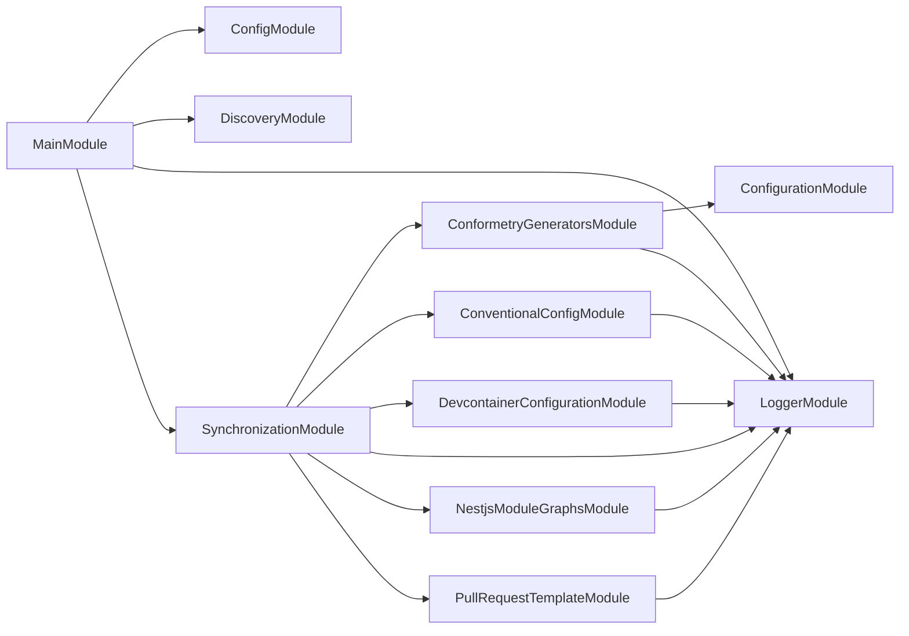

# ↔️ Synchronization

**Keep the derived files derived.**

Some files in this workspace are not really written — they are copies of, or
tables generated from, something else. The generator table in `AGENTS.md` comes
from the conformetry configuration. The cloud devcontainer shares most of its
fields with the local one. The PR template appears verbatim inside a skill.

Every one of those is a place where two files can quietly disagree.
Synchronization is the NestJS CLI that regenerates them, and the CI check that
fails when someone edits the copy instead of the source.

## Usage

```bash
nx run synchronization:start            # Check every source (default)
nx run synchronization:start:write      # Regenerate every derived file
```

Every command runs in one of two modes:

| Mode | Does |
| ---- | ---- |
| `check` | Compares, writes nothing, exits non-zero on drift. The default |
| `write` | Regenerates the derived file from its source |

`check` is what [`lint-codebase`](../../AGENTS.md#code-quality) depends on, so
drift fails a pull request rather than surviving into `main`.

## What it synchronizes

| Command | Source | Destination |
| ------- | ------ | ----------- |
| `conformetry-generators` | `configuration/conformetry.config.ts` | The generator table in `AGENTS.md`, between marker comments |
| `conventional-config` | `configuration/conventional.config.cjs` | The commit type and scope tables, commitlint, and release configuration |
| `devcontainer-configuration` | `.devcontainer/local/devcontainer.json` | The shared fields of `.devcontainer/cloud/devcontainer.json` |
| `nestjs-module-graphs` | The `@Module` metadata reachable from each NestJS project's `MainModule` | The mermaid module graph in that project's `AGENTS.md` and `README.md` |
| `pull-request-template` | `.github/PULL_REQUEST_TEMPLATE.md` | The template embedded in the PR skill files |

### Module graphs

`nestjs-module-graphs` finds every project with a `src/main.module.ts`, reads
the `@Module` metadata reachable from it with
[nestjs-spelunker](https://github.com/jmcdo29/nestjs-spelunker), and writes a
mermaid diagram into that project's `AGENTS.md` and `README.md`.

The metadata is read statically — `SpelunkerModule.debug` walks decorators
rather than a running application — so nothing is instantiated and a project
whose modules open a database connection on boot is still safe to explore.
Loading the module files is still a real import, though: a project that cannot
be imported at all fails this command rather than being skipped.

A target markdown file without the marker comments counts as drift, because a
project whose graph has nowhere to live is exactly the case the check exists to
catch. Add the markers to the file rather than expecting `write` to place the
section for you.

Run one on its own with its named configuration:

```bash
nx run synchronization:start:conformetry-generators-write
nx run synchronization:start:devcontainer-configuration-check
```

## Why one aggregate command

The `synchronization` command drives all five in a single process. Each `nx
run` rebuilds the project graph, so five targets cost five graph builds where
one costs one.

The aggregate also reports _all_ drift at once rather than stopping at the
first failure: each command's `synchronize` returns whether it succeeded, and
exiting stays in each command's own `run`, where it belongs. A contributor gets
one list of what to regenerate instead of discovering the next problem after
fixing the last.

## The `synchronize` target

```bash
nx run synchronization:synchronize                          # check
nx run synchronization:synchronize --configuration=write    # write
```

This exists alongside `start` because `lint-codebase` cannot depend on `start`
— other projects use that target name to launch an application. It is cached
and declares its sources as inputs, so it only reruns when one of the files it
watches actually changes.

## Module Graph

Every NestJS module reachable from `MainModule`, regenerated by `nx run synchronization:synchronize --configuration=write`.

<!-- nestjs-module-graph-start -->



<!-- nestjs-module-graph-end -->

## Adding a synchronizer

1. Generate a module: `nx g conformetry:nestjs-command-module --name=<domain> --project=synchronization`
2. Implement `SynchronizableCommand` — a `synchronizationLabel` and a
   `synchronize(mode)` returning whether the destination was already current.
3. Register the command in `SynchronizationCommand.getCommands()`.
4. Add the source path to the `synchronize` target's `inputs` in
   `project.json`, or Nx will serve a stale cached result when it changes.

## Start

```bash
nx run synchronization:start
```

## Test

```bash
nx run synchronization:vitest
```

## Development

```bash
nx run synchronization:repl
nx run synchronization:lint-codebase --configuration=write
```

## License

MIT — see [LICENSE](../../LICENSE).
