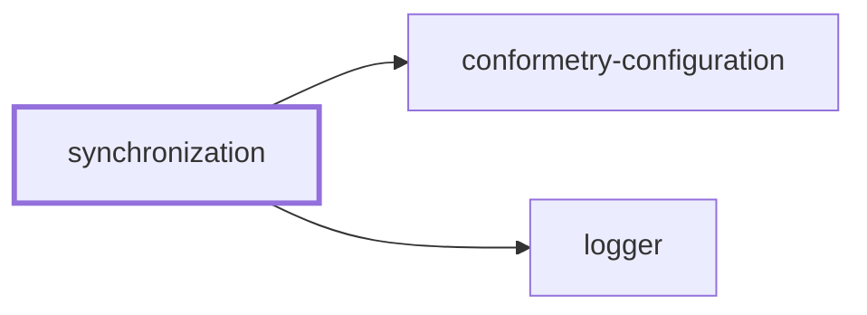

# ↔️ Synchronization

**Keep the derived files derived.**

Some files in this workspace are not really written — they are copies of, or
tables generated from, something else. The generator table in `AGENTS.md` comes
from the conformetry configuration. The cloud devcontainer shares most of its
fields with the local one. The PR template appears verbatim inside a skill.

Every one of those is a place where two files can quietly disagree.
Synchronization is the NestJS CLI that regenerates them, and the CI check that
fails when someone edits the copy instead of the source.

## Usage

```bash
nx run synchronization:start            # Check every source (default)
nx run synchronization:start:write      # Regenerate every derived file
```

Every command runs in one of two modes:

| Mode | Does |
| ---- | ---- |
| `check` | Compares, writes nothing, exits non-zero on drift. The default |
| `write` | Regenerates the derived file from its source |

`check` is what [`lint-codebase`](../../AGENTS.md#code-quality) depends on, so
drift fails a pull request rather than surviving into `main`.

## What it synchronizes

| Command | Source | Destination |
| ------- | ------ | ----------- |
| `conformetry-generators` | `configuration/conformetry.config.ts` | The generator table in `AGENTS.md`, between marker comments |
| `conventional-config` | `configuration/conventional.config.cjs` | The commit type and scope tables, commitlint, and release configuration |
| `devcontainer-configuration` | `.devcontainer/local/devcontainer.json` | The shared fields of `.devcontainer/cloud/devcontainer.json` |
| `nestjs-module-graphs` | The NestJS container each project builds | The mermaid module graph in that project's `AGENTS.md` and `README.md` |
| `nx-project-graphs` | The Nx project graph | The mermaid project graph in every project's `README.md` |
| `pull-request-template` | `.github/PULL_REQUEST_TEMPLATE.md` | The template embedded in the PR skill files |

### Module graphs

`nestjs-module-graphs` finds every project tagged `framework:nestjs`, explores
the container it builds with
[nestjs-spelunker](https://github.com/jmcdo29/nestjs-spelunker), and writes a
mermaid diagram into that project's `AGENTS.md` and `README.md`.

The container is built in NestJS **preview mode**, which registers every module
and provider without instantiating any of them. That is what makes exploring
safe from a workstation or from CI: `lexico-ingestion` builds its
`TypeOrmModule.forRootAsync` options without a database ever being contacted.
Loading the module files is still a real import, though, so a project that
cannot be imported at all fails this command rather than being skipped.

An application is rooted in its `src/main.module.ts`. A library package has
nothing to bootstrap, so it is rooted in a `SyntheticRootModule` importing
every module it defines — along with a global `ConfigModule`, without which a
package that reads configuration in a `useFactory` cannot be scanned at all.
Both are kept out of the diagram, as are the `ConfigHostModule` and
`TypeOrmCoreModule` that NestJS builds underneath a `forRoot`: they are
implementation details of a dynamic module rather than anything a project
designs. `TypeOrmModule` itself stays.

Two more things are left out, for a reason worth knowing when the diagram looks
sparser than the code reads. `explore` reports the container's view rather than
the decorators', so a `@Global()` module — `LoggerModule`, or a global
`ConfigModule` — is listed as an import of _every_ module in the project. Drawn
literally, one of those contributes an edge per module and buries everything
worth reading, so a module that every other module imports is treated as
ambient: its edges are dropped and it is kept as a node on its own. Nothing a
project actually designs comes close to that threshold.

A target file that exists but has no marker comments counts as drift. Which
files a project must keep is conformetry's rule rather than this command's:
the markers live in the NestJS project templates, so validation fails a project
whose `README.md` or `AGENTS.md` has dropped them.

### Project graphs

`nx-project-graphs` is the level above. It reads the Nx project graph once and
writes each project's own neighborhood into its `README.md`: what it depends
on, and what depends on it. One hop in each direction is deliberate — a
project's README should say what it needs and who would break if it changed,
not redraw the workspace.

A dependency Nx inferred from an import is drawn solid, and one declared in
configuration alone is drawn dotted. A project connected to nothing gets a
sentence saying so rather than a diagram of one box.

This one covers every project, not only the NestJS ones, so its markers live in
all four project templates — `jupyter-notebook-application` as well as the
three NestJS ones. The projects no template governs (`lexico`,
`lexico-components`, `lexico-entities`, and `logger`) still get a graph; there
is simply no template to fail them if they drop the block.

Run one on its own with its named configuration:

```bash
nx run synchronization:start:conformetry-generators-write
nx run synchronization:start:devcontainer-configuration-check
```

## Why one aggregate command

The `synchronization` command drives all six in a single process. Each `nx
run` rebuilds the project graph, so six targets cost six graph builds where one
costs one.

The aggregate also reports _all_ drift at once rather than stopping at the
first failure: each command's `synchronize` returns whether it succeeded, and
exiting stays in each command's own `run`, where it belongs. A contributor gets
one list of what to regenerate instead of discovering the next problem after
fixing the last.

## The `synchronize` target

```bash
nx run synchronization:synchronize                          # check
nx run synchronization:synchronize --configuration=write    # write
```

This exists alongside `start` because `lint-codebase` cannot depend on `start`
— other projects use that target name to launch an application. It is cached
and declares its sources as inputs, so it only reruns when one of the files it
watches actually changes.

## Project Graph

Where this project sits in the Nx project graph: what it depends on, and what depends on it. Regenerated by `nx run synchronization:synchronize --configuration=write`.

<!-- nx-project-graph-start -->



<!-- nx-project-graph-end -->

## Module Graph

The modules this project defines and the imports between them, regenerated by `nx run synchronization:synchronize --configuration=write`.

```mermaid
flowchart LR
  subgraph group0["synchronization"]
    ConformetryGeneratorsModule
    ConventionalConfigModule
    DevcontainerConfigurationModule
    MainModule
    NestjsModuleGraphsModule
    NxProjectGraphsModule
    PullRequestTemplateModule
    SynchronizationModule
  end
  subgraph group1["logger"]
    LoggerModule([LoggerModule])
  end
  ConfigModule([ConfigModule])
  ConfigurationModule
  DiscoveryModule
  ConformetryGeneratorsModule --> ConfigurationModule
  MainModule --> DiscoveryModule
  MainModule --> SynchronizationModule
  SynchronizationModule --> ConformetryGeneratorsModule
  SynchronizationModule --> ConventionalConfigModule
  SynchronizationModule --> DevcontainerConfigurationModule
  SynchronizationModule --> NestjsModuleGraphsModule
  SynchronizationModule --> NxProjectGraphsModule
  SynchronizationModule --> PullRequestTemplateModule
```

<!-- nestjs-module-graph-start -->



_Rounded modules are global: every module can inject them, so their edges are left out._

<!-- nestjs-module-graph-end -->

## Adding a synchronizer

1. Generate a module: `nx g conformetry:nestjs-command-module --name=<domain> --project=synchronization`
2. Implement `SynchronizableCommand` — a `synchronizationLabel` and a
   `synchronize(mode)` returning whether the destination was already current.
3. Register the command in `SynchronizationCommand.getCommands()`.
4. Add the source path to the `synchronize` target's `inputs` in
   `project.json`, or Nx will serve a stale cached result when it changes.

## Start

```bash
nx run synchronization:start
```

## Test

```bash
nx run synchronization:vitest
```

## Development

```bash
nx run synchronization:repl
nx run synchronization:lint-codebase --configuration=write
```

## License

MIT — see [LICENSE](../../LICENSE).
