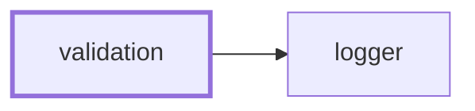
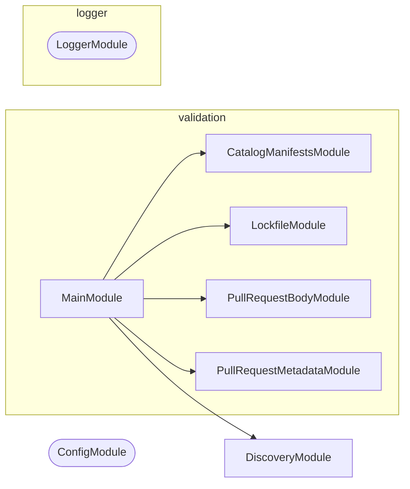

# 🧑‍⚖️ Validation

**Answer whether something conforms, and say what to do when it does not.**

Some checks have only one side. There is nothing to write back: a pull request
title either agrees with its labels or it does not, a manifest either pins
`catalog:` or it does not. This is the NestJS CLI that runs those checks,
collects every failure rather than the first, and prints the command that fixes
each one.

```bash
nx run validation:start:pull-request-metadata     # labels and assignees against the title
nx run validation:start:pull-request-body         # the four headings and no unfilled template comment
nx run validation:start:catalog-manifests         # catalog:/workspace:* in every manifest
nx run validation:start:lockfile                  # pnpm-lock.yaml against the manifests
```

It is the one-sided counterpart to
[synchronization](../synchronization/README.md): that tool reconciles a
`check` against a `write`, this one has no `write` to offer.

## Why it lives here

A check belongs here when it has a `check` and no `write`, and when it already
depends on Node. Both halves matter.

The first half is the boundary against
[synchronization](../synchronization/README.md), whose whole contract is
`check`/`write` reconciliation. A check that cannot write has nothing to put on
the other side of that contract, so modelling it as a synchronization would mean
a `write` mode that either lies or refuses.

The second half is the boundary against `scripts/git/`. Moving a check into this
CLI makes it depend on a healthy `node_modules`, which is fine for a check that
already ran Node and fatal for one that did not. That is why the signing and
authentication checks stay in shell — see [AGENTS.md](AGENTS.md).

## Checks

| Check | Answers |
| ----- | ------- |
| `pull-request-metadata` | Do a pull request's labels and assignees agree with its title? |
| `pull-request-body` | Does a pull request description carry all four headings with no template comment left unfilled? |
| `catalog-manifests` | Does every workspace manifest pin externals as `catalog:` and internals as `workspace:*`? |
| `lockfile` | Is `pnpm-lock.yaml` in sync with the manifests? |

### `pull-request-metadata`

Checks five things about a pull request, all against its own title: exactly one
`type:*` label equal to the title's type, exactly the `scope:*` labels named by
the title's scopes, no `do-not-merge` label, at least one assignee, and exactly
one `source:*` label declaring who opened it.

Two input modes. Given a pull request number it reads the metadata live through
`gh pr view`, which is the local mode. Given none it reads
`PULL_REQUEST_TITLE`, `PULL_REQUEST_LABELS`, `PULL_REQUEST_ASSIGNEES`, and
`PULL_REQUEST_NUMBER` from the environment, which is the workflow mode: a pure
function of its inputs, needing no network, no token, and no write permission.

The title's scope group is matched as optional even though the convention
requires one. commitlint rejects a title with no scope first, so in a workflow
run this check never sees one; run by hand ahead of any title check it still
has to say something useful, and one collected failure naming the missing scope
is more useful than a parse error.

### `pull-request-body`

Checks that all four template headings are present and that no `<!-- … -->`
prompt from [.github/PULL_REQUEST_TEMPLATE.md](../../.github/PULL_REQUEST_TEMPLATE.md)
survives unfilled. The comments are read from the template at runtime rather
than listed here, so adding a prompt to the template starts it being checked
with no code change.

### `catalog-manifests`

Every external dependency in every workspace manifest must be `catalog:`, and
every internal one `workspace:*`. Both directions are checked in every
dependency section, and every violation is named at once.

### `lockfile`

Runs `pnpm install --frozen-lockfile` and reports whether the manifests and the
lockfile still agree. The only check here that shells out to something else, for
the reason the manifest check does not: what "in sync" means is pnpm's answer,
not one worth reimplementing.

## Project Graph

Where this project sits in the Nx project graph: what it depends on, and what depends on it. Regenerated by `nx run synchronization:nx-project-graphs:write`.

<!-- nx-project-graph-start -->



<!-- nx-project-graph-end -->

## Module Graph

The modules this project defines and the imports between them, published by `nx run synchronization:nestjs-module-graphs:write`.

<!-- nestjs-module-graph-start -->



_Rounded modules are global: every module can inject them, so their edges are left out._

<!-- nestjs-module-graph-end -->

## Start

```bash
nx run validation:start
```

## Test

```bash
nx run validation:vitest
```

<!-- CALL_STACKS_START -->

## 🔭 Callidescope

Call stacks traced through `validation`, deepest first. Each frame shows what it takes, what it returns, and what its documentation says.

| Measure | Value |
| --- | --- |
| Callables | 75 |
| Files | 27 |
| Calls traced | 92 |
| Call stacks | 11 |
| Deepest stack | 6 |
| Stacks through recursion | 0 |
| Unfollowable calls | 9 |

### Call stacks

**1. `PullRequestMetadataCommand.run`** — depth ≥ 6 · decorated-method

```text
🚀 PullRequestMetadataCommand.run(passedParameters: string[]): Promise<void> [tools/validation/src/modules/pull-request-metadata/pull-request-metadata.command.ts:264]
   ↳ Checks the pull request's metadata and exits 0 or 1 on the verdict.
  └─> PullRequestMetadataCommand.resolveMetadata(…): PullRequestMetadataResolution [tools/validation/src/modules/pull-request-metadata/pull-request-metadata.command.ts:214]
     ↳ Reads the metadata from wherever this invocation says it lives.
    └─> PullRequestMetadataCommand.readEnvironmentMetadata(reportLines: string[]): PullRequestMetadataResolution [tools/validation/src/modules/pull-request-metadata/pull-request-metadata.command.ts:132]
       ↳ Reads the metadata from the environment, the workflow mode.
      └─> PullRequestMetadataService.resolveFromEnvironment(…): PullRequestMetadataResolution [tools/validation/src/modules/pull-request-metadata/pull-request-metadata.service.ts:332]
         ↳ Reads the metadata out of the three environment documents.
        └─> PullRequestMetadataService.parseJsonArray(…): { entries: unknown[]; } | { failure: string; } [tools/validation/src/modules/pull-request-metadata/pull-request-metadata.service.ts:177]
           ↳ Reads a JSON array, or says why the document was not one.
          └─> PullRequestMetadataService.describeError(error: unknown): string [tools/validation/src/modules/pull-request-metadata/pull-request-metadata.service.ts:249]
             ↳ Whatever went wrong, as the one line a report can carry.
```

**2. `PullRequestBodyCommand.run`** — depth 5 · decorated-method

```text
🚀 PullRequestBodyCommand.run(passedParameters: string[]): Promise<void> [tools/validation/src/modules/pull-request-body/pull-request-body.command.ts:123]
   ↳ Checks the description and exits 0 or 1 on the verdict.
  └─> PullRequestBodyService.checkBody(…): BodyVerdict [tools/validation/src/modules/pull-request-body/pull-request-body.service.ts:50]
     ↳ Both lists of failures, from one description and the template's prompts.
    └─> PullRequestBodyService.findUnfilledComments(…): string[] [tools/validation/src/modules/pull-request-body/pull-request-body.service.ts:75]
       ↳ Every template prompt the description still carries.
      └─> PullRequestBodyService.filter(…)(templateComment: string): boolean [tools/validation/src/modules/pull-request-body/pull-request-body.service.ts:81]
        └─> PullRequestBodyService.prefixOf(templateComment: string): string [tools/validation/src/modules/pull-request-body/pull-request-body.service.ts:41]
           ↳ The leading run of a prompt that a description has to still carry.
```

**3. `CatalogManifestsCommand.run`** — depth 3 · decorated-method

```text
🚀 CatalogManifestsCommand.run(): Promise<void> [tools/validation/src/modules/catalog-manifests/catalog-manifests.command.ts:44]
   ↳ Checks every workspace manifest and exits 0 or 1 on the verdict.
  └─> CatalogManifestsCommand.flatMap(…)(this: undefined, manifestPath: string): string[] [tools/validation/src/modules/catalog-manifests/catalog-manifests.command.ts:50]
    └─> CatalogManifestsService.readManifest(manifestPath: string): PackageManifest [tools/validation/src/modules/catalog-manifests/catalog-manifests.service.ts:46]
       ↳ Reads and parses one manifest.
```

<details>
<summary>8 more call stacks</summary>

**4. `LockfileCommand.run`** — depth 3 · decorated-method

```text
🚀 LockfileCommand.run(): Promise<void> [tools/validation/src/modules/lockfile/lockfile.command.ts:50]
   ↳ Checks the lockfile and exits 0 or 1 on pnpm's verdict.
  └─> LockfileService.checkLockfile(): FrozenInstallResult [tools/validation/src/modules/lockfile/lockfile.service.ts:60]
     ↳ Runs `pnpm install --frozen-lockfile`, wherever pnpm can be found.
    └─> LockfileService.runFrozenInstall(packageManagerPath: string): FrozenInstallResult [tools/validation/src/modules/lockfile/lockfile.service.ts:33]
       ↳ Runs one candidate pnpm, merging both of its streams.
```

**5. `CatalogManifestsService.validateManifestDependencies`** — depth 3 · orphan-root

```text
🚀 CatalogManifestsService.validateManifestDependencies(manifestPath: string, manifest: PackageManifest): string[] [tools/validation/src/modules/catalog-manifests/catalog-manifests.service.ts:84]
   ↳ Every mis-pinned dependency in one manifest, in every section.
  └─> CatalogManifestsService.isInternalWorkspaceDependency(dependencyName: string): boolean [tools/validation/src/modules/catalog-manifests/catalog-manifests.service.ts:37]
     ↳ Whether this dependency names one of this workspace's own packages.
    └─> CatalogManifestsService.some(…)(scope: string): boolean [tools/validation/src/modules/catalog-manifests/catalog-manifests.service.ts:38]
```

**6. `main`** — depth ≥ 2 · module-bootstrap

```text
🚀 main(): Promise<void> [tools/validation/src/main.ts:9]
   ↳ Bootstraps the validation CLI application.
  └─> LoggerService.constructor(): LoggerService [packages/logger/src/modules/logger/logger.service.ts:38]
```

**7. `CatalogManifestsCommand.constructor`** — depth ≥ 2 · orphan-root

```text
🚀 CatalogManifestsCommand.constructor(…): CatalogManifestsCommand [tools/validation/src/modules/catalog-manifests/catalog-manifests.command.ts:27]
  └─> LoggerService.setContext(context: string): void [packages/logger/src/modules/logger/logger.service.ts:285]
     ↳ Sets the context label included in every subsequent log line.
```

**8. `LockfileCommand.constructor`** — depth ≥ 2 · orphan-root

```text
🚀 LockfileCommand.constructor(lockfileService: LockfileService, logger: LoggerService): LockfileCommand [tools/validation/src/modules/lockfile/lockfile.command.ts:33]
  └─> LoggerService.setContext(context: string): void [packages/logger/src/modules/logger/logger.service.ts:285]
     ↳ Sets the context label included in every subsequent log line.
```

**9. `PullRequestBodyCommand.constructor`** — depth ≥ 2 · orphan-root

```text
🚀 PullRequestBodyCommand.constructor(…): PullRequestBodyCommand [tools/validation/src/modules/pull-request-body/pull-request-body.command.ts:46]
  └─> LoggerService.setContext(context: string): void [packages/logger/src/modules/logger/logger.service.ts:285]
     ↳ Sets the context label included in every subsequent log line.
```

**10. `PullRequestMetadataService.nameOf`** — depth 2 · orphan-root

```text
🚀 PullRequestMetadataService.nameOf(entry: unknown, propertyName: string): string [tools/validation/src/modules/pull-request-metadata/pull-request-metadata.service.ts:162]
   ↳ Reads one label or assignee entry, whichever shape it arrived in.
  └─> PullRequestMetadataService.isRecord(value: unknown): value is Record<string, unknown> [tools/validation/src/modules/pull-request-metadata/pull-request-metadata.service.ts:157]
     ↳ Whether this value can be read by property name at all.
```

**11. `PullRequestMetadataCommand.constructor`** — depth ≥ 2 · orphan-root

```text
🚀 PullRequestMetadataCommand.constructor(…): PullRequestMetadataCommand [tools/validation/src/modules/pull-request-metadata/pull-request-metadata.command.ts:56]
  └─> LoggerService.setContext(context: string): void [packages/logger/src/modules/logger/logger.service.ts:285]
     ↳ Sets the context label included in every subsequent log line.
```

</details>

### Module spread

None.

### Possibly misplaced

None.
<!-- CALL_STACKS_END -->
