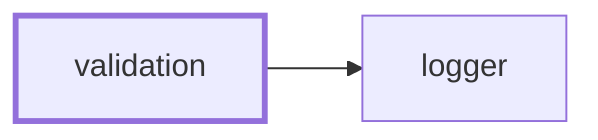
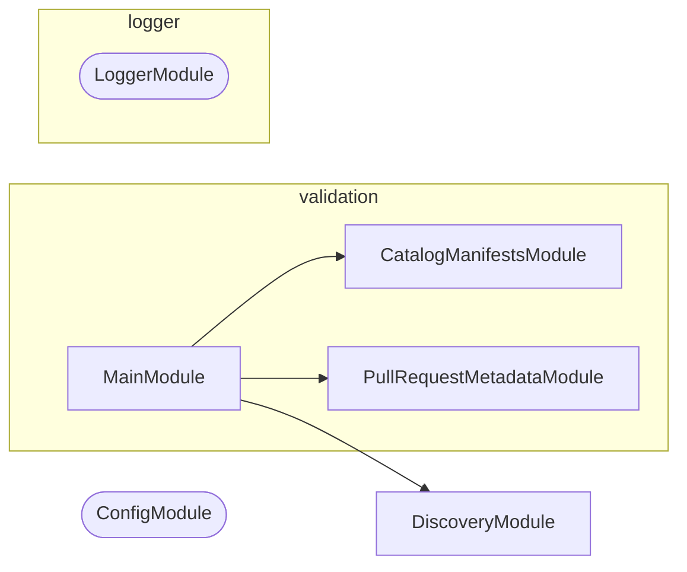

# 🧑‍⚖️ Validation

**Answer whether something conforms, and say what to do when it does not.**

Some checks have only one side. There is nothing to write back: a pull request
title either agrees with its labels or it does not, a manifest either pins
`catalog:` or it does not. This is the NestJS CLI that runs those checks,
collects every failure rather than the first, and prints the command that fixes
each one.

```bash
nx run validation:start:pull-request-metadata     # labels and assignees against the title
nx run validation:start:pull-request-body         # the four headings and no unfilled template comment
nx run validation:start:catalog-manifests         # catalog:/workspace:* in every manifest
nx run validation:start:lockfile                  # pnpm-lock.yaml against the manifests
```

It is the one-sided counterpart to
[synchronization](../synchronization/README.md): that tool reconciles a
`check` against a `write`, this one has no `write` to offer.

## Why it lives here

A check belongs here when it has a `check` and no `write`, and when it already
depends on Node. Both halves matter.

The first half is the boundary against
[synchronization](../synchronization/README.md), whose whole contract is
`check`/`write` reconciliation. A check that cannot write has nothing to put on
the other side of that contract, so modelling it as a synchronization would mean
a `write` mode that either lies or refuses.

The second half is the boundary against `scripts/git/`. Moving a check into this
CLI makes it depend on a healthy `node_modules`, which is fine for a check that
already ran Node and fatal for one that did not. That is why the signing and
authentication checks stay in shell — see [AGENTS.md](AGENTS.md).

## Checks

| Check | Answers |
| ----- | ------- |
| `pull-request-metadata` | Do a pull request's labels and assignees agree with its title? |
| `pull-request-body` | Does a pull request description carry all four headings with no template comment left unfilled? |
| `catalog-manifests` | Does every workspace manifest pin externals as `catalog:` and internals as `workspace:*`? |
| `lockfile` | Is `pnpm-lock.yaml` in sync with the manifests? |

### `pull-request-metadata`

Checks five things about a pull request, all against its own title: exactly one
`type:*` label equal to the title's type, exactly the `scope:*` labels named by
the title's scopes, no `do-not-merge` label, at least one assignee, and exactly
one `source:*` label declaring who opened it.

Two input modes. Given a pull request number it reads the metadata live through
`gh pr view`, which is the local mode. Given none it reads
`PULL_REQUEST_TITLE`, `PULL_REQUEST_LABELS`, `PULL_REQUEST_ASSIGNEES`, and
`PULL_REQUEST_NUMBER` from the environment, which is the workflow mode: a pure
function of its inputs, needing no network, no token, and no write permission.

The title's scope group is matched as optional even though the convention
requires one. commitlint rejects a title with no scope first, so in a workflow
run this check never sees one; run by hand ahead of any title check it still
has to say something useful, and one collected failure naming the missing scope
is more useful than a parse error.

### `pull-request-body`

Checks that all four template headings are present and that no `<!-- … -->`
prompt from [.github/PULL_REQUEST_TEMPLATE.md](../../.github/PULL_REQUEST_TEMPLATE.md)
survives unfilled. The comments are read from the template at runtime rather
than listed here, so adding a prompt to the template starts it being checked
with no code change.

### `catalog-manifests`

Every external dependency in every workspace manifest must be `catalog:`, and
every internal one `workspace:*`. Both directions are checked in every
dependency section, and every violation is named at once.

### `lockfile`

Runs `pnpm install --frozen-lockfile` and reports whether the manifests and the
lockfile still agree. The only check here that shells out to something else, for
the reason the manifest check does not: what "in sync" means is pnpm's answer,
not one worth reimplementing.

## Project Graph

Where this project sits in the Nx project graph: what it depends on, and what depends on it. Regenerated by `nx run synchronization:synchronize --configuration=write`.

<!-- nx-project-graph-start -->



<!-- nx-project-graph-end -->

## Module Graph

The modules this project defines and the imports between them, published by `nx run synchronization:synchronize --configuration=write`.

<!-- nestjs-module-graph-start -->



_Rounded modules are global: every module can inject them, so their edges are left out._

<!-- nestjs-module-graph-end -->

## Start

```bash
nx run validation:start
```

## Test

```bash
nx run validation:vitest
```
