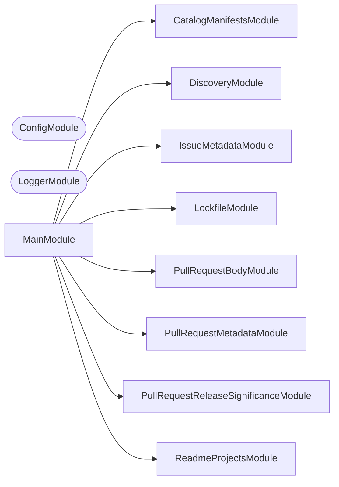

# 🧑‍⚖️ Validation

**Answer whether something conforms, and say what to do when it does not.**

Some checks have only one side. There is nothing to write back: a pull request
title either agrees with its labels or it does not, a manifest either pins
`catalog:` or it does not. This is the NestJS CLI that runs those checks,
collects every failure rather than the first, and prints the command that fixes
each one.

```bash
nx run validation:start:pull-request-metadata     # labels and assignees against the title
nx run validation:start:pull-request-body         # the four headings and no unfilled template comment
nx run validation:start:catalog-manifests         # catalog:/workspace:* in every manifest
nx run validation:start:lockfile                  # pnpm-lock.yaml against the manifests
```

It is the one-sided counterpart to
[synchronization](../synchronization/README.md): that tool reconciles a
`check` against a `write`, this one has no `write` to offer.

## Why it lives here

A check belongs here when it has a `check` and no `write`, and when it already
depends on Node. Both halves matter.

The first half is the boundary against
[synchronization](../synchronization/README.md), whose whole contract is
`check`/`write` reconciliation. A check that cannot write has nothing to put on
the other side of that contract, so modelling it as a synchronization would mean
a `write` mode that either lies or refuses.

The second half is the boundary against `scripts/git/`. Moving a check into this
CLI makes it depend on a healthy `node_modules`, which is fine for a check that
already ran Node and fatal for one that did not. That is why the signing and
authentication checks stay in shell — see [AGENTS.md](AGENTS.md).

## Checks

| Check | Answers |
| ----- | ------- |
| `pull-request-metadata` | Do a pull request's labels and assignees agree with its title? |
| `pull-request-body` | Does a pull request description carry all four headings with no template comment left unfilled? |
| `catalog-manifests` | Does every workspace manifest pin externals as `catalog:` and internals as `workspace:*`? |
| `lockfile` | Is `pnpm-lock.yaml` in sync with the manifests? |

### `pull-request-metadata`

Checks five things about a pull request, all against its own title: exactly one
`type:*` label equal to the title's type, exactly the `scope:*` labels named by
the title's scopes, no `do-not-merge` label, at least one assignee, and exactly
one `source:*` label declaring who opened it.

Two input modes. Given a pull request number it reads the metadata live through
`gh pr view`, which is the local mode. Given none it reads
`PULL_REQUEST_TITLE`, `PULL_REQUEST_LABELS`, `PULL_REQUEST_ASSIGNEES`, and
`PULL_REQUEST_NUMBER` from the environment, which is the workflow mode: a pure
function of its inputs, needing no network, no token, and no write permission.

The title's scope group is matched as optional even though the convention
requires one. commitlint rejects a title with no scope first, so in a workflow
run this check never sees one; run by hand ahead of any title check it still
has to say something useful, and one collected failure naming the missing scope
is more useful than a parse error.

### `pull-request-body`

Checks that all four template headings are present and that no `<!-- … -->`
prompt from [.github/PULL_REQUEST_TEMPLATE.md](../../.github/PULL_REQUEST_TEMPLATE.md)
survives unfilled. The comments are read from the template at runtime rather
than listed here, so adding a prompt to the template starts it being checked
with no code change.

### `catalog-manifests`

Every external dependency in every workspace manifest must be `catalog:`, and
every internal one `workspace:*`. Both directions are checked in every
dependency section, and every violation is named at once.

### `lockfile`

Runs `pnpm install --frozen-lockfile` and reports whether the manifests and the
lockfile still agree. The only check here that shells out to something else, for
the reason the manifest check does not: what "in sync" means is pnpm's answer,
not one worth reimplementing.

## Start

```bash
nx run validation:start
```

## Test

```bash
nx run validation:vitest
```

## 👔 Conformetry

This project was generated from the [nestjs-command-project](../../configuration/conformetry-templates/nestjs-command-project) conformetry template.

<!-- CALL_STACKS_START -->

## 🔭 Callidescope

Call stacks traced through `tools/validation`, deepest first. Each frame shows what it takes, what it returns, and what its documentation says.

| Measure | Value |
| --- | --- |
| Callables | 162 |
| Files | 44 |
| Calls traced | 200 |
| Call stacks | 10 |
| Deepest stack | 7 |
| Stacks through recursion | 0 |
| Unfollowable calls | 17 |

### Call stacks (depth)

**1. `IssueMetadataCommand.run`** — depth ≥ 7 · decorated-method

```text
🚀 IssueMetadataCommand.run(passedParameters: string[]): Promise<void> [tools/validation/src/modules/issue-metadata/issue-metadata.command.ts:257]
   ↳ Checks the issue's metadata and exits 0 or 1 on the verdict.
  └─> IssueMetadataCommand.resolveMetadata(reportLines: string[], passedParameters: string[]): IssueMetadataResolution [tools/validation/src/modules/issue-metadata/issue-metadata.command.ts:227]
     ↳ Reads the metadata from wherever this invocation says it lives.
    └─> IssueMetadataCommand.readEnvironmentMetadata(reportLines: string[]): IssueMetadataResolution [tools/validation/src/modules/issue-metadata/issue-metadata.command.ts:131]
       ↳ Reads the metadata from the environment, the workflow mode.
      └─> IssueMetadataService.resolveFromEnvironment(…): IssueMetadataResolution [tools/validation/src/modules/issue-metadata/issue-metadata.service.ts:311]
         ↳ Reads the metadata out of the two environment documents.
        └─> IssueMetadataService.readLabelNames(entries: unknown[]): string[] [tools/validation/src/modules/issue-metadata/issue-metadata.service.ts:209]
           ↳ Every label name, with the nameless entries dropped.
          └─> IssueMetadataService.map(…)(entry: unknown): string [tools/validation/src/modules/issue-metadata/issue-metadata.service.ts:211]
            └─> IssueMetadataService.isRecord(value: unknown): value is Record<string, unknown> [tools/validation/src/modules/issue-metadata/issue-metadata.service.ts:204]
               ↳ Whether this value can be read by property name at all.
```

**2. `PullRequestMetadataCommand.run`** — depth ≥ 6 · decorated-method

```text
🚀 PullRequestMetadataCommand.run(passedParameters: string[]): Promise<void> [tools/validation/src/modules/pull-request-metadata/pull-request-metadata.command.ts:264]
   ↳ Checks the pull request's metadata and exits 0 or 1 on the verdict.
  └─> PullRequestMetadataCommand.resolveMetadata(…): PullRequestMetadataResolution [tools/validation/src/modules/pull-request-metadata/pull-request-metadata.command.ts:214]
     ↳ Reads the metadata from wherever this invocation says it lives.
    └─> PullRequestMetadataCommand.readEnvironmentMetadata(reportLines: string[]): PullRequestMetadataResolution [tools/validation/src/modules/pull-request-metadata/pull-request-metadata.command.ts:132]
       ↳ Reads the metadata from the environment, the workflow mode.
      └─> PullRequestMetadataService.resolveFromEnvironment(…): PullRequestMetadataResolution [tools/validation/src/modules/pull-request-metadata/pull-request-metadata.service.ts:332]
         ↳ Reads the metadata out of the three environment documents.
        └─> PullRequestMetadataService.parseJsonArray(…): { entries: unknown[]; } | { failure: string; } [tools/validation/src/modules/pull-request-metadata/pull-request-metadata.service.ts:177]
           ↳ Reads a JSON array, or says why the document was not one.
          └─> PullRequestMetadataService.describeError(error: unknown): string [tools/validation/src/modules/pull-request-metadata/pull-request-metadata.service.ts:249]
             ↳ Whatever went wrong, as the one line a report can carry.
```

**3. `PullRequestReleaseSignificanceCommand.run`** — depth 6 · decorated-method

```text
🚀 PullRequestReleaseSignificanceCommand.run(passedParameters: string[]): Promise<void> [tools/validation/src/modules/pull-request-release-significance/pull-request-release-significance.command.ts:212]
   ↳ Checks the pull request's title against its commits and exits 0 or 1.
  └─> PullRequestReleaseSignificanceService.checkSignificance(…): SignificanceVerdict [tools/validation/src/modules/pull-request-release-significance/pull-request-release-significance.service.ts:205]
     ↳ Every way this pull request's title understates its own commits.
    └─> PullRequestReleaseSignificanceService.findMostSignificantCommit(…): { commit: PullRequestCommit; rank: number; } | undefined [tools/validation/src/modules/pull-request-release-significance/pull-request-release-significance.service.ts:103]
       ↳ The commit whose own type and scopes rank most release-significant.
      └─> PullRequestReleaseSignificanceService.significanceRank(subject: ConventionalSubject, releaseRules: readonly ReleaseRule[]): number [tools/validation/src/modules/pull-request-release-significance/pull-request-release-significance.service.ts:332]
         ↳ How release-significant this subject is, under these `releaseRules`.
        └─> PullRequestReleaseSignificanceService.matchRule(…): ReleaseRule | undefined [tools/validation/src/modules/pull-request-release-significance/pull-request-release-significance.service.ts:140]
           ↳ The first `releaseRules` entry this subject satisfies, in array order.
          └─> PullRequestReleaseSignificanceService.find(…)(rule: ReleaseRule): boolean [tools/validation/src/modules/pull-request-release-significance/pull-request-release-significance.service.ts:144]
```

<details>
<summary>7 more call stacks</summary>

**4. `PullRequestBodyCommand.run`** — depth 5 · decorated-method

```text
🚀 PullRequestBodyCommand.run(passedParameters: string[]): Promise<void> [tools/validation/src/modules/pull-request-body/pull-request-body.command.ts:123]
   ↳ Checks the description and exits 0 or 1 on the verdict.
  └─> PullRequestBodyService.checkBody(…): BodyVerdict [tools/validation/src/modules/pull-request-body/pull-request-body.service.ts:50]
     ↳ Both lists of failures, from one description and the template's prompts.
    └─> PullRequestBodyService.findUnfilledComments(…): string[] [tools/validation/src/modules/pull-request-body/pull-request-body.service.ts:75]
       ↳ Every template prompt the description still carries.
      └─> PullRequestBodyService.filter(…)(templateComment: string): boolean [tools/validation/src/modules/pull-request-body/pull-request-body.service.ts:81]
        └─> PullRequestBodyService.prefixOf(templateComment: string): string [tools/validation/src/modules/pull-request-body/pull-request-body.service.ts:41]
           ↳ The leading run of a prompt that a description has to still carry.
```

**5. `CatalogManifestsCommand.run`** — depth 3 · decorated-method

```text
🚀 CatalogManifestsCommand.run(): Promise<void> [tools/validation/src/modules/catalog-manifests/catalog-manifests.command.ts:44]
   ↳ Checks every workspace manifest and exits 0 or 1 on the verdict.
  └─> CatalogManifestsCommand.flatMap(…)(this: undefined, manifestPath: string): string[] [tools/validation/src/modules/catalog-manifests/catalog-manifests.command.ts:50]
    └─> CatalogManifestsService.readManifest(manifestPath: string): PackageManifest [tools/validation/src/modules/catalog-manifests/catalog-manifests.service.ts:46]
       ↳ Reads and parses one manifest.
```

**6. `LockfileCommand.run`** — depth 3 · decorated-method

```text
🚀 LockfileCommand.run(): Promise<void> [tools/validation/src/modules/lockfile/lockfile.command.ts:50]
   ↳ Checks the lockfile and exits 0 or 1 on pnpm's verdict.
  └─> LockfileService.checkLockfile(): FrozenInstallResult [tools/validation/src/modules/lockfile/lockfile.service.ts:60]
     ↳ Runs `pnpm install --frozen-lockfile`, wherever pnpm can be found.
    └─> LockfileService.runFrozenInstall(packageManagerPath: string): FrozenInstallResult [tools/validation/src/modules/lockfile/lockfile.service.ts:33]
       ↳ Runs one candidate pnpm, merging both of its streams.
```

**7. `ReadmeProjectsCommand.run`** — depth 3 · decorated-method

```text
🚀 ReadmeProjectsCommand.run(): Promise<void> [tools/validation/src/modules/readme-projects/readme-projects.command.ts:43]
   ↳ Checks every workspace project and exits 0 or 1 on the verdict.
  └─> ReadmeProjectsService.findUndocumentedProjectPaths(projectPaths: string[], readmeContents: string): string[] [tools/validation/src/modules/readme-projects/readme-projects.service.ts:36]
     ↳ Every project path the README does not link to.
    └─> ReadmeProjectsService.filter(…)(projectPath: string): boolean [tools/validation/src/modules/readme-projects/readme-projects.service.ts:41]
```

**8. `CatalogManifestsService.validateManifestDependencies`** — depth 3 · orphan-root

```text
🚀 CatalogManifestsService.validateManifestDependencies(manifestPath: string, manifest: PackageManifest): string[] [tools/validation/src/modules/catalog-manifests/catalog-manifests.service.ts:84]
   ↳ Every mis-pinned dependency in one manifest, in every section.
  └─> CatalogManifestsService.isInternalWorkspaceDependency(dependencyName: string): boolean [tools/validation/src/modules/catalog-manifests/catalog-manifests.service.ts:37]
     ↳ Whether this dependency names one of this workspace's own packages.
    └─> CatalogManifestsService.some(…)(scope: string): boolean [tools/validation/src/modules/catalog-manifests/catalog-manifests.service.ts:38]
```

**9. `PullRequestReleaseSignificanceService.readRawCommit`** — depth 3 · orphan-root

```text
🚀 PullRequestReleaseSignificanceService.readRawCommit(entry: unknown): PullRequestCommit [tools/validation/src/modules/pull-request-release-significance/pull-request-release-significance.service.ts:153]
   ↳ Reads one raw `commits` array entry into a `PullRequestCommit`.
  └─> PullRequestReleaseSignificanceService.parseConventionalSubject(subject: string, body?: string): ConventionalSubject | undefined [tools/validation/src/modules/pull-request-release-significance/pull-request-release-significance.service.ts:250]
     ↳ Reads the type, scopes, and breaking marker out of a conventional subject line.
    └─> PullRequestReleaseSignificanceService.filter(…)(scope: string): boolean [tools/validation/src/modules/pull-request-release-significance/pull-request-release-significance.service.ts:266]
```

**10. `PullRequestMetadataService.nameOf`** — depth 2 · orphan-root

```text
🚀 PullRequestMetadataService.nameOf(entry: unknown, propertyName: string): string [tools/validation/src/modules/pull-request-metadata/pull-request-metadata.service.ts:162]
   ↳ Reads one label or assignee entry, whichever shape it arrived in.
  └─> PullRequestMetadataService.isRecord(value: unknown): value is Record<string, unknown> [tools/validation/src/modules/pull-request-metadata/pull-request-metadata.service.ts:157]
     ↳ Whether this value can be read by property name at all.
```

</details>

### Module spread

None.

### Breadth

| Callable | Breadth | Calls directly | Location |
| --- | --- | --- | --- |
| `PullRequestReleaseSignificanceCommand.run` | 9 | `PullRequestReleaseSignificanceCommand.resolvePullRequestNumber`, `PullRequestReleaseSignificanceCommand.readLivePullRequest`, `PullRequestReleaseSignificanceCommand.failWithMessage`, `PullRequestReleaseSignificanceService.parseConventionalSubject`, `PullRequestReleaseSignificanceService.readReleaseRules`, `PullRequestReleaseSignificanceService.checkSignificance`, `PullRequestReleaseSignificanceCommand.reportFailures`, `PullRequestReleaseSignificanceCommand.appendToReport`, `PullRequestReleaseSignificanceCommand.mirrorToStepSummary` | `tools/validation/src/modules/pull-request-release-significance/pull-request-release-significance.command.ts:212` |
| `IssueMetadataCommand.run` | 8 | `IssueMetadataCommand.resolveMetadata`, `IssueMetadataCommand.failWithMessage`, `IssueMetadataService.parseFormAnswers`, `IssueMetadataService.checkMetadata`, `IssueMetadataCommand.resolveIssueNumber`, `IssueMetadataCommand.reportFailures`, `IssueMetadataCommand.appendToReport`, `IssueMetadataCommand.mirrorToStepSummary` | `tools/validation/src/modules/issue-metadata/issue-metadata.command.ts:257` |
| `PullRequestMetadataCommand.run` | 8 | `PullRequestMetadataCommand.resolveMetadata`, `PullRequestMetadataCommand.failWithMessage`, `PullRequestMetadataService.parseTitle`, `PullRequestMetadataService.checkMetadata`, `PullRequestMetadataCommand.resolvePullRequestNumber`, `PullRequestMetadataCommand.reportFailures`, `PullRequestMetadataCommand.appendToReport`, `PullRequestMetadataCommand.mirrorToStepSummary` | `tools/validation/src/modules/pull-request-metadata/pull-request-metadata.command.ts:264` |

<details>
<summary>70 more callables</summary>

| Callable | Breadth | Calls directly | Location |
| --- | --- | --- | --- |
| `IssueMetadataCommand.readLiveMetadata` | 5 | `IssueMetadataGithubService.isAvailable`, `IssueMetadataCommand.failWithUsageError`, `IssueMetadataGithubService.run`, `IssueMetadataGithubService.describeFailure`, `IssueMetadataService.resolveFromDocument` | `tools/validation/src/modules/issue-metadata/issue-metadata.command.ts:151` |
| `PullRequestMetadataService.checkMetadata` | 5 | `PullRequestMetadataService.groupLabels`, `PullRequestMetadataService.checkTypeLabel`, `PullRequestMetadataService.checkScopeLabels`, `PullRequestMetadataService.record`, `PullRequestMetadataService.checkSourceLabel` | `tools/validation/src/modules/pull-request-metadata/pull-request-metadata.service.ts:213` |
| `PullRequestMetadataCommand.readLiveMetadata` | 5 | `PullRequestMetadataGithubService.isAvailable`, `PullRequestMetadataCommand.failWithUsageError`, `PullRequestMetadataGithubService.run`, `PullRequestMetadataGithubService.describeFailure`, `PullRequestMetadataService.resolveFromDocument` | `tools/validation/src/modules/pull-request-metadata/pull-request-metadata.command.ts:154` |
| `PullRequestReleaseSignificanceService.checkSignificance` | 5 | `PullRequestReleaseSignificanceService.significanceRank`, `PullRequestReleaseSignificanceService.findMostSignificantCommit`, `PullRequestReleaseSignificanceService.findMissingScopes`, `PullRequestReleaseSignificanceService.describeSignificanceFailure`, `PullRequestReleaseSignificanceService.describeMissingScopeFailures` | `tools/validation/src/modules/pull-request-release-significance/pull-request-release-significance.service.ts:205` |
| `PullRequestReleaseSignificanceCommand.readLivePullRequest` | 5 | `PullRequestReleaseSignificanceGithubService.isAvailable`, `PullRequestReleaseSignificanceCommand.failWithUsageError`, `PullRequestReleaseSignificanceGithubService.run`, `PullRequestReleaseSignificanceGithubService.describeFailure`, `PullRequestReleaseSignificanceService.resolveFromDocument` | `tools/validation/src/modules/pull-request-release-significance/pull-request-release-significance.command.ts:114` |
| `IssueMetadataService.checkMetadata` | 4 | `IssueMetadataService.groupLabels`, `IssueMetadataService.checkTypeLabel`, `IssueMetadataService.checkScopeLabels`, `IssueMetadataService.checkSourceLabel` | `tools/validation/src/modules/issue-metadata/issue-metadata.service.ts:230` |
| `PullRequestBodyCommand.run` | 4 | `PullRequestBodyCommand.resolveBody`, `PullRequestBodyService.checkBody`, `PullRequestBodyService.extractTemplateComments`, `PullRequestBodyCommand.reportVerdict` | `tools/validation/src/modules/pull-request-body/pull-request-body.command.ts:123` |
| `IssueMetadataService.checkTypeLabel` | 3 | `IssueMetadataService.checkTypeLabelPresence`, `IssueMetadataService.map(…)`, `IssueMetadataService.filter(…)` | `tools/validation/src/modules/issue-metadata/issue-metadata.service.ts:123` |
| `IssueMetadataService.groupLabels` | 3 | `IssueMetadataService.filter(…)`, `IssueMetadataService.filter(…)`, `IssueMetadataService.filter(…)` | `tools/validation/src/modules/issue-metadata/issue-metadata.service.ts:256` |
| `IssueMetadataService.resolveFromDocument` | 3 | `IssueMetadataService.describeError`, `IssueMetadataService.isRecord`, `IssueMetadataService.readLabelNames` | `tools/validation/src/modules/issue-metadata/issue-metadata.service.ts:285` |
| `IssueMetadataCommand.resolveMetadata` | 3 | `IssueMetadataCommand.failWithUsageError`, `IssueMetadataCommand.readEnvironmentMetadata`, `IssueMetadataCommand.readLiveMetadata` | `tools/validation/src/modules/issue-metadata/issue-metadata.command.ts:227` |
| `PullRequestMetadataService.groupLabels` | 3 | `PullRequestMetadataService.filter(…)`, `PullRequestMetadataService.filter(…)`, `PullRequestMetadataService.filter(…)` | `tools/validation/src/modules/pull-request-metadata/pull-request-metadata.service.ts:254` |
| `PullRequestMetadataService.resolveFromDocument` | 3 | `PullRequestMetadataService.describeError`, `PullRequestMetadataService.isRecord`, `PullRequestMetadataService.readNames` | `tools/validation/src/modules/pull-request-metadata/pull-request-metadata.service.ts:297` |
| `PullRequestMetadataCommand.resolveMetadata` | 3 | `PullRequestMetadataCommand.failWithUsageError`, `PullRequestMetadataCommand.readEnvironmentMetadata`, `PullRequestMetadataCommand.readLiveMetadata` | `tools/validation/src/modules/pull-request-metadata/pull-request-metadata.command.ts:214` |
| `ReadmeProjectsCommand.run` | 3 | `ReadmeProjectsService.resolveWorkspaceProjectPaths`, `ReadmeProjectsService.readRootReadme`, `ReadmeProjectsService.findUndocumentedProjectPaths` | `tools/validation/src/modules/readme-projects/readme-projects.command.ts:43` |
| `CatalogManifestsCommand.run` | 2 | `CatalogManifestsService.resolveWorkspaceManifestPaths`, `CatalogManifestsCommand.flatMap(…)` | `tools/validation/src/modules/catalog-manifests/catalog-manifests.command.ts:44` |
| `IssueMetadataService.checkSourceLabel` | 2 | `IssueMetadataService.map(…)`, `IssueMetadataService.map(…)` | `tools/validation/src/modules/issue-metadata/issue-metadata.service.ts:88` |
| `IssueMetadataService.readLabelNames` | 2 | `IssueMetadataService.filter(…)`, `IssueMetadataService.map(…)` | `tools/validation/src/modules/issue-metadata/issue-metadata.service.ts:209` |
| `IssueMetadataService.resolveFromEnvironment` | 2 | `IssueMetadataService.describeError`, `IssueMetadataService.readLabelNames` | `tools/validation/src/modules/issue-metadata/issue-metadata.service.ts:311` |
| `IssueMetadataCommand.failWithMessage` | 2 | `IssueMetadataCommand.appendToReport`, `IssueMetadataCommand.mirrorToStepSummary` | `tools/validation/src/modules/issue-metadata/issue-metadata.command.ts:77` |
| `IssueMetadataCommand.failWithUsageError` | 2 | `IssueMetadataCommand.appendToReport`, `IssueMetadataCommand.mirrorToStepSummary` | `tools/validation/src/modules/issue-metadata/issue-metadata.command.ts:85` |
| `IssueMetadataCommand.readEnvironmentMetadata` | 2 | `IssueMetadataCommand.failWithUsageError`, `IssueMetadataService.resolveFromEnvironment` | `tools/validation/src/modules/issue-metadata/issue-metadata.command.ts:131` |
| `IssueMetadataCommand.reportFailures` | 2 | `IssueMetadataCommand.appendToReport`, `IssueMetadataCommand.mirrorToStepSummary` | `tools/validation/src/modules/issue-metadata/issue-metadata.command.ts:181` |
| `PullRequestBodyService.checkBody` | 2 | `PullRequestBodyService.findMissingHeadings`, `PullRequestBodyService.findUnfilledComments` | `tools/validation/src/modules/pull-request-body/pull-request-body.service.ts:50` |
| `PullRequestBodyService.findMissingHeadings` | 2 | `PullRequestBodyService.map(…)`, `PullRequestBodyService.filter(…)` | `tools/validation/src/modules/pull-request-body/pull-request-body.service.ts:68` |
| `PullRequestMetadataService.checkSourceLabel` | 2 | `PullRequestMetadataService.map(…)`, `PullRequestMetadataService.map(…)` | `tools/validation/src/modules/pull-request-metadata/pull-request-metadata.service.ts:93` |
| `PullRequestMetadataService.checkTypeLabel` | 2 | `PullRequestMetadataService.map(…)`, `PullRequestMetadataService.filter(…)` | `tools/validation/src/modules/pull-request-metadata/pull-request-metadata.service.ts:124` |
| `PullRequestMetadataService.readNames` | 2 | `PullRequestMetadataService.filter(…)`, `PullRequestMetadataService.map(…)` | `tools/validation/src/modules/pull-request-metadata/pull-request-metadata.service.ts:199` |
| `PullRequestMetadataService.parseTitle` | 2 | `PullRequestMetadataService.filter(…)`, `PullRequestMetadataService.map(…)` | `tools/validation/src/modules/pull-request-metadata/pull-request-metadata.service.ts:276` |
| `PullRequestMetadataService.resolveFromEnvironment` | 2 | `PullRequestMetadataService.parseJsonArray`, `PullRequestMetadataService.readNames` | `tools/validation/src/modules/pull-request-metadata/pull-request-metadata.service.ts:332` |
| `PullRequestMetadataCommand.failWithMessage` | 2 | `PullRequestMetadataCommand.appendToReport`, `PullRequestMetadataCommand.mirrorToStepSummary` | `tools/validation/src/modules/pull-request-metadata/pull-request-metadata.command.ts:78` |
| `PullRequestMetadataCommand.failWithUsageError` | 2 | `PullRequestMetadataCommand.appendToReport`, `PullRequestMetadataCommand.mirrorToStepSummary` | `tools/validation/src/modules/pull-request-metadata/pull-request-metadata.command.ts:86` |
| `PullRequestMetadataCommand.readEnvironmentMetadata` | 2 | `PullRequestMetadataCommand.failWithUsageError`, `PullRequestMetadataService.resolveFromEnvironment` | `tools/validation/src/modules/pull-request-metadata/pull-request-metadata.command.ts:132` |
| `PullRequestMetadataCommand.reportFailures` | 2 | `PullRequestMetadataCommand.appendToReport`, `PullRequestMetadataCommand.mirrorToStepSummary` | `tools/validation/src/modules/pull-request-metadata/pull-request-metadata.command.ts:186` |
| `PullRequestReleaseSignificanceService.describeSignificanceFailure` | 2 | `PullRequestReleaseSignificanceService.releaseLevelName`, `PullRequestReleaseSignificanceService.find(…)` | `tools/validation/src/modules/pull-request-release-significance/pull-request-release-significance.service.ts:61` |
| `PullRequestReleaseSignificanceService.readRawCommit` | 2 | `PullRequestReleaseSignificanceService.isRecord`, `PullRequestReleaseSignificanceService.parseConventionalSubject` | `tools/validation/src/modules/pull-request-release-significance/pull-request-release-significance.service.ts:153` |
| `PullRequestReleaseSignificanceService.parseConventionalSubject` | 2 | `PullRequestReleaseSignificanceService.filter(…)`, `PullRequestReleaseSignificanceService.map(…)` | `tools/validation/src/modules/pull-request-release-significance/pull-request-release-significance.service.ts:250` |
| `PullRequestReleaseSignificanceService.resolveFromDocument` | 2 | `PullRequestReleaseSignificanceService.describeError`, `PullRequestReleaseSignificanceService.map(…)` | `tools/validation/src/modules/pull-request-release-significance/pull-request-release-significance.service.ts:306` |
| `PullRequestReleaseSignificanceService.significanceRank` | 2 | `PullRequestReleaseSignificanceService.matchRule`, `PullRequestReleaseSignificanceService.rankOfRelease` | `tools/validation/src/modules/pull-request-release-significance/pull-request-release-significance.service.ts:332` |
| `PullRequestReleaseSignificanceCommand.failWithMessage` | 2 | `PullRequestReleaseSignificanceCommand.appendToReport`, `PullRequestReleaseSignificanceCommand.mirrorToStepSummary` | `tools/validation/src/modules/pull-request-release-significance/pull-request-release-significance.command.ts:73` |
| `PullRequestReleaseSignificanceCommand.failWithUsageError` | 2 | `PullRequestReleaseSignificanceCommand.appendToReport`, `PullRequestReleaseSignificanceCommand.mirrorToStepSummary` | `tools/validation/src/modules/pull-request-release-significance/pull-request-release-significance.command.ts:81` |
| `PullRequestReleaseSignificanceCommand.reportFailures` | 2 | `PullRequestReleaseSignificanceCommand.appendToReport`, `PullRequestReleaseSignificanceCommand.mirrorToStepSummary` | `tools/validation/src/modules/pull-request-release-significance/pull-request-release-significance.command.ts:146` |
| `CatalogManifestsService.isInternalWorkspaceDependency` | 1 | `CatalogManifestsService.some(…)` | `tools/validation/src/modules/catalog-manifests/catalog-manifests.service.ts:37` |
| `CatalogManifestsService.validateManifestDependencies` | 1 | `CatalogManifestsService.isInternalWorkspaceDependency` | `tools/validation/src/modules/catalog-manifests/catalog-manifests.service.ts:84` |
| `CatalogManifestsCommand.flatMap(…)` | 1 | `CatalogManifestsService.readManifest` | `tools/validation/src/modules/catalog-manifests/catalog-manifests.command.ts:50` |
| `IssueMetadataGithubService.describeFailure` | 1 | `IssueMetadataGithubService.filter(…)` | `tools/validation/src/modules/issue-metadata/issue-metadata-github.service.ts:47` |
| `IssueMetadataGithubService.isAvailable` | 1 | `IssueMetadataGithubService.run` | `tools/validation/src/modules/issue-metadata/issue-metadata-github.service.ts:56` |
| `IssueMetadataService.checkTypeLabelPresence` | 1 | `IssueMetadataService.map(…)` | `tools/validation/src/modules/issue-metadata/issue-metadata.service.ts:162` |
| `IssueMetadataService.map(…)` | 1 | `IssueMetadataService.isRecord` | `tools/validation/src/modules/issue-metadata/issue-metadata.service.ts:211` |
| `IssueMetadataService.parseFormAnswers` | 1 | `IssueMetadataService.extractFormField` | `tools/validation/src/modules/issue-metadata/issue-metadata.service.ts:274` |
| `LockfileService.checkLockfile` | 1 | `LockfileService.runFrozenInstall` | `tools/validation/src/modules/lockfile/lockfile.service.ts:60` |
| `LockfileCommand.run` | 1 | `LockfileService.checkLockfile` | `tools/validation/src/modules/lockfile/lockfile.command.ts:50` |
| `PullRequestBodyService.extractTemplateComments` | 1 | `PullRequestBodyService.map(…)` | `tools/validation/src/modules/pull-request-body/pull-request-body.service.ts:61` |
| `PullRequestBodyService.findUnfilledComments` | 1 | `PullRequestBodyService.filter(…)` | `tools/validation/src/modules/pull-request-body/pull-request-body.service.ts:75` |
| `PullRequestBodyService.filter(…)` | 1 | `PullRequestBodyService.prefixOf` | `tools/validation/src/modules/pull-request-body/pull-request-body.service.ts:81` |
| `PullRequestBodyCommand.reportVerdict` | 1 | `PullRequestBodyCommand.map(…)` | `tools/validation/src/modules/pull-request-body/pull-request-body.command.ts:72` |
| `PullRequestBodyCommand.resolveBody` | 1 | `PullRequestBodyCommand.failWithUsageError` | `tools/validation/src/modules/pull-request-body/pull-request-body.command.ts:98` |
| `PullRequestMetadataGithubService.describeFailure` | 1 | `PullRequestMetadataGithubService.filter(…)` | `tools/validation/src/modules/pull-request-metadata/pull-request-metadata-github.service.ts:47` |
| `PullRequestMetadataGithubService.isAvailable` | 1 | `PullRequestMetadataGithubService.run` | `tools/validation/src/modules/pull-request-metadata/pull-request-metadata-github.service.ts:56` |
| `PullRequestMetadataService.nameOf` | 1 | `PullRequestMetadataService.isRecord` | `tools/validation/src/modules/pull-request-metadata/pull-request-metadata.service.ts:162` |
| `PullRequestMetadataService.parseJsonArray` | 1 | `PullRequestMetadataService.describeError` | `tools/validation/src/modules/pull-request-metadata/pull-request-metadata.service.ts:177` |
| `PullRequestReleaseSignificanceGithubService.describeFailure` | 1 | `PullRequestReleaseSignificanceGithubService.filter(…)` | `tools/validation/src/modules/pull-request-release-significance/pull-request-release-significance-github.service.ts:42` |
| `PullRequestReleaseSignificanceGithubService.isAvailable` | 1 | `PullRequestReleaseSignificanceGithubService.run` | `tools/validation/src/modules/pull-request-release-significance/pull-request-release-significance-github.service.ts:51` |
| `PullRequestReleaseSignificanceService.describeMissingScopeFailures` | 1 | `PullRequestReleaseSignificanceService.map(…)` | `tools/validation/src/modules/pull-request-release-significance/pull-request-release-significance.service.ts:51` |
| `PullRequestReleaseSignificanceService.findMostSignificantCommit` | 1 | `PullRequestReleaseSignificanceService.significanceRank` | `tools/validation/src/modules/pull-request-release-significance/pull-request-release-significance.service.ts:103` |
| `PullRequestReleaseSignificanceService.matchRule` | 1 | `PullRequestReleaseSignificanceService.find(…)` | `tools/validation/src/modules/pull-request-release-significance/pull-request-release-significance.service.ts:140` |
| `PullRequestReleaseSignificanceService.releaseLevelName` | 1 | `PullRequestReleaseSignificanceService.find(…)` | `tools/validation/src/modules/pull-request-release-significance/pull-request-release-significance.service.ts:172` |
| `PullRequestReleaseSignificanceService.readReleaseRules` | 1 | `PullRequestReleaseSignificanceService.find(…)` | `tools/validation/src/modules/pull-request-release-significance/pull-request-release-significance.service.ts:284` |
| `PullRequestReleaseSignificanceCommand.resolvePullRequestNumber` | 1 | `PullRequestReleaseSignificanceCommand.failWithUsageError` | `tools/validation/src/modules/pull-request-release-significance/pull-request-release-significance.command.ts:173` |
| `ReadmeProjectsService.findUndocumentedProjectPaths` | 1 | `ReadmeProjectsService.filter(…)` | `tools/validation/src/modules/readme-projects/readme-projects.service.ts:36` |

</details>

### Possibly misplaced

None.
<!-- CALL_STACKS_END -->

## 🕸️ Codependix

Dependency graphs exported by [codependix](https://github.com/JimmyPaolini/codebase/tree/main/packages/codependix-cli), regenerated by `nx run codebase:codependix:write`.

### Nx Neighborhood

<!-- codependix:start name="codependix-nx" -->

<!-- codependix:end name="codependix-nx" -->

### NestJS Module Graph

<!-- codependix:start name="codependix-nestjs" -->


_Rounded modules are global: every module can inject them, so their edges are left out._
<!-- codependix:end name="codependix-nestjs" -->

### File Imports

<!-- codependix:start name="codependix-imports" -->
```mermaid
graph LR
  file_codometer_config_ts["codometer.config.ts"]
  file_eslint_config_ts["eslint.config.ts"]
  file_src_constants_ts["src/constants.ts"]
  file_src_main_end_to_end_test_ts["src/main.end-to-end.test.ts"]
  file_src_main_module_ts["src/main.module.ts"]
  file_src_main_ts["src/main.ts"]
  file_src_main_unit_test_ts["src/main.unit.test.ts"]
  file_src_modules_catalog_manifests_catalog_manifests_command_ts["src/modules/catalog-manifests/catalog-manifests.command.ts"]
  file_src_modules_catalog_manifests_catalog_manifests_command_unit_test_ts["src/modules/catalog-manifests/catalog-manifests.command.unit.test.ts"]
  file_src_modules_catalog_manifests_catalog_manifests_constants_ts["src/modules/catalog-manifests/catalog-manifests.constants.ts"]
  file_src_modules_catalog_manifests_catalog_manifests_module_ts["src/modules/catalog-manifests/catalog-manifests.module.ts"]
  file_src_modules_catalog_manifests_catalog_manifests_module_unit_test_ts["src/modules/catalog-manifests/catalog-manifests.module.unit.test.ts"]
  file_src_modules_catalog_manifests_catalog_manifests_service_ts["src/modules/catalog-manifests/catalog-manifests.service.ts"]
  file_src_modules_catalog_manifests_catalog_manifests_service_unit_test_ts["src/modules/catalog-manifests/catalog-manifests.service.unit.test.ts"]
  file_src_modules_catalog_manifests_catalog_manifests_types_ts["src/modules/catalog-manifests/catalog-manifests.types.ts"]
  file_src_modules_issue_metadata_issue_metadata_github_service_ts["src/modules/issue-metadata/issue-metadata-github.service.ts"]
  file_src_modules_issue_metadata_issue_metadata_github_service_unit_test_ts["src/modules/issue-metadata/issue-metadata-github.service.unit.test.ts"]
  file_src_modules_issue_metadata_issue_metadata_command_ts["src/modules/issue-metadata/issue-metadata.command.ts"]
  file_src_modules_issue_metadata_issue_metadata_command_unit_test_ts["src/modules/issue-metadata/issue-metadata.command.unit.test.ts"]
  file_src_modules_issue_metadata_issue_metadata_constants_ts["src/modules/issue-metadata/issue-metadata.constants.ts"]
  file_src_modules_issue_metadata_issue_metadata_module_ts["src/modules/issue-metadata/issue-metadata.module.ts"]
  file_src_modules_issue_metadata_issue_metadata_module_unit_test_ts["src/modules/issue-metadata/issue-metadata.module.unit.test.ts"]
  file_src_modules_issue_metadata_issue_metadata_service_ts["src/modules/issue-metadata/issue-metadata.service.ts"]
  file_src_modules_issue_metadata_issue_metadata_service_unit_test_ts["src/modules/issue-metadata/issue-metadata.service.unit.test.ts"]
  file_src_modules_issue_metadata_issue_metadata_types_ts["src/modules/issue-metadata/issue-metadata.types.ts"]
  file_src_modules_lockfile_lockfile_command_ts["src/modules/lockfile/lockfile.command.ts"]
  file_src_modules_lockfile_lockfile_command_unit_test_ts["src/modules/lockfile/lockfile.command.unit.test.ts"]
  file_src_modules_lockfile_lockfile_constants_ts["src/modules/lockfile/lockfile.constants.ts"]
  file_src_modules_lockfile_lockfile_module_ts["src/modules/lockfile/lockfile.module.ts"]
  file_src_modules_lockfile_lockfile_module_unit_test_ts["src/modules/lockfile/lockfile.module.unit.test.ts"]
  file_src_modules_lockfile_lockfile_service_ts["src/modules/lockfile/lockfile.service.ts"]
  file_src_modules_lockfile_lockfile_service_unit_test_ts["src/modules/lockfile/lockfile.service.unit.test.ts"]
  file_src_modules_lockfile_lockfile_types_ts["src/modules/lockfile/lockfile.types.ts"]
  file_src_modules_pull_request_body_pull_request_body_command_ts["src/modules/pull-request-body/pull-request-body.command.ts"]
  file_src_modules_pull_request_body_pull_request_body_command_unit_test_ts["src/modules/pull-request-body/pull-request-body.command.unit.test.ts"]
  file_src_modules_pull_request_body_pull_request_body_constants_ts["src/modules/pull-request-body/pull-request-body.constants.ts"]
  file_src_modules_pull_request_body_pull_request_body_module_ts["src/modules/pull-request-body/pull-request-body.module.ts"]
  file_src_modules_pull_request_body_pull_request_body_module_unit_test_ts["src/modules/pull-request-body/pull-request-body.module.unit.test.ts"]
  file_src_modules_pull_request_body_pull_request_body_service_ts["src/modules/pull-request-body/pull-request-body.service.ts"]
  file_src_modules_pull_request_body_pull_request_body_service_unit_test_ts["src/modules/pull-request-body/pull-request-body.service.unit.test.ts"]
  file_src_modules_pull_request_body_pull_request_body_types_ts["src/modules/pull-request-body/pull-request-body.types.ts"]
  file_src_modules_pull_request_metadata_pull_request_metadata_github_service_ts["src/modules/pull-request-metadata/pull-request-metadata-github.service.ts"]
  file_src_modules_pull_request_metadata_pull_request_metadata_github_service_unit_test_ts["src/modules/pull-request-metadata/pull-request-metadata-github.service.unit.test.ts"]
  file_src_modules_pull_request_metadata_pull_request_metadata_command_ts["src/modules/pull-request-metadata/pull-request-metadata.command.ts"]
  file_src_modules_pull_request_metadata_pull_request_metadata_command_unit_test_ts["src/modules/pull-request-metadata/pull-request-metadata.command.unit.test.ts"]
  file_src_modules_pull_request_metadata_pull_request_metadata_constants_ts["src/modules/pull-request-metadata/pull-request-metadata.constants.ts"]
  file_src_modules_pull_request_metadata_pull_request_metadata_module_ts["src/modules/pull-request-metadata/pull-request-metadata.module.ts"]
  file_src_modules_pull_request_metadata_pull_request_metadata_module_unit_test_ts["src/modules/pull-request-metadata/pull-request-metadata.module.unit.test.ts"]
  file_src_modules_pull_request_metadata_pull_request_metadata_service_ts["src/modules/pull-request-metadata/pull-request-metadata.service.ts"]
  file_src_modules_pull_request_metadata_pull_request_metadata_service_unit_test_ts["src/modules/pull-request-metadata/pull-request-metadata.service.unit.test.ts"]
  file_src_modules_pull_request_metadata_pull_request_metadata_types_ts["src/modules/pull-request-metadata/pull-request-metadata.types.ts"]
  file_src_modules_pull_request_release_significance_pull_request_release_significance_github_service_ts["src/modules/pull-request-release-significance/pull-request-release-significance-github.service.ts"]
  file_src_modules_pull_request_release_significance_pull_request_release_significance_github_service_unit_test_ts["src/modules/pull-request-release-significance/pull-request-release-significance-github.service.unit.test.ts"]
  file_src_modules_pull_request_release_significance_pull_request_release_significance_command_ts["src/modules/pull-request-release-significance/pull-request-release-significance.command.ts"]
  file_src_modules_pull_request_release_significance_pull_request_release_significance_command_unit_test_ts["src/modules/pull-request-release-significance/pull-request-release-significance.command.unit.test.ts"]
  file_src_modules_pull_request_release_significance_pull_request_release_significance_constants_ts["src/modules/pull-request-release-significance/pull-request-release-significance.constants.ts"]
  file_src_modules_pull_request_release_significance_pull_request_release_significance_module_ts["src/modules/pull-request-release-significance/pull-request-release-significance.module.ts"]
  file_src_modules_pull_request_release_significance_pull_request_release_significance_module_unit_test_ts["src/modules/pull-request-release-significance/pull-request-release-significance.module.unit.test.ts"]
  file_src_modules_pull_request_release_significance_pull_request_release_significance_service_ts["src/modules/pull-request-release-significance/pull-request-release-significance.service.ts"]
  file_src_modules_pull_request_release_significance_pull_request_release_significance_service_unit_test_ts["src/modules/pull-request-release-significance/pull-request-release-significance.service.unit.test.ts"]
  file_src_modules_pull_request_release_significance_pull_request_release_significance_types_ts["src/modules/pull-request-release-significance/pull-request-release-significance.types.ts"]
  file_src_modules_readme_projects_readme_projects_command_ts["src/modules/readme-projects/readme-projects.command.ts"]
  file_src_modules_readme_projects_readme_projects_command_unit_test_ts["src/modules/readme-projects/readme-projects.command.unit.test.ts"]
  file_src_modules_readme_projects_readme_projects_constants_ts["src/modules/readme-projects/readme-projects.constants.ts"]
  file_src_modules_readme_projects_readme_projects_module_ts["src/modules/readme-projects/readme-projects.module.ts"]
  file_src_modules_readme_projects_readme_projects_module_unit_test_ts["src/modules/readme-projects/readme-projects.module.unit.test.ts"]
  file_src_modules_readme_projects_readme_projects_service_ts["src/modules/readme-projects/readme-projects.service.ts"]
  file_src_modules_readme_projects_readme_projects_service_unit_test_ts["src/modules/readme-projects/readme-projects.service.unit.test.ts"]
  file_src_modules_readme_projects_readme_projects_types_ts["src/modules/readme-projects/readme-projects.types.ts"]
  file_src_repl_ts["src/repl.ts"]
  file_src_repl_unit_test_ts["src/repl.unit.test.ts"]
  file_testing_mocks_ts["testing/mocks.ts"]
  file_testing_setup_ts["testing/setup.ts"]
  file_vitest_config_ts["vitest.config.ts"]
  file_src_main_end_to_end_test_ts --> file_src_constants_ts
  file_src_main_module_ts --> file_src_constants_ts
  file_src_main_module_ts --> file_src_modules_catalog_manifests_catalog_manifests_module_ts
  file_src_main_module_ts --> file_src_modules_issue_metadata_issue_metadata_module_ts
  file_src_main_module_ts --> file_src_modules_lockfile_lockfile_module_ts
  file_src_main_module_ts --> file_src_modules_pull_request_body_pull_request_body_module_ts
  file_src_main_module_ts --> file_src_modules_pull_request_metadata_pull_request_metadata_module_ts
  file_src_main_module_ts --> file_src_modules_pull_request_release_significance_pull_request_release_significance_module_ts
  file_src_main_module_ts --> file_src_modules_readme_projects_readme_projects_module_ts
  file_src_main_ts --> file_src_main_module_ts
  file_src_main_unit_test_ts --> file_src_modules_catalog_manifests_catalog_manifests_module_ts
  file_src_main_unit_test_ts --> file_src_modules_issue_metadata_issue_metadata_module_ts
  file_src_main_unit_test_ts --> file_src_modules_lockfile_lockfile_module_ts
  file_src_main_unit_test_ts --> file_src_modules_pull_request_body_pull_request_body_module_ts
  file_src_main_unit_test_ts --> file_src_modules_pull_request_metadata_pull_request_metadata_module_ts
  file_src_main_unit_test_ts --> file_src_modules_pull_request_release_significance_pull_request_release_significance_module_ts
  file_src_main_unit_test_ts --> file_src_modules_readme_projects_readme_projects_module_ts
  file_src_modules_catalog_manifests_catalog_manifests_command_ts --> file_src_modules_catalog_manifests_catalog_manifests_service_ts
  file_src_modules_catalog_manifests_catalog_manifests_command_unit_test_ts --> file_src_modules_catalog_manifests_catalog_manifests_command_ts
  file_src_modules_catalog_manifests_catalog_manifests_command_unit_test_ts --> file_src_modules_catalog_manifests_catalog_manifests_service_ts
  file_src_modules_catalog_manifests_catalog_manifests_command_unit_test_ts --> file_testing_mocks_ts
  file_src_modules_catalog_manifests_catalog_manifests_constants_ts --> file_src_modules_catalog_manifests_catalog_manifests_types_ts
  file_src_modules_catalog_manifests_catalog_manifests_module_ts --> file_src_modules_catalog_manifests_catalog_manifests_command_ts
  file_src_modules_catalog_manifests_catalog_manifests_module_ts --> file_src_modules_catalog_manifests_catalog_manifests_service_ts
  file_src_modules_catalog_manifests_catalog_manifests_module_unit_test_ts --> file_src_modules_catalog_manifests_catalog_manifests_command_ts
  file_src_modules_catalog_manifests_catalog_manifests_module_unit_test_ts --> file_src_modules_catalog_manifests_catalog_manifests_module_ts
  file_src_modules_catalog_manifests_catalog_manifests_module_unit_test_ts --> file_src_modules_catalog_manifests_catalog_manifests_service_ts
  file_src_modules_catalog_manifests_catalog_manifests_service_ts --> file_src_modules_catalog_manifests_catalog_manifests_constants_ts
  file_src_modules_catalog_manifests_catalog_manifests_service_ts --> file_src_modules_catalog_manifests_catalog_manifests_types_ts
  file_src_modules_catalog_manifests_catalog_manifests_service_unit_test_ts --> file_src_modules_catalog_manifests_catalog_manifests_service_ts
  file_src_modules_catalog_manifests_catalog_manifests_service_unit_test_ts --> file_src_modules_catalog_manifests_catalog_manifests_types_ts
  file_src_modules_issue_metadata_issue_metadata_github_service_ts --> file_src_modules_issue_metadata_issue_metadata_constants_ts
  file_src_modules_issue_metadata_issue_metadata_github_service_ts --> file_src_modules_issue_metadata_issue_metadata_types_ts
  file_src_modules_issue_metadata_issue_metadata_github_service_unit_test_ts --> file_src_modules_issue_metadata_issue_metadata_github_service_ts
  file_src_modules_issue_metadata_issue_metadata_github_service_unit_test_ts --> file_src_modules_issue_metadata_issue_metadata_constants_ts
  file_src_modules_issue_metadata_issue_metadata_command_ts --> file_src_modules_issue_metadata_issue_metadata_github_service_ts
  file_src_modules_issue_metadata_issue_metadata_command_ts --> file_src_modules_issue_metadata_issue_metadata_constants_ts
  file_src_modules_issue_metadata_issue_metadata_command_ts --> file_src_modules_issue_metadata_issue_metadata_service_ts
  file_src_modules_issue_metadata_issue_metadata_command_ts --> file_src_modules_issue_metadata_issue_metadata_types_ts
  file_src_modules_issue_metadata_issue_metadata_command_unit_test_ts --> file_src_modules_issue_metadata_issue_metadata_github_service_ts
  file_src_modules_issue_metadata_issue_metadata_command_unit_test_ts --> file_src_modules_issue_metadata_issue_metadata_command_ts
  file_src_modules_issue_metadata_issue_metadata_command_unit_test_ts --> file_src_modules_issue_metadata_issue_metadata_constants_ts
  file_src_modules_issue_metadata_issue_metadata_command_unit_test_ts --> file_src_modules_issue_metadata_issue_metadata_service_ts
  file_src_modules_issue_metadata_issue_metadata_command_unit_test_ts --> file_src_modules_issue_metadata_issue_metadata_types_ts
  file_src_modules_issue_metadata_issue_metadata_command_unit_test_ts --> file_testing_mocks_ts
  file_src_modules_issue_metadata_issue_metadata_module_ts --> file_src_modules_issue_metadata_issue_metadata_github_service_ts
  file_src_modules_issue_metadata_issue_metadata_module_ts --> file_src_modules_issue_metadata_issue_metadata_command_ts
  file_src_modules_issue_metadata_issue_metadata_module_ts --> file_src_modules_issue_metadata_issue_metadata_service_ts
  file_src_modules_issue_metadata_issue_metadata_module_unit_test_ts --> file_src_modules_issue_metadata_issue_metadata_github_service_ts
  file_src_modules_issue_metadata_issue_metadata_module_unit_test_ts --> file_src_modules_issue_metadata_issue_metadata_command_ts
  file_src_modules_issue_metadata_issue_metadata_module_unit_test_ts --> file_src_modules_issue_metadata_issue_metadata_module_ts
  file_src_modules_issue_metadata_issue_metadata_module_unit_test_ts --> file_src_modules_issue_metadata_issue_metadata_service_ts
  file_src_modules_issue_metadata_issue_metadata_service_ts --> file_src_modules_issue_metadata_issue_metadata_constants_ts
  file_src_modules_issue_metadata_issue_metadata_service_ts --> file_src_modules_issue_metadata_issue_metadata_types_ts
  file_src_modules_issue_metadata_issue_metadata_service_unit_test_ts --> file_src_modules_issue_metadata_issue_metadata_service_ts
  file_src_modules_issue_metadata_issue_metadata_service_unit_test_ts --> file_src_modules_issue_metadata_issue_metadata_types_ts
  file_src_modules_lockfile_lockfile_command_ts --> file_src_modules_lockfile_lockfile_constants_ts
  file_src_modules_lockfile_lockfile_command_ts --> file_src_modules_lockfile_lockfile_service_ts
  file_src_modules_lockfile_lockfile_command_unit_test_ts --> file_src_modules_lockfile_lockfile_command_ts
  file_src_modules_lockfile_lockfile_command_unit_test_ts --> file_src_modules_lockfile_lockfile_service_ts
  file_src_modules_lockfile_lockfile_command_unit_test_ts --> file_testing_mocks_ts
  file_src_modules_lockfile_lockfile_module_ts --> file_src_modules_lockfile_lockfile_command_ts
  file_src_modules_lockfile_lockfile_module_ts --> file_src_modules_lockfile_lockfile_service_ts
  file_src_modules_lockfile_lockfile_module_unit_test_ts --> file_src_modules_lockfile_lockfile_command_ts
  file_src_modules_lockfile_lockfile_module_unit_test_ts --> file_src_modules_lockfile_lockfile_module_ts
  file_src_modules_lockfile_lockfile_module_unit_test_ts --> file_src_modules_lockfile_lockfile_service_ts
  file_src_modules_lockfile_lockfile_service_ts --> file_src_modules_lockfile_lockfile_constants_ts
  file_src_modules_lockfile_lockfile_service_ts --> file_src_modules_lockfile_lockfile_types_ts
  file_src_modules_lockfile_lockfile_service_unit_test_ts --> file_src_modules_lockfile_lockfile_constants_ts
  file_src_modules_lockfile_lockfile_service_unit_test_ts --> file_src_modules_lockfile_lockfile_service_ts
  file_src_modules_pull_request_body_pull_request_body_command_ts --> file_src_modules_pull_request_body_pull_request_body_constants_ts
  file_src_modules_pull_request_body_pull_request_body_command_ts --> file_src_modules_pull_request_body_pull_request_body_service_ts
  file_src_modules_pull_request_body_pull_request_body_command_ts --> file_src_modules_pull_request_body_pull_request_body_types_ts
  file_src_modules_pull_request_body_pull_request_body_command_unit_test_ts --> file_src_modules_pull_request_body_pull_request_body_command_ts
  file_src_modules_pull_request_body_pull_request_body_command_unit_test_ts --> file_src_modules_pull_request_body_pull_request_body_constants_ts
  file_src_modules_pull_request_body_pull_request_body_command_unit_test_ts --> file_src_modules_pull_request_body_pull_request_body_service_ts
  file_src_modules_pull_request_body_pull_request_body_command_unit_test_ts --> file_testing_mocks_ts
  file_src_modules_pull_request_body_pull_request_body_module_ts --> file_src_modules_pull_request_body_pull_request_body_command_ts
  file_src_modules_pull_request_body_pull_request_body_module_ts --> file_src_modules_pull_request_body_pull_request_body_service_ts
  file_src_modules_pull_request_body_pull_request_body_module_unit_test_ts --> file_src_modules_pull_request_body_pull_request_body_command_ts
  file_src_modules_pull_request_body_pull_request_body_module_unit_test_ts --> file_src_modules_pull_request_body_pull_request_body_module_ts
  file_src_modules_pull_request_body_pull_request_body_module_unit_test_ts --> file_src_modules_pull_request_body_pull_request_body_service_ts
  file_src_modules_pull_request_body_pull_request_body_service_ts --> file_src_modules_pull_request_body_pull_request_body_constants_ts
  file_src_modules_pull_request_body_pull_request_body_service_ts --> file_src_modules_pull_request_body_pull_request_body_types_ts
  file_src_modules_pull_request_body_pull_request_body_service_unit_test_ts --> file_src_modules_pull_request_body_pull_request_body_service_ts
  file_src_modules_pull_request_metadata_pull_request_metadata_github_service_ts --> file_src_modules_pull_request_metadata_pull_request_metadata_constants_ts
  file_src_modules_pull_request_metadata_pull_request_metadata_github_service_ts --> file_src_modules_pull_request_metadata_pull_request_metadata_types_ts
  file_src_modules_pull_request_metadata_pull_request_metadata_github_service_unit_test_ts --> file_src_modules_pull_request_metadata_pull_request_metadata_github_service_ts
  file_src_modules_pull_request_metadata_pull_request_metadata_github_service_unit_test_ts --> file_src_modules_pull_request_metadata_pull_request_metadata_constants_ts
  file_src_modules_pull_request_metadata_pull_request_metadata_command_ts --> file_src_modules_pull_request_metadata_pull_request_metadata_github_service_ts
  file_src_modules_pull_request_metadata_pull_request_metadata_command_ts --> file_src_modules_pull_request_metadata_pull_request_metadata_constants_ts
  file_src_modules_pull_request_metadata_pull_request_metadata_command_ts --> file_src_modules_pull_request_metadata_pull_request_metadata_service_ts
  file_src_modules_pull_request_metadata_pull_request_metadata_command_ts --> file_src_modules_pull_request_metadata_pull_request_metadata_types_ts
  file_src_modules_pull_request_metadata_pull_request_metadata_command_unit_test_ts --> file_src_modules_pull_request_metadata_pull_request_metadata_github_service_ts
  file_src_modules_pull_request_metadata_pull_request_metadata_command_unit_test_ts --> file_src_modules_pull_request_metadata_pull_request_metadata_command_ts
  file_src_modules_pull_request_metadata_pull_request_metadata_command_unit_test_ts --> file_src_modules_pull_request_metadata_pull_request_metadata_constants_ts
  file_src_modules_pull_request_metadata_pull_request_metadata_command_unit_test_ts --> file_src_modules_pull_request_metadata_pull_request_metadata_service_ts
  file_src_modules_pull_request_metadata_pull_request_metadata_command_unit_test_ts --> file_src_modules_pull_request_metadata_pull_request_metadata_types_ts
  file_src_modules_pull_request_metadata_pull_request_metadata_command_unit_test_ts --> file_testing_mocks_ts
  file_src_modules_pull_request_metadata_pull_request_metadata_module_ts --> file_src_modules_pull_request_metadata_pull_request_metadata_github_service_ts
  file_src_modules_pull_request_metadata_pull_request_metadata_module_ts --> file_src_modules_pull_request_metadata_pull_request_metadata_command_ts
  file_src_modules_pull_request_metadata_pull_request_metadata_module_ts --> file_src_modules_pull_request_metadata_pull_request_metadata_service_ts
  file_src_modules_pull_request_metadata_pull_request_metadata_module_unit_test_ts --> file_src_modules_pull_request_metadata_pull_request_metadata_github_service_ts
  file_src_modules_pull_request_metadata_pull_request_metadata_module_unit_test_ts --> file_src_modules_pull_request_metadata_pull_request_metadata_command_ts
  file_src_modules_pull_request_metadata_pull_request_metadata_module_unit_test_ts --> file_src_modules_pull_request_metadata_pull_request_metadata_module_ts
  file_src_modules_pull_request_metadata_pull_request_metadata_module_unit_test_ts --> file_src_modules_pull_request_metadata_pull_request_metadata_service_ts
  file_src_modules_pull_request_metadata_pull_request_metadata_service_ts --> file_src_modules_pull_request_metadata_pull_request_metadata_constants_ts
  file_src_modules_pull_request_metadata_pull_request_metadata_service_ts --> file_src_modules_pull_request_metadata_pull_request_metadata_types_ts
  file_src_modules_pull_request_metadata_pull_request_metadata_service_unit_test_ts --> file_src_modules_pull_request_metadata_pull_request_metadata_service_ts
  file_src_modules_pull_request_metadata_pull_request_metadata_service_unit_test_ts --> file_src_modules_pull_request_metadata_pull_request_metadata_types_ts
  file_src_modules_pull_request_release_significance_pull_request_release_significance_github_service_ts --> file_src_modules_pull_request_release_significance_pull_request_release_significance_constants_ts
  file_src_modules_pull_request_release_significance_pull_request_release_significance_github_service_ts --> file_src_modules_pull_request_release_significance_pull_request_release_significance_types_ts
  file_src_modules_pull_request_release_significance_pull_request_release_significance_github_service_unit_test_ts --> file_src_modules_pull_request_release_significance_pull_request_release_significance_github_service_ts
  file_src_modules_pull_request_release_significance_pull_request_release_significance_github_service_unit_test_ts --> file_src_modules_pull_request_release_significance_pull_request_release_significance_constants_ts
  file_src_modules_pull_request_release_significance_pull_request_release_significance_command_ts --> file_src_modules_pull_request_release_significance_pull_request_release_significance_github_service_ts
  file_src_modules_pull_request_release_significance_pull_request_release_significance_command_ts --> file_src_modules_pull_request_release_significance_pull_request_release_significance_constants_ts
  file_src_modules_pull_request_release_significance_pull_request_release_significance_command_ts --> file_src_modules_pull_request_release_significance_pull_request_release_significance_service_ts
  file_src_modules_pull_request_release_significance_pull_request_release_significance_command_ts --> file_src_modules_pull_request_release_significance_pull_request_release_significance_types_ts
  file_src_modules_pull_request_release_significance_pull_request_release_significance_command_unit_test_ts --> file_src_modules_pull_request_release_significance_pull_request_release_significance_github_service_ts
  file_src_modules_pull_request_release_significance_pull_request_release_significance_command_unit_test_ts --> file_src_modules_pull_request_release_significance_pull_request_release_significance_command_ts
  file_src_modules_pull_request_release_significance_pull_request_release_significance_command_unit_test_ts --> file_src_modules_pull_request_release_significance_pull_request_release_significance_constants_ts
  file_src_modules_pull_request_release_significance_pull_request_release_significance_command_unit_test_ts --> file_src_modules_pull_request_release_significance_pull_request_release_significance_service_ts
  file_src_modules_pull_request_release_significance_pull_request_release_significance_command_unit_test_ts --> file_src_modules_pull_request_release_significance_pull_request_release_significance_types_ts
  file_src_modules_pull_request_release_significance_pull_request_release_significance_command_unit_test_ts --> file_testing_mocks_ts
  file_src_modules_pull_request_release_significance_pull_request_release_significance_module_ts --> file_src_modules_pull_request_release_significance_pull_request_release_significance_github_service_ts
  file_src_modules_pull_request_release_significance_pull_request_release_significance_module_ts --> file_src_modules_pull_request_release_significance_pull_request_release_significance_command_ts
  file_src_modules_pull_request_release_significance_pull_request_release_significance_module_ts --> file_src_modules_pull_request_release_significance_pull_request_release_significance_service_ts
  file_src_modules_pull_request_release_significance_pull_request_release_significance_module_unit_test_ts --> file_src_modules_pull_request_release_significance_pull_request_release_significance_github_service_ts
  file_src_modules_pull_request_release_significance_pull_request_release_significance_module_unit_test_ts --> file_src_modules_pull_request_release_significance_pull_request_release_significance_command_ts
  file_src_modules_pull_request_release_significance_pull_request_release_significance_module_unit_test_ts --> file_src_modules_pull_request_release_significance_pull_request_release_significance_module_ts
  file_src_modules_pull_request_release_significance_pull_request_release_significance_module_unit_test_ts --> file_src_modules_pull_request_release_significance_pull_request_release_significance_service_ts
  file_src_modules_pull_request_release_significance_pull_request_release_significance_service_ts --> file_src_modules_pull_request_release_significance_pull_request_release_significance_constants_ts
  file_src_modules_pull_request_release_significance_pull_request_release_significance_service_ts --> file_src_modules_pull_request_release_significance_pull_request_release_significance_types_ts
  file_src_modules_pull_request_release_significance_pull_request_release_significance_service_unit_test_ts --> file_src_modules_pull_request_release_significance_pull_request_release_significance_service_ts
  file_src_modules_pull_request_release_significance_pull_request_release_significance_service_unit_test_ts --> file_src_modules_pull_request_release_significance_pull_request_release_significance_types_ts
  file_src_modules_readme_projects_readme_projects_command_ts --> file_src_modules_readme_projects_readme_projects_service_ts
  file_src_modules_readme_projects_readme_projects_command_unit_test_ts --> file_src_modules_readme_projects_readme_projects_command_ts
  file_src_modules_readme_projects_readme_projects_command_unit_test_ts --> file_src_modules_readme_projects_readme_projects_service_ts
  file_src_modules_readme_projects_readme_projects_command_unit_test_ts --> file_testing_mocks_ts
  file_src_modules_readme_projects_readme_projects_module_ts --> file_src_modules_readme_projects_readme_projects_command_ts
  file_src_modules_readme_projects_readme_projects_module_ts --> file_src_modules_readme_projects_readme_projects_service_ts
  file_src_modules_readme_projects_readme_projects_module_unit_test_ts --> file_src_modules_readme_projects_readme_projects_command_ts
  file_src_modules_readme_projects_readme_projects_module_unit_test_ts --> file_src_modules_readme_projects_readme_projects_module_ts
  file_src_modules_readme_projects_readme_projects_module_unit_test_ts --> file_src_modules_readme_projects_readme_projects_service_ts
  file_src_modules_readme_projects_readme_projects_service_ts --> file_src_modules_readme_projects_readme_projects_constants_ts
  file_src_modules_readme_projects_readme_projects_service_unit_test_ts --> file_src_modules_readme_projects_readme_projects_service_ts
  file_src_repl_ts --> file_src_main_module_ts
```
<!-- codependix:end name="codependix-imports" -->

<!-- CODE_STATISTICS_START -->

## ⏲️ Codometer

### Project


### TypeScript


### JavaScript


### Python


### JSON


### YAML


### TOML


### Shell


### SQL


### HCL


### CSS


### Conventions


### Jupyter


### Markdown


<!-- CODE_STATISTICS_END -->
